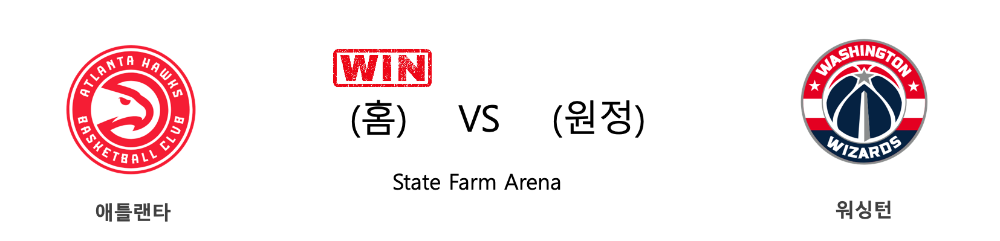
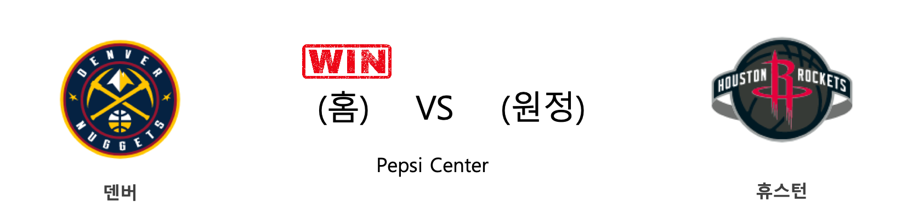

####  샌안토니오(홈) VS 토론토(원정) 

<table class="tg">
  <tr>
    <th class="tg-rr9t">SAS</th>
    <th class="tg-rr9t">팀</th>
    <th class="tg-rr9t">TOR</th>
  </tr>
  <tr>
    <td class="tg-dcpn">1승 1패</td>
    <td class="tg-rr9t">시즌 상대전적</td>
    <td class="tg-dcpn">1승 1패</td>
  </tr>
  <tr>
    <td class="tg-dcpn">106</td>
    <td class="tg-rr9t">점수</td>
    <td class="tg-dcpn">110</td>
  </tr>
  <tr>
    <td class="tg-dcpn">18/45(40%)</td>
    <td class="tg-rr9t">2점(%)</td>
    <td class="tg-dcpn">25/49(51%)</td>
  </tr>
  <tr>
    <td class="tg-dcpn">16/37(43%)</td>
    <td class="tg-rr9t">3점(%)</td>
    <td class="tg-dcpn">16/50(32%)</td>
  </tr>
  <tr>
    <td class="tg-dcpn">22/24(92%)</td>
    <td class="tg-rr9t">자유투(%)</td>
    <td class="tg-dcpn">12/15(80%)</td>
  </tr>
  <tr>
    <td class="tg-dcpn">48</td>
    <td class="tg-rr9t">리바운드</td>
    <td class="tg-dcpn">50</td>
  </tr>
  <tr>
    <td class="tg-dcpn">27</td>
    <td class="tg-rr9t">어시스트</td>
    <td class="tg-dcpn">31</td>
  </tr>
  <tr>
    <td class="tg-dcpn">5</td>
    <td class="tg-rr9t">스틸</td>
    <td class="tg-dcpn">11</td>
  </tr>
  <tr>
    <td class="tg-dcpn">8</td>
    <td class="tg-rr9t">블록</td>
    <td class="tg-dcpn">2</td>
  </tr>
  <tr>
    <td class="tg-dcpn">16</td>
    <td class="tg-rr9t">턴오버</td>
    <td class="tg-dcpn">8</td>
  </tr>
  <tr>
    <td class="tg-dcpn"></td>
    <td class="tg-rr9t">주요 득점선수</td>
    <td class="tg-dcpn">KyleLowryG(16) PascalSiakamF(35)</td>
  </tr>
</table>

#### 경기 관련 주요 기사         

[[오늘의 NBA] (1/9) 그렉 포포비치 감독의 보스턴 수비 인수분해](http://sports.news.naver.com/basketball/news/read.nhn?oid=486&aid=0000001191)

[[오늘의 NBA] (1/23) 자이언 윌리엄슨의 NBA 데뷔전](http://sports.news.naver.com/basketball/news/read.nhn?oid=486&aid=0000001205)

[[오늘의 NBA] (1/27) 자 모란트, 4쿼터를 지배하는 신인](http://sports.news.naver.com/basketball/news/read.nhn?oid=486&aid=0000001209)

[[오늘의 NBA] (1/5) 제이슨 테이텀, 보스턴의 밀당남](http://sports.news.naver.com/basketball/news/read.nhn?oid=486&aid=0000001187)

[[오늘의 NBA] (1/8) POR 데미안 릴라드&카멜로 앤써니, 대역전극을 연출하다](http://sports.news.naver.com/basketball/news/read.nhn?oid=486&aid=0000001190)

        
        

####  뉴올리언스(홈) VS 보스턴(원정) 

<table class="tg">
  <tr>
    <th class="tg-rr9t">NOP</th>
    <th class="tg-rr9t">팀</th>
    <th class="tg-rr9t">BOS</th>
  </tr>
  <tr>
    <td class="tg-dcpn">1승 0패</td>
    <td class="tg-rr9t">시즌 상대전적</td>
    <td class="tg-dcpn">0승 1패</td>
  </tr>
  <tr>
    <td class="tg-dcpn">123</td>
    <td class="tg-rr9t">점수</td>
    <td class="tg-dcpn">108</td>
  </tr>
  <tr>
    <td class="tg-dcpn">28/56(50%)</td>
    <td class="tg-rr9t">2점(%)</td>
    <td class="tg-dcpn">33/56(59%)</td>
  </tr>
  <tr>
    <td class="tg-dcpn">16/36(44%)</td>
    <td class="tg-rr9t">3점(%)</td>
    <td class="tg-dcpn">8/33(24%)</td>
  </tr>
  <tr>
    <td class="tg-dcpn">19/29(66%)</td>
    <td class="tg-rr9t">자유투(%)</td>
    <td class="tg-dcpn">18/22(82%)</td>
  </tr>
  <tr>
    <td class="tg-dcpn">54</td>
    <td class="tg-rr9t">리바운드</td>
    <td class="tg-dcpn">37</td>
  </tr>
  <tr>
    <td class="tg-dcpn">31</td>
    <td class="tg-rr9t">어시스트</td>
    <td class="tg-dcpn">21</td>
  </tr>
  <tr>
    <td class="tg-dcpn">7</td>
    <td class="tg-rr9t">스틸</td>
    <td class="tg-dcpn">6</td>
  </tr>
  <tr>
    <td class="tg-dcpn">5</td>
    <td class="tg-rr9t">블록</td>
    <td class="tg-dcpn">5</td>
  </tr>
  <tr>
    <td class="tg-dcpn">18</td>
    <td class="tg-rr9t">턴오버</td>
    <td class="tg-dcpn">16</td>
  </tr>
  <tr>
    <td class="tg-dcpn">BrandonIngram(16) ZionWilliamso(21) JrueHolidayG(25) DerrickFavors(15) JJRedick(17)</td>
    <td class="tg-rr9t">주요 득점선수</td>
    <td class="tg-dcpn">DanielTheisC(15) GordonHayward(23) JaylenBrownF(20) KembaWalkerG(35)</td>
  </tr>
</table>

#### 경기 관련 주요 기사         

[[오늘의 NBA] (1/21) 데미안 릴라드, 포틀랜드의 슈퍼스타](http://sports.news.naver.com/basketball/news/read.nhn?oid=486&aid=0000001203)

[[오늘의 NBA] (1/23) 자이언 윌리엄슨의 NBA 데뷔전](http://sports.news.naver.com/basketball/news/read.nhn?oid=486&aid=0000001205)

[[오늘의 NBA] (1/27) 자 모란트, 4쿼터를 지배하는 신인](http://sports.news.naver.com/basketball/news/read.nhn?oid=486&aid=0000001209)

[[오늘의 NBA] (12/29) 마이애미, 연장전 승부 전문가](http://sports.news.naver.com/basketball/news/read.nhn?oid=486&aid=0000001180)

[[오늘의 NBA] (1/17) 브랜든 잉그램 vs 도노반 미첼, 1월의 명승부](http://sports.news.naver.com/basketball/news/read.nhn?oid=486&aid=0000001199)

        
        

####  애틀랜타(홈) VS 워싱턴(원정) 

<table class="tg">
  <tr>
    <th class="tg-rr9t">ATL</th>
    <th class="tg-rr9t">팀</th>
    <th class="tg-rr9t">WAS</th>
  </tr>
  <tr>
    <td class="tg-dcpn">1승 1패</td>
    <td class="tg-rr9t">시즌 상대전적</td>
    <td class="tg-dcpn">1승 1패</td>
  </tr>
  <tr>
    <td class="tg-dcpn">152</td>
    <td class="tg-rr9t">점수</td>
    <td class="tg-dcpn">133</td>
  </tr>
  <tr>
    <td class="tg-dcpn">39/58(67%)</td>
    <td class="tg-rr9t">2점(%)</td>
    <td class="tg-dcpn">31/55(56%)</td>
  </tr>
  <tr>
    <td class="tg-dcpn">15/35(43%)</td>
    <td class="tg-rr9t">3점(%)</td>
    <td class="tg-dcpn">11/33(33%)</td>
  </tr>
  <tr>
    <td class="tg-dcpn">29/34(85%)</td>
    <td class="tg-rr9t">자유투(%)</td>
    <td class="tg-dcpn">38/42(90%)</td>
  </tr>
  <tr>
    <td class="tg-dcpn">48</td>
    <td class="tg-rr9t">리바운드</td>
    <td class="tg-dcpn">34</td>
  </tr>
  <tr>
    <td class="tg-dcpn">30</td>
    <td class="tg-rr9t">어시스트</td>
    <td class="tg-dcpn">20</td>
  </tr>
  <tr>
    <td class="tg-dcpn">7</td>
    <td class="tg-rr9t">스틸</td>
    <td class="tg-dcpn">5</td>
  </tr>
  <tr>
    <td class="tg-dcpn">3</td>
    <td class="tg-rr9t">블록</td>
    <td class="tg-dcpn">7</td>
  </tr>
  <tr>
    <td class="tg-dcpn">14</td>
    <td class="tg-rr9t">턴오버</td>
    <td class="tg-dcpn">11</td>
  </tr>
  <tr>
    <td class="tg-dcpn">De'AndreHunte(25) TraeYoungG(45) KevinHuerterG(18) JohnCollinsF(16)</td>
    <td class="tg-rr9t">주요 득점선수</td>
    <td class="tg-dcpn">TroyBrownJr.(19) BradleyBealF(40)</td>
  </tr>
</table>

#### 경기 관련 주요 기사         

[[오늘의 NBA] (12/29) 마이애미, 연장전 승부 전문가](http://sports.news.naver.com/basketball/news/read.nhn?oid=486&aid=0000001180)

[[오늘의 NBA] (12/22) 휴스턴 원투펀치의 피닉스 홈코트 침공](http://sports.news.naver.com/basketball/news/read.nhn?oid=486&aid=0000001174)

[[오늘의 NBA] (1/18) 애틀랜타의 AT&T 센터 던전 정복!](http://sports.news.naver.com/basketball/news/read.nhn?oid=486&aid=0000001200)

[[오늘의 NBA] (10/31) HOU vs WAS, NBA 득점 쟁탈전 역사를 새로 쓰다](http://sports.news.naver.com/basketball/news/read.nhn?oid=486&aid=0000001123)

[[오늘의 NBA] (1/5) 제이슨 테이텀, 보스턴의 밀당남](http://sports.news.naver.com/basketball/news/read.nhn?oid=486&aid=0000001187)

        
        

####  멤피스(홈) VS 피닉스(원정) 

<table class="tg">
  <tr>
    <th class="tg-rr9t">MEM</th>
    <th class="tg-rr9t">팀</th>
    <th class="tg-rr9t">PHX</th>
  </tr>
  <tr>
    <td class="tg-dcpn">3승 1패</td>
    <td class="tg-rr9t">시즌 상대전적</td>
    <td class="tg-dcpn">1승 3패</td>
  </tr>
  <tr>
    <td class="tg-dcpn">114</td>
    <td class="tg-rr9t">점수</td>
    <td class="tg-dcpn">109</td>
  </tr>
  <tr>
    <td class="tg-dcpn">36/65(55%)</td>
    <td class="tg-rr9t">2점(%)</td>
    <td class="tg-dcpn">24/63(38%)</td>
  </tr>
  <tr>
    <td class="tg-dcpn">8/19(42%)</td>
    <td class="tg-rr9t">3점(%)</td>
    <td class="tg-dcpn">11/29(38%)</td>
  </tr>
  <tr>
    <td class="tg-dcpn">18/26(69%)</td>
    <td class="tg-rr9t">자유투(%)</td>
    <td class="tg-dcpn">28/35(80%)</td>
  </tr>
  <tr>
    <td class="tg-dcpn">46</td>
    <td class="tg-rr9t">리바운드</td>
    <td class="tg-dcpn">42</td>
  </tr>
  <tr>
    <td class="tg-dcpn">25</td>
    <td class="tg-rr9t">어시스트</td>
    <td class="tg-dcpn">23</td>
  </tr>
  <tr>
    <td class="tg-dcpn">10</td>
    <td class="tg-rr9t">스틸</td>
    <td class="tg-dcpn">14</td>
  </tr>
  <tr>
    <td class="tg-dcpn">8</td>
    <td class="tg-rr9t">블록</td>
    <td class="tg-dcpn">7</td>
  </tr>
  <tr>
    <td class="tg-dcpn">25</td>
    <td class="tg-rr9t">턴오버</td>
    <td class="tg-dcpn">17</td>
  </tr>
  <tr>
    <td class="tg-dcpn">JaMorantG(23) DillonBrooksG(20) JarenJacksonJ(20)</td>
    <td class="tg-rr9t">주요 득점선수</td>
    <td class="tg-dcpn">DevinBookerG(36) KellyOubreJr.(27) DeandreAytonC(17)</td>
  </tr>
</table>

#### 경기 관련 주요 기사         

[[오늘의 NBA] (1/13) 더마 드로잔, 1년간 기다렸던 복수극](http://sports.news.naver.com/basketball/news/read.nhn?oid=486&aid=0000001195)

[[오늘의 NBA] (1/21) 데미안 릴라드, 포틀랜드의 슈퍼스타](http://sports.news.naver.com/basketball/news/read.nhn?oid=486&aid=0000001203)

[[오늘의 NBA] (1/27) 자 모란트, 4쿼터를 지배하는 신인](http://sports.news.naver.com/basketball/news/read.nhn?oid=486&aid=0000001209)

[[오늘의 NBA] (1/25) 러셀 웨스트브룩의 '마이 웨이'](http://sports.news.naver.com/basketball/news/read.nhn?oid=486&aid=0000001207)

[[오늘의 NBA] (1/11) 멤피스, 서부컨퍼런스 8위 등극](http://sports.news.naver.com/basketball/news/read.nhn?oid=486&aid=0000001193)

        
        

####  덴버(홈) VS 휴스턴(원정) 

<table class="tg">
  <tr>
    <th class="tg-rr9t">DEN</th>
    <th class="tg-rr9t">팀</th>
    <th class="tg-rr9t">HOU</th>
  </tr>
  <tr>
    <td class="tg-dcpn">2승 2패</td>
    <td class="tg-rr9t">시즌 상대전적</td>
    <td class="tg-dcpn">2승 2패</td>
  </tr>
  <tr>
    <td class="tg-dcpn">117</td>
    <td class="tg-rr9t">점수</td>
    <td class="tg-dcpn">110</td>
  </tr>
  <tr>
    <td class="tg-dcpn">33/65(51%)</td>
    <td class="tg-rr9t">2점(%)</td>
    <td class="tg-dcpn">29/55(53%)</td>
  </tr>
  <tr>
    <td class="tg-dcpn">11/28(39%)</td>
    <td class="tg-rr9t">3점(%)</td>
    <td class="tg-dcpn">11/33(33%)</td>
  </tr>
  <tr>
    <td class="tg-dcpn">18/20(90%)</td>
    <td class="tg-rr9t">자유투(%)</td>
    <td class="tg-dcpn">19/27(70%)</td>
  </tr>
  <tr>
    <td class="tg-dcpn">42</td>
    <td class="tg-rr9t">리바운드</td>
    <td class="tg-dcpn">44</td>
  </tr>
  <tr>
    <td class="tg-dcpn">28</td>
    <td class="tg-rr9t">어시스트</td>
    <td class="tg-dcpn">19</td>
  </tr>
  <tr>
    <td class="tg-dcpn">10</td>
    <td class="tg-rr9t">스틸</td>
    <td class="tg-dcpn">6</td>
  </tr>
  <tr>
    <td class="tg-dcpn">3</td>
    <td class="tg-rr9t">블록</td>
    <td class="tg-dcpn">7</td>
  </tr>
  <tr>
    <td class="tg-dcpn">14</td>
    <td class="tg-rr9t">턴오버</td>
    <td class="tg-dcpn">16</td>
  </tr>
  <tr>
    <td class="tg-dcpn">NikolaJokicC(24) JeramiGrantF(25) MonteMorris(17) MichaelPorter(17)</td>
    <td class="tg-rr9t">주요 득점선수</td>
    <td class="tg-dcpn">RussellWestbr(32) EricGordonG(19) BenMcLemoreF(15)</td>
  </tr>
</table>

#### 경기 관련 주요 기사         

[[오늘의 NBA] (1/16) 올랜도, 난적 LA 레이커스를 제압하다](http://sports.news.naver.com/basketball/news/read.nhn?oid=486&aid=0000001198)

[[오늘의 NBA] (1/1) 휴스턴의 불장난](http://sports.news.naver.com/basketball/news/read.nhn?oid=486&aid=0000001183)

[[오늘의 NBA] (1/21) 데미안 릴라드, 포틀랜드의 슈퍼스타](http://sports.news.naver.com/basketball/news/read.nhn?oid=486&aid=0000001203)

[[오늘의 NBA] (1/25) 러셀 웨스트브룩의 '마이 웨이'](http://sports.news.naver.com/basketball/news/read.nhn?oid=486&aid=0000001207)

[[오늘의 NBA] (1/15) 유타 10연승 달성!](http://sports.news.naver.com/basketball/news/read.nhn?oid=486&aid=0000001197)

        
        

####  포틀랜드(홈) VS 인디애나(원정) 

<table class="tg">
  <tr>
    <th class="tg-rr9t">POR</th>
    <th class="tg-rr9t">팀</th>
    <th class="tg-rr9t">IND</th>
  </tr>
  <tr>
    <td class="tg-dcpn">1승 0패</td>
    <td class="tg-rr9t">시즌 상대전적</td>
    <td class="tg-dcpn">0승 1패</td>
  </tr>
  <tr>
    <td class="tg-dcpn">139</td>
    <td class="tg-rr9t">점수</td>
    <td class="tg-dcpn">129</td>
  </tr>
  <tr>
    <td class="tg-dcpn">29/55(53%)</td>
    <td class="tg-rr9t">2점(%)</td>
    <td class="tg-dcpn">35/65(54%)</td>
  </tr>
  <tr>
    <td class="tg-dcpn">20/35(57%)</td>
    <td class="tg-rr9t">3점(%)</td>
    <td class="tg-dcpn">13/28(46%)</td>
  </tr>
  <tr>
    <td class="tg-dcpn">21/25(84%)</td>
    <td class="tg-rr9t">자유투(%)</td>
    <td class="tg-dcpn">20/21(95%)</td>
  </tr>
  <tr>
    <td class="tg-dcpn">43</td>
    <td class="tg-rr9t">리바운드</td>
    <td class="tg-dcpn">31</td>
  </tr>
  <tr>
    <td class="tg-dcpn">27</td>
    <td class="tg-rr9t">어시스트</td>
    <td class="tg-dcpn">31</td>
  </tr>
  <tr>
    <td class="tg-dcpn">1</td>
    <td class="tg-rr9t">스틸</td>
    <td class="tg-dcpn">5</td>
  </tr>
  <tr>
    <td class="tg-dcpn">7</td>
    <td class="tg-rr9t">블록</td>
    <td class="tg-dcpn">2</td>
  </tr>
  <tr>
    <td class="tg-dcpn">15</td>
    <td class="tg-rr9t">턴오버</td>
    <td class="tg-dcpn">6</td>
  </tr>
  <tr>
    <td class="tg-dcpn">HassanWhitesi(21) DamianLillard(50) CJMcCollumG(28)</td>
    <td class="tg-rr9t">주요 득점선수</td>
    <td class="tg-dcpn">AaronHoliday(17) JeremyLambG(28) DougMcDermott(19) DomantasSabon(27)</td>
  </tr>
</table>

#### 경기 관련 주요 기사         

[[오늘의 NBA] (11/28) 앤써니 데이비스, 노란 셔츠를 입은 사나이](http://sports.news.naver.com/basketball/news/read.nhn?oid=486&aid=0000001151)

[[오늘의 NBA] (11/19) 댈러스의 루카 복음 낭송](http://sports.news.naver.com/basketball/news/read.nhn?oid=486&aid=0000001142)

[[오늘의 NBA] (12/14) 레이커스, 마이애미 홈 코트를 점령하다](http://sports.news.naver.com/basketball/news/read.nhn?oid=486&aid=0000001166)

[[오늘의 NBA] (1/16) 올랜도, 난적 LA 레이커스를 제압하다](http://sports.news.naver.com/basketball/news/read.nhn?oid=486&aid=0000001198)

[[오늘의 NBA] (1/23) 자이언 윌리엄슨의 NBA 데뷔전](http://sports.news.naver.com/basketball/news/read.nhn?oid=486&aid=0000001205)

        
        

####  올랜도(홈) VS LA클리퍼스(원정) 

<table class="tg">
  <tr>
    <th class="tg-rr9t">ORL</th>
    <th class="tg-rr9t">팀</th>
    <th class="tg-rr9t">LAC</th>
  </tr>
  <tr>
    <td class="tg-dcpn">0승 2패</td>
    <td class="tg-rr9t">시즌 상대전적</td>
    <td class="tg-dcpn">2승 0패</td>
  </tr>
  <tr>
    <td class="tg-dcpn">97</td>
    <td class="tg-rr9t">점수</td>
    <td class="tg-dcpn">112</td>
  </tr>
  <tr>
    <td class="tg-dcpn">27/63(43%)</td>
    <td class="tg-rr9t">2점(%)</td>
    <td class="tg-dcpn">24/49(49%)</td>
  </tr>
  <tr>
    <td class="tg-dcpn">7/32(22%)</td>
    <td class="tg-rr9t">3점(%)</td>
    <td class="tg-dcpn">13/30(43%)</td>
  </tr>
  <tr>
    <td class="tg-dcpn">22/32(69%)</td>
    <td class="tg-rr9t">자유투(%)</td>
    <td class="tg-dcpn">25/29(86%)</td>
  </tr>
  <tr>
    <td class="tg-dcpn">44</td>
    <td class="tg-rr9t">리바운드</td>
    <td class="tg-dcpn">53</td>
  </tr>
  <tr>
    <td class="tg-dcpn">27</td>
    <td class="tg-rr9t">어시스트</td>
    <td class="tg-dcpn">20</td>
  </tr>
  <tr>
    <td class="tg-dcpn">9</td>
    <td class="tg-rr9t">스틸</td>
    <td class="tg-dcpn">2</td>
  </tr>
  <tr>
    <td class="tg-dcpn">7</td>
    <td class="tg-rr9t">블록</td>
    <td class="tg-dcpn">7</td>
  </tr>
  <tr>
    <td class="tg-dcpn">6</td>
    <td class="tg-rr9t">턴오버</td>
    <td class="tg-dcpn">17</td>
  </tr>
  <tr>
    <td class="tg-dcpn">MichaelCarter(15)</td>
    <td class="tg-rr9t">주요 득점선수</td>
    <td class="tg-dcpn">LandryShametG(19) KawhiLeonardG(31) MontrezlHarre(19) LouWilliams(15)</td>
  </tr>
</table>

#### 경기 관련 주요 기사         

[[오늘의 NBA] (1/19) 르브론 제임스, 휴스턴을 저격하다!](http://sports.news.naver.com/basketball/news/read.nhn?oid=486&aid=0000001201)

[[오늘의 NBA] (1/25) 러셀 웨스트브룩의 '마이 웨이'](http://sports.news.naver.com/basketball/news/read.nhn?oid=486&aid=0000001207)

[[오늘의 NBA] (1/14) 샤이 길저스-알랙선더, 선배 러셀 웨스트브룩을 오마쥬하다](http://sports.news.naver.com/basketball/news/read.nhn?oid=486&aid=0000001196)

[[오늘의 NBA] (1/11) 멤피스, 서부컨퍼런스 8위 등극](http://sports.news.naver.com/basketball/news/read.nhn?oid=486&aid=0000001193)

[[오늘의 NBA] (1/27) 자 모란트, 4쿼터를 지배하는 신인](http://sports.news.naver.com/basketball/news/read.nhn?oid=486&aid=0000001209)

        
        

####  뉴욕(홈) VS 브루클린(원정) 

<table class="tg">
  <tr>
    <th class="tg-rr9t">NYK</th>
    <th class="tg-rr9t">팀</th>
    <th class="tg-rr9t">BKN</th>
  </tr>
  <tr>
    <td class="tg-dcpn">2승 2패</td>
    <td class="tg-rr9t">시즌 상대전적</td>
    <td class="tg-dcpn">2승 2패</td>
  </tr>
  <tr>
    <td class="tg-dcpn">110</td>
    <td class="tg-rr9t">점수</td>
    <td class="tg-dcpn">97</td>
  </tr>
  <tr>
    <td class="tg-dcpn">43/73(59%)</td>
    <td class="tg-rr9t">2점(%)</td>
    <td class="tg-dcpn">21/42(50%)</td>
  </tr>
  <tr>
    <td class="tg-dcpn">6/19(32%)</td>
    <td class="tg-rr9t">3점(%)</td>
    <td class="tg-dcpn">13/39(33%)</td>
  </tr>
  <tr>
    <td class="tg-dcpn">6/13(46%)</td>
    <td class="tg-rr9t">자유투(%)</td>
    <td class="tg-dcpn">16/23(70%)</td>
  </tr>
  <tr>
    <td class="tg-dcpn">48</td>
    <td class="tg-rr9t">리바운드</td>
    <td class="tg-dcpn">34</td>
  </tr>
  <tr>
    <td class="tg-dcpn">19</td>
    <td class="tg-rr9t">어시스트</td>
    <td class="tg-dcpn">21</td>
  </tr>
  <tr>
    <td class="tg-dcpn">7</td>
    <td class="tg-rr9t">스틸</td>
    <td class="tg-dcpn">6</td>
  </tr>
  <tr>
    <td class="tg-dcpn">8</td>
    <td class="tg-rr9t">블록</td>
    <td class="tg-dcpn">4</td>
  </tr>
  <tr>
    <td class="tg-dcpn">13</td>
    <td class="tg-rr9t">턴오버</td>
    <td class="tg-dcpn">14</td>
  </tr>
  <tr>
    <td class="tg-dcpn">MarcusMorrisS(21) JuliusRandleF(22)</td>
    <td class="tg-rr9t">주요 득점선수</td>
    <td class="tg-dcpn">SpencerDinwid(23)</td>
  </tr>
</table>

#### 경기 관련 주요 기사         

[[오늘의 NBA] (1/11) 멤피스, 서부컨퍼런스 8위 등극](http://sports.news.naver.com/basketball/news/read.nhn?oid=486&aid=0000001193)

[[오늘의 NBA] (1/24) 르브론 제임스, 코비 브라이언트를 정조준하다!](http://sports.news.naver.com/basketball/news/read.nhn?oid=486&aid=0000001206)

[[오늘의 NBA] (1/13) 더마 드로잔, 1년간 기다렸던 복수극](http://sports.news.naver.com/basketball/news/read.nhn?oid=486&aid=0000001195)

[[오늘의 NBA] (1/27) 자 모란트, 4쿼터를 지배하는 신인](http://sports.news.naver.com/basketball/news/read.nhn?oid=486&aid=0000001209)

[[오늘의 NBA] (1/21) 데미안 릴라드, 포틀랜드의 슈퍼스타](http://sports.news.naver.com/basketball/news/read.nhn?oid=486&aid=0000001203)

        
        

#### 리그 (Eastern) 순위
    

<table class="tg">
  <tr>
    <th class="tg-d14o">순위</th>
    <th class="tg-d14o">팀명</th>
    <th class="tg-d14o">경기수</th>
    <th class="tg-d14o">승</th>
    <th class="tg-d14o">패</th>
    <th class="tg-d14o">승차</th>
    <th class="tg-d14o">승률</th>
  </tr>
  
<tr>
    <td class="tg-50j8">1</td>
    <td class="tg-50j8">MIL</td>
    <td class="tg-50j8">44</td>
    <td class="tg-50j8">38</td>
    <td class="tg-50j8">6</td>
    <td class="tg-50j8">0</td>
    <td class="tg-50j8">0.864</td>
</tr>

<tr>
    <td class="tg-50j8">2</td>
    <td class="tg-50j8">TOR</td>
    <td class="tg-50j8">46</td>
    <td class="tg-50j8">32</td>
    <td class="tg-50j8">14</td>
    <td class="tg-50j8">6</td>
    <td class="tg-50j8">0.696</td>
</tr>

<tr>
    <td class="tg-50j8">3</td>
    <td class="tg-50j8">MIA</td>
    <td class="tg-50j8">44</td>
    <td class="tg-50j8">31</td>
    <td class="tg-50j8">13</td>
    <td class="tg-50j8">7</td>
    <td class="tg-50j8">0.705</td>
</tr>

<tr>
    <td class="tg-50j8">4</td>
    <td class="tg-50j8">IND</td>
    <td class="tg-50j8">47</td>
    <td class="tg-50j8">30</td>
    <td class="tg-50j8">17</td>
    <td class="tg-50j8">8</td>
    <td class="tg-50j8">0.638</td>
</tr>

<tr>
    <td class="tg-50j8">5</td>
    <td class="tg-50j8">BOS</td>
    <td class="tg-50j8">43</td>
    <td class="tg-50j8">29</td>
    <td class="tg-50j8">14</td>
    <td class="tg-50j8">9</td>
    <td class="tg-50j8">0.674</td>
</tr>

<tr>
    <td class="tg-50j8">6</td>
    <td class="tg-50j8">PHI</td>
    <td class="tg-50j8">45</td>
    <td class="tg-50j8">29</td>
    <td class="tg-50j8">16</td>
    <td class="tg-50j8">9</td>
    <td class="tg-50j8">0.644</td>
</tr>

<tr>
    <td class="tg-50j8">7</td>
    <td class="tg-50j8">ORL</td>
    <td class="tg-50j8">46</td>
    <td class="tg-50j8">21</td>
    <td class="tg-50j8">25</td>
    <td class="tg-50j8">17</td>
    <td class="tg-50j8">0.457</td>
</tr>

<tr>
    <td class="tg-50j8">8</td>
    <td class="tg-50j8">BKN</td>
    <td class="tg-50j8">44</td>
    <td class="tg-50j8">19</td>
    <td class="tg-50j8">25</td>
    <td class="tg-50j8">19</td>
    <td class="tg-50j8">0.432</td>
</tr>

<tr>
    <td class="tg-50j8">9</td>
    <td class="tg-50j8">DET</td>
    <td class="tg-50j8">44</td>
    <td class="tg-50j8">17</td>
    <td class="tg-50j8">27</td>
    <td class="tg-50j8">21</td>
    <td class="tg-50j8">0.386</td>
</tr>

<tr>
    <td class="tg-50j8">10</td>
    <td class="tg-50j8">CHI</td>
    <td class="tg-50j8">46</td>
    <td class="tg-50j8">17</td>
    <td class="tg-50j8">29</td>
    <td class="tg-50j8">21</td>
    <td class="tg-50j8">0.37</td>
</tr>

<tr>
    <td class="tg-50j8">11</td>
    <td class="tg-50j8">CHA</td>
    <td class="tg-50j8">46</td>
    <td class="tg-50j8">15</td>
    <td class="tg-50j8">31</td>
    <td class="tg-50j8">0</td>
    <td class="tg-50j8">0.326</td>
</tr>

<tr>
    <td class="tg-50j8">12</td>
    <td class="tg-50j8">WAS</td>
    <td class="tg-50j8">44</td>
    <td class="tg-50j8">14</td>
    <td class="tg-50j8">30</td>
    <td class="tg-50j8">24</td>
    <td class="tg-50j8">0.318</td>
</tr>

<tr>
    <td class="tg-50j8">13</td>
    <td class="tg-50j8">NYK</td>
    <td class="tg-50j8">47</td>
    <td class="tg-50j8">13</td>
    <td class="tg-50j8">34</td>
    <td class="tg-50j8">25</td>
    <td class="tg-50j8">0.277</td>
</tr>

<tr>
    <td class="tg-50j8">14</td>
    <td class="tg-50j8">ATL</td>
    <td class="tg-50j8">46</td>
    <td class="tg-50j8">11</td>
    <td class="tg-50j8">35</td>
    <td class="tg-50j8">27</td>
    <td class="tg-50j8">0.239</td>
</tr>

<tr>
    <td class="tg-50j8">15</td>
    <td class="tg-50j8">CLE</td>
    <td class="tg-50j8">44</td>
    <td class="tg-50j8">10</td>
    <td class="tg-50j8">34</td>
    <td class="tg-50j8">28</td>
    <td class="tg-50j8">0.227</td>
</tr>
</table> 
#### 리그 (Western) 순위
    

<table class="tg">
  <tr>
    <th class="tg-d14o">순위</th>
    <th class="tg-d14o">팀명</th>
    <th class="tg-d14o">경기수</th>
    <th class="tg-d14o">승</th>
    <th class="tg-d14o">패</th>
    <th class="tg-d14o">승차</th>
    <th class="tg-d14o">승률</th>
  </tr>
  
<tr>
    <td class="tg-50j8">1</td>
    <td class="tg-50j8">LAL</td>
    <td class="tg-50j8">45</td>
    <td class="tg-50j8">35</td>
    <td class="tg-50j8">10</td>
    <td class="tg-50j8">3</td>
    <td class="tg-50j8">0.778</td>
</tr>

<tr>
    <td class="tg-50j8">2</td>
    <td class="tg-50j8">LAC</td>
    <td class="tg-50j8">47</td>
    <td class="tg-50j8">33</td>
    <td class="tg-50j8">14</td>
    <td class="tg-50j8">5</td>
    <td class="tg-50j8">0.702</td>
</tr>

<tr>
    <td class="tg-50j8">3</td>
    <td class="tg-50j8">DEN</td>
    <td class="tg-50j8">44</td>
    <td class="tg-50j8">31</td>
    <td class="tg-50j8">13</td>
    <td class="tg-50j8">7</td>
    <td class="tg-50j8">0.705</td>
</tr>

<tr>
    <td class="tg-50j8">3</td>
    <td class="tg-50j8">UTA</td>
    <td class="tg-50j8">44</td>
    <td class="tg-50j8">31</td>
    <td class="tg-50j8">13</td>
    <td class="tg-50j8">7</td>
    <td class="tg-50j8">0.705</td>
</tr>

<tr>
    <td class="tg-50j8">5</td>
    <td class="tg-50j8">OKC</td>
    <td class="tg-50j8">46</td>
    <td class="tg-50j8">28</td>
    <td class="tg-50j8">18</td>
    <td class="tg-50j8">10</td>
    <td class="tg-50j8">0.609</td>
</tr>

<tr>
    <td class="tg-50j8">6</td>
    <td class="tg-50j8">HOU</td>
    <td class="tg-50j8">44</td>
    <td class="tg-50j8">27</td>
    <td class="tg-50j8">17</td>
    <td class="tg-50j8">11</td>
    <td class="tg-50j8">0.614</td>
</tr>

<tr>
    <td class="tg-50j8">7</td>
    <td class="tg-50j8">DAL</td>
    <td class="tg-50j8">43</td>
    <td class="tg-50j8">26</td>
    <td class="tg-50j8">17</td>
    <td class="tg-50j8">12</td>
    <td class="tg-50j8">0.605</td>
</tr>

<tr>
    <td class="tg-50j8">8</td>
    <td class="tg-50j8">MEM</td>
    <td class="tg-50j8">46</td>
    <td class="tg-50j8">22</td>
    <td class="tg-50j8">24</td>
    <td class="tg-50j8">16</td>
    <td class="tg-50j8">0.478</td>
</tr>

<tr>
    <td class="tg-50j8">9</td>
    <td class="tg-50j8">SAS</td>
    <td class="tg-50j8">44</td>
    <td class="tg-50j8">20</td>
    <td class="tg-50j8">24</td>
    <td class="tg-50j8">18</td>
    <td class="tg-50j8">0.455</td>
</tr>

<tr>
    <td class="tg-50j8">9</td>
    <td class="tg-50j8">POR</td>
    <td class="tg-50j8">44</td>
    <td class="tg-50j8">20</td>
    <td class="tg-50j8">24</td>
    <td class="tg-50j8">18</td>
    <td class="tg-50j8">0.455</td>
</tr>

<tr>
    <td class="tg-50j8">11</td>
    <td class="tg-50j8">PHX</td>
    <td class="tg-50j8">45</td>
    <td class="tg-50j8">18</td>
    <td class="tg-50j8">27</td>
    <td class="tg-50j8">20</td>
    <td class="tg-50j8">0.4</td>
</tr>

<tr>
    <td class="tg-50j8">12</td>
    <td class="tg-50j8">NOP</td>
    <td class="tg-50j8">46</td>
    <td class="tg-50j8">18</td>
    <td class="tg-50j8">28</td>
    <td class="tg-50j8">20</td>
    <td class="tg-50j8">0.391</td>
</tr>

<tr>
    <td class="tg-50j8">13</td>
    <td class="tg-50j8">SAC</td>
    <td class="tg-50j8">45</td>
    <td class="tg-50j8">16</td>
    <td class="tg-50j8">29</td>
    <td class="tg-50j8">22</td>
    <td class="tg-50j8">0.356</td>
</tr>

<tr>
    <td class="tg-50j8">14</td>
    <td class="tg-50j8">MIN</td>
    <td class="tg-50j8">44</td>
    <td class="tg-50j8">14</td>
    <td class="tg-50j8">30</td>
    <td class="tg-50j8">24</td>
    <td class="tg-50j8">0.318</td>
</tr>

<tr>
    <td class="tg-50j8">15</td>
    <td class="tg-50j8">GSW</td>
    <td class="tg-50j8">47</td>
    <td class="tg-50j8">10</td>
    <td class="tg-50j8">37</td>
    <td class="tg-50j8">28</td>
    <td class="tg-50j8">0.213</td>
</tr>
</table> 

        
        
#nba #미국농구 #엔비에이 #농구분석 #토토 #스포츠토토 #경기예측 #농구결과 #20200127 #샌안토니오 #토론토 #뉴올리언스 #보스턴 #애틀랜타 #워싱턴 #멤피스 #피닉스 #덴버 #휴스턴 #포틀랜드 #인디애나 #올랜도 #LA클리퍼스 #뉴욕 #브루클린 #샌안토니오토론토 #뉴올리언스보스턴 #애틀랜타워싱턴 #멤피스피닉스 #덴버휴스턴 #포틀랜드인디애나 #올랜도LA클리퍼스 #뉴욕브루클린 