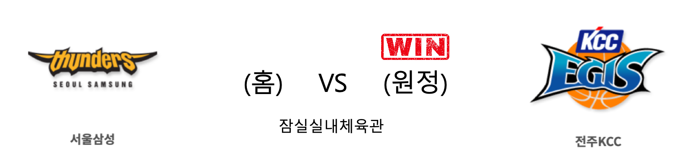

####  고양오리온(홈) VS 창원LG(원정) 

<table class="tg">
  <tr>
    <th class="tg-rr9t">고양오리온</th>
    <th class="tg-rr9t">팀</th>
    <th class="tg-rr9t">창원LG</th>
  </tr>
  <tr>
    <td class="tg-dcpn">2승 3패</td>
    <td class="tg-rr9t">시즌 상대전적</td>
    <td class="tg-dcpn">3승 2패</td>
  </tr>
  <tr>
    <td class="tg-dcpn">68</td>
    <td class="tg-rr9t">점수</td>
    <td class="tg-dcpn">70</td>
  </tr>
  <tr>
    <td class="tg-dcpn">18/39(46%)</td>
    <td class="tg-rr9t">2점(%)</td>
    <td class="tg-dcpn">15/35(43%)</td>
  </tr>
  <tr>
    <td class="tg-dcpn">6/23(26%)</td>
    <td class="tg-rr9t">3점(%)</td>
    <td class="tg-dcpn">6/13(46%)</td>
  </tr>
  <tr>
    <td class="tg-dcpn">14/21(67%)</td>
    <td class="tg-rr9t">자유투(%)</td>
    <td class="tg-dcpn">22/31(71%)</td>
  </tr>
  <tr>
    <td class="tg-dcpn">22</td>
    <td class="tg-rr9t">리바운드</td>
    <td class="tg-dcpn">38</td>
  </tr>
  <tr>
    <td class="tg-dcpn">0</td>
    <td class="tg-rr9t">어시스트</td>
    <td class="tg-dcpn">1</td>
  </tr>
  <tr>
    <td class="tg-dcpn">8</td>
    <td class="tg-rr9t">스틸</td>
    <td class="tg-dcpn">14</td>
  </tr>
  <tr>
    <td class="tg-dcpn">9</td>
    <td class="tg-rr9t">블록</td>
    <td class="tg-dcpn">4</td>
  </tr>
  <tr>
    <td class="tg-dcpn">13</td>
    <td class="tg-rr9t">턴오버</td>
    <td class="tg-dcpn">12</td>
  </tr>
  <tr>
    <td class="tg-dcpn">보리스 사보비치(17)</td>
    <td class="tg-rr9t">주요 득점선수</td>
    <td class="tg-dcpn">캐디 라렌(24) 강병현(17)</td>
  </tr>
</table>

#### 경기 관련 주요 기사         

[프로농구 창원LG-고양오리온전](http://yna.kr/PYH20200131208800060?did=1196m)

['김시래가 돌아온다!' 31일 오리온 전서 복귀 알려](http://www.rookie.co.kr/news/articleView.html?idxno=38699)

[강병현-라렌 펄펄…LG, 오리온 꺾고 9위 수성](http://www.spotvnews.co.kr/?mod=news&act=articleView&idxno=342460)

['라렌 24점·17R' LG, 오리온 추격 뿌리치고 단독 9위 유지](http://www.mydaily.co.kr/new_yk/html/read.php?newsid=202001312103502937&ext=na)

        
        

####  서울삼성(홈) VS 전주KCC(원정) 

<table class="tg">
  <tr>
    <th class="tg-rr9t">서울삼성</th>
    <th class="tg-rr9t">팀</th>
    <th class="tg-rr9t">전주KCC</th>
  </tr>
  <tr>
    <td class="tg-dcpn">1승 4패</td>
    <td class="tg-rr9t">시즌 상대전적</td>
    <td class="tg-dcpn">4승 1패</td>
  </tr>
  <tr>
    <td class="tg-dcpn">70</td>
    <td class="tg-rr9t">점수</td>
    <td class="tg-dcpn">77</td>
  </tr>
  <tr>
    <td class="tg-dcpn">16/41(39%)</td>
    <td class="tg-rr9t">2점(%)</td>
    <td class="tg-dcpn">23/41(56%)</td>
  </tr>
  <tr>
    <td class="tg-dcpn">10/26(38%)</td>
    <td class="tg-rr9t">3점(%)</td>
    <td class="tg-dcpn">5/19(26%)</td>
  </tr>
  <tr>
    <td class="tg-dcpn">8/14(57%)</td>
    <td class="tg-rr9t">자유투(%)</td>
    <td class="tg-dcpn">16/20(80%)</td>
  </tr>
  <tr>
    <td class="tg-dcpn">29</td>
    <td class="tg-rr9t">리바운드</td>
    <td class="tg-dcpn">39</td>
  </tr>
  <tr>
    <td class="tg-dcpn">0</td>
    <td class="tg-rr9t">어시스트</td>
    <td class="tg-dcpn">3</td>
  </tr>
  <tr>
    <td class="tg-dcpn">10</td>
    <td class="tg-rr9t">스틸</td>
    <td class="tg-dcpn">16</td>
  </tr>
  <tr>
    <td class="tg-dcpn">12</td>
    <td class="tg-rr9t">블록</td>
    <td class="tg-dcpn">7</td>
  </tr>
  <tr>
    <td class="tg-dcpn">15</td>
    <td class="tg-rr9t">턴오버</td>
    <td class="tg-dcpn">18</td>
  </tr>
  <tr>
    <td class="tg-dcpn">닉 미네라스(27)</td>
    <td class="tg-rr9t">주요 득점선수</td>
    <td class="tg-dcpn">이정현(18) 라건아(25) 송교창(18)</td>
  </tr>
</table>

#### 경기 관련 주요 기사         

[연패 맞대결서 웃은 KCC…삼성 7점차로 꺾고 단독 4위 점프](http://news1.kr/articles/?3830439)

[[포토] KCC '역전은 절대 용납 못해'](http://sports.chosun.com/news/ntype.htm?id=202001310100211390013987&servicedate=20200131)

[2연패 탈출한 KCC, 과제로 남은 외곽수비 [MD포커스]](http://www.mydaily.co.kr/new_yk/html/read.php?newsid=202001312034652999&ext=na)

[전주KCC '잘하고 있어'](http://yna.kr/PYH20200131208600013?did=1196m)

        
        

#### 리그 순위

<table class="tg">
  <tr>
    <th class="tg-d14o">순위</th>
    <th class="tg-d14o">팀명</th>
    <th class="tg-d14o">경기수</th>
    <th class="tg-d14o">승</th>
    <th class="tg-d14o">패</th>
    <th class="tg-d14o">승차</th>
    <th class="tg-d14o">승률</th>
  </tr>
  
<tr>
    <td class="tg-50j8">1</td>
    <td class="tg-50j8">원주DB</td>
    <td class="tg-50j8">36</td>
    <td class="tg-50j8">23</td>
    <td class="tg-50j8">13</td>
    <td class="tg-50j8">0</td>
    <td class="tg-50j8">0.639</td>
</tr>

<tr>
    <td class="tg-50j8">1</td>
    <td class="tg-50j8">안양KGC</td>
    <td class="tg-50j8">36</td>
    <td class="tg-50j8">23</td>
    <td class="tg-50j8">13</td>
    <td class="tg-50j8">0</td>
    <td class="tg-50j8">0.639</td>
</tr>

<tr>
    <td class="tg-50j8">3</td>
    <td class="tg-50j8">서울SK</td>
    <td class="tg-50j8">36</td>
    <td class="tg-50j8">22</td>
    <td class="tg-50j8">14</td>
    <td class="tg-50j8">1</td>
    <td class="tg-50j8">0.611</td>
</tr>

<tr>
    <td class="tg-50j8">4</td>
    <td class="tg-50j8">전주KCC</td>
    <td class="tg-50j8">37</td>
    <td class="tg-50j8">20</td>
    <td class="tg-50j8">17</td>
    <td class="tg-50j8">3</td>
    <td class="tg-50j8">0.541</td>
</tr>

<tr>
    <td class="tg-50j8">5</td>
    <td class="tg-50j8">인천전자랜드</td>
    <td class="tg-50j8">36</td>
    <td class="tg-50j8">19</td>
    <td class="tg-50j8">17</td>
    <td class="tg-50j8">4</td>
    <td class="tg-50j8">0.528</td>
</tr>

<tr>
    <td class="tg-50j8">6</td>
    <td class="tg-50j8">부산KT</td>
    <td class="tg-50j8">36</td>
    <td class="tg-50j8">18</td>
    <td class="tg-50j8">18</td>
    <td class="tg-50j8">5</td>
    <td class="tg-50j8">0.5</td>
</tr>

<tr>
    <td class="tg-50j8">7</td>
    <td class="tg-50j8">울산현대모비스</td>
    <td class="tg-50j8">36</td>
    <td class="tg-50j8">16</td>
    <td class="tg-50j8">20</td>
    <td class="tg-50j8">7</td>
    <td class="tg-50j8">0.444</td>
</tr>

<tr>
    <td class="tg-50j8">8</td>
    <td class="tg-50j8">서울삼성</td>
    <td class="tg-50j8">37</td>
    <td class="tg-50j8">15</td>
    <td class="tg-50j8">22</td>
    <td class="tg-50j8">8</td>
    <td class="tg-50j8">0.405</td>
</tr>

<tr>
    <td class="tg-50j8">9</td>
    <td class="tg-50j8">창원LG</td>
    <td class="tg-50j8">37</td>
    <td class="tg-50j8">14</td>
    <td class="tg-50j8">23</td>
    <td class="tg-50j8">9</td>
    <td class="tg-50j8">0.378</td>
</tr>

<tr>
    <td class="tg-50j8">10</td>
    <td class="tg-50j8">고양오리온</td>
    <td class="tg-50j8">37</td>
    <td class="tg-50j8">12</td>
    <td class="tg-50j8">25</td>
    <td class="tg-50j8">11</td>
    <td class="tg-50j8">0.324</td>
</tr>
</table> 

        
        
#kbl #국내농구 #농구분석 #토토 #스포츠토토 #경기예측 #농구결과 #20200131 #고양오리온 #창원LG #서울삼성 #전주KCC #고양오리온창원LG #서울삼성전주KCC 