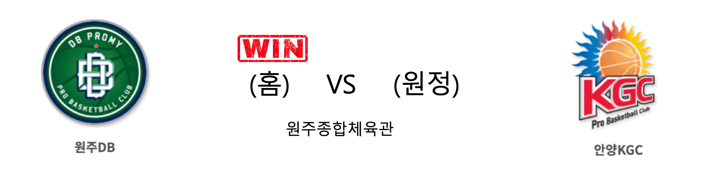

####  서울삼성(홈) VS 부산KT(원정) 

<table class="tg">
  <tr>
    <th class="tg-rr9t">서울삼성</th>
    <th class="tg-rr9t">팀</th>
    <th class="tg-rr9t">부산KT</th>
  </tr>
  <tr>
    <td class="tg-dcpn">1승 4패</td>
    <td class="tg-rr9t">시즌 상대전적</td>
    <td class="tg-dcpn">4승 1패</td>
  </tr>
  <tr>
    <td class="tg-dcpn">90</td>
    <td class="tg-rr9t">점수</td>
    <td class="tg-dcpn">74</td>
  </tr>
  <tr>
    <td class="tg-dcpn">23/43(53%)</td>
    <td class="tg-rr9t">2점(%)</td>
    <td class="tg-dcpn">16/37(43%)</td>
  </tr>
  <tr>
    <td class="tg-dcpn">10/22(45%)</td>
    <td class="tg-rr9t">3점(%)</td>
    <td class="tg-dcpn">7/25(28%)</td>
  </tr>
  <tr>
    <td class="tg-dcpn">14/18(78%)</td>
    <td class="tg-rr9t">자유투(%)</td>
    <td class="tg-dcpn">21/26(81%)</td>
  </tr>
  <tr>
    <td class="tg-dcpn">37</td>
    <td class="tg-rr9t">리바운드</td>
    <td class="tg-dcpn">30</td>
  </tr>
  <tr>
    <td class="tg-dcpn">1</td>
    <td class="tg-rr9t">어시스트</td>
    <td class="tg-dcpn">1</td>
  </tr>
  <tr>
    <td class="tg-dcpn">11</td>
    <td class="tg-rr9t">스틸</td>
    <td class="tg-dcpn">10</td>
  </tr>
  <tr>
    <td class="tg-dcpn">6</td>
    <td class="tg-rr9t">블록</td>
    <td class="tg-dcpn">10</td>
  </tr>
  <tr>
    <td class="tg-dcpn">23</td>
    <td class="tg-rr9t">턴오버</td>
    <td class="tg-dcpn">13</td>
  </tr>
  <tr>
    <td class="tg-dcpn">제임스 톰슨(18) 닉 미네라스(20)</td>
    <td class="tg-rr9t">주요 득점선수</td>
    <td class="tg-dcpn">앨런 더햄(16) 최성모(15)</td>
  </tr>
</table>

#### 경기 관련 주요 기사         

[KT 상대로 승리 거둔 삼성](http://news1.kr/photos/view/?4034864)

['효율적 수비' 삼성, KT 꺾고 지긋지긋한 KT 공포증 탈출...DB는 공동1위로](http://www.sportsseoul.com/news/read/879087)

[프로농구 삼성, 1년 만에 kt전 승리…3연패 탈출](http://yna.kr/AKR20200202048500007?did=1195m)

[‘미네라스 20득점’ 삼성, KT전 6연패 탈출…7호 전 구단 승](http://www.mydaily.co.kr/new_yk/html/read.php?newsid=202002021500193573&ext=na)

        
        

####  전주KCC(홈) VS 서울SK(원정) 

<table class="tg">
  <tr>
    <th class="tg-rr9t">전주KCC</th>
    <th class="tg-rr9t">팀</th>
    <th class="tg-rr9t">서울SK</th>
  </tr>
  <tr>
    <td class="tg-dcpn">3승 2패</td>
    <td class="tg-rr9t">시즌 상대전적</td>
    <td class="tg-dcpn">2승 3패</td>
  </tr>
  <tr>
    <td class="tg-dcpn">95</td>
    <td class="tg-rr9t">점수</td>
    <td class="tg-dcpn">81</td>
  </tr>
  <tr>
    <td class="tg-dcpn">22/35(63%)</td>
    <td class="tg-rr9t">2점(%)</td>
    <td class="tg-dcpn">21/45(47%)</td>
  </tr>
  <tr>
    <td class="tg-dcpn">12/25(48%)</td>
    <td class="tg-rr9t">3점(%)</td>
    <td class="tg-dcpn">10/27(37%)</td>
  </tr>
  <tr>
    <td class="tg-dcpn">15/20(75%)</td>
    <td class="tg-rr9t">자유투(%)</td>
    <td class="tg-dcpn">9/12(75%)</td>
  </tr>
  <tr>
    <td class="tg-dcpn">37</td>
    <td class="tg-rr9t">리바운드</td>
    <td class="tg-dcpn">30</td>
  </tr>
  <tr>
    <td class="tg-dcpn">2</td>
    <td class="tg-rr9t">어시스트</td>
    <td class="tg-dcpn">0</td>
  </tr>
  <tr>
    <td class="tg-dcpn">15</td>
    <td class="tg-rr9t">스틸</td>
    <td class="tg-dcpn">8</td>
  </tr>
  <tr>
    <td class="tg-dcpn">5</td>
    <td class="tg-rr9t">블록</td>
    <td class="tg-dcpn">13</td>
  </tr>
  <tr>
    <td class="tg-dcpn">25</td>
    <td class="tg-rr9t">턴오버</td>
    <td class="tg-dcpn">17</td>
  </tr>
  <tr>
    <td class="tg-dcpn">이정현(16) 라건아(26) 송교창(16)</td>
    <td class="tg-rr9t">주요 득점선수</td>
    <td class="tg-dcpn">변기훈(21) 애런 헤인즈(15)</td>
  </tr>
</table>

#### 경기 관련 주요 기사         

[SK 최준용, KCC 전에서 왼쪽 무릎 부상으로 교체...서울로 이송](http://www.rookie.co.kr/news/articleView.html?idxno=38757)

['라건아 더블 더블' KCC, 2연승·단독 4위…SK 최준용 부상 악재](http://www.mydaily.co.kr/new_yk/html/read.php?newsid=202002021739187926&ext=na)

[DB, 연장 혈투 끝에 인삼공사 꺾고 공동 선두…KCC, 단독 4위로(종합)](http://www.newsis.com/view/?id=NISX20200202_0000905761&cID=10505&pID=10500)

[[JB화보] 전주 KCC, 서울 SK에 95-81로 승리](http://sports.news.naver.com/basketball/news/read.nhn?oid=065&aid=0000196694)

        
        

####  인천전자랜드(홈) VS 창원LG(원정) 

<table class="tg">
  <tr>
    <th class="tg-rr9t">인천전자랜드</th>
    <th class="tg-rr9t">팀</th>
    <th class="tg-rr9t">창원LG</th>
  </tr>
  <tr>
    <td class="tg-dcpn">2승 3패</td>
    <td class="tg-rr9t">시즌 상대전적</td>
    <td class="tg-dcpn">3승 2패</td>
  </tr>
  <tr>
    <td class="tg-dcpn">65</td>
    <td class="tg-rr9t">점수</td>
    <td class="tg-dcpn">81</td>
  </tr>
  <tr>
    <td class="tg-dcpn">13/34(38%)</td>
    <td class="tg-rr9t">2점(%)</td>
    <td class="tg-dcpn">18/36(50%)</td>
  </tr>
  <tr>
    <td class="tg-dcpn">8/21(38%)</td>
    <td class="tg-rr9t">3점(%)</td>
    <td class="tg-dcpn">12/30(40%)</td>
  </tr>
  <tr>
    <td class="tg-dcpn">15/20(75%)</td>
    <td class="tg-rr9t">자유투(%)</td>
    <td class="tg-dcpn">9/13(69%)</td>
  </tr>
  <tr>
    <td class="tg-dcpn">26</td>
    <td class="tg-rr9t">리바운드</td>
    <td class="tg-dcpn">42</td>
  </tr>
  <tr>
    <td class="tg-dcpn">1</td>
    <td class="tg-rr9t">어시스트</td>
    <td class="tg-dcpn">2</td>
  </tr>
  <tr>
    <td class="tg-dcpn">8</td>
    <td class="tg-rr9t">스틸</td>
    <td class="tg-dcpn">6</td>
  </tr>
  <tr>
    <td class="tg-dcpn">5</td>
    <td class="tg-rr9t">블록</td>
    <td class="tg-dcpn">8</td>
  </tr>
  <tr>
    <td class="tg-dcpn">15</td>
    <td class="tg-rr9t">턴오버</td>
    <td class="tg-dcpn">21</td>
  </tr>
  <tr>
    <td class="tg-dcpn">트로이 길렌워터(22)</td>
    <td class="tg-rr9t">주요 득점선수</td>
    <td class="tg-dcpn">유병훈(15) 정희재(15) 캐디 라렌(26)</td>
  </tr>
</table>

#### 경기 관련 주요 기사         

[천적과 맞대결서 웃은 삼성-LG, KT-전자랜드 상대 연패 탈출](http://www.osen.co.kr/article/G1111302039)

[[JB화보] 창원 LG, 인천 전자랜드에 81-65로 편안한 승리](http://sports.news.naver.com/basketball/news/read.nhn?oid=065&aid=0000196675)

[[BK Review] '라렌-희재-병훈 펄펄' LG, 전자랜드 꺾고 인천 원정 7연패 탈출](http://www.basketkorea.com/news/articleView.html?idxno=191970)

[삼성, 3연패·KT전 6연패 탈출…LG, 인천 원정 7연패 끊어](http://www.newsis.com/view/?id=NISX20200202_0000905681&cID=10505&pID=10500)

        
        

####  원주DB(홈) VS 안양KGC(원정) 

<table class="tg">
  <tr>
    <th class="tg-rr9t">원주DB</th>
    <th class="tg-rr9t">팀</th>
    <th class="tg-rr9t">안양KGC</th>
  </tr>
  <tr>
    <td class="tg-dcpn">3승 2패</td>
    <td class="tg-rr9t">시즌 상대전적</td>
    <td class="tg-dcpn">2승 3패</td>
  </tr>
  <tr>
    <td class="tg-dcpn">103</td>
    <td class="tg-rr9t">점수</td>
    <td class="tg-dcpn">95</td>
  </tr>
  <tr>
    <td class="tg-dcpn">27/45(60%)</td>
    <td class="tg-rr9t">2점(%)</td>
    <td class="tg-dcpn">20/43(47%)</td>
  </tr>
  <tr>
    <td class="tg-dcpn">13/29(45%)</td>
    <td class="tg-rr9t">3점(%)</td>
    <td class="tg-dcpn">13/36(36%)</td>
  </tr>
  <tr>
    <td class="tg-dcpn">10/14(71%)</td>
    <td class="tg-rr9t">자유투(%)</td>
    <td class="tg-dcpn">16/25(64%)</td>
  </tr>
  <tr>
    <td class="tg-dcpn">43</td>
    <td class="tg-rr9t">리바운드</td>
    <td class="tg-dcpn">36</td>
  </tr>
  <tr>
    <td class="tg-dcpn">7</td>
    <td class="tg-rr9t">어시스트</td>
    <td class="tg-dcpn">0</td>
  </tr>
  <tr>
    <td class="tg-dcpn">22</td>
    <td class="tg-rr9t">스틸</td>
    <td class="tg-dcpn">15</td>
  </tr>
  <tr>
    <td class="tg-dcpn">9</td>
    <td class="tg-rr9t">블록</td>
    <td class="tg-dcpn">14</td>
  </tr>
  <tr>
    <td class="tg-dcpn">32</td>
    <td class="tg-rr9t">턴오버</td>
    <td class="tg-dcpn">18</td>
  </tr>
  <tr>
    <td class="tg-dcpn">치나누 오누아쿠(16) 김종규(21) 두경민(20)</td>
    <td class="tg-rr9t">주요 득점선수</td>
    <td class="tg-dcpn">전성현(16) 덴젤 보울스(31) 박형철(22)</td>
  </tr>
</table>

#### 경기 관련 주요 기사         

[DB, 연장 혈투 끝에 인삼공사 꺾고 공동 선두…KCC, 단독 4위로(종합)](http://www.newsis.com/view/?id=NISX20200202_0000905761&cID=10505&pID=10500)

[[JB화보] DB, KGC에 103-95로 승리](http://sports.news.naver.com/basketball/news/read.nhn?oid=065&aid=0000196688)

[[BK Review] '두경민-김종규 연장 활약' DB, KGC 꺾고 공동 선두 등극](http://www.basketkorea.com/news/articleView.html?idxno=191980)

[KGC, 승리를 향해](http://yna.kr/PYH20200202114100062?did=1196m)

        
        

#### 리그 순위

<table class="tg">
  <tr>
    <th class="tg-d14o">순위</th>
    <th class="tg-d14o">팀명</th>
    <th class="tg-d14o">경기수</th>
    <th class="tg-d14o">승</th>
    <th class="tg-d14o">패</th>
    <th class="tg-d14o">승차</th>
    <th class="tg-d14o">승률</th>
  </tr>
  
<tr>
    <td class="tg-50j8">1</td>
    <td class="tg-50j8">원주DB</td>
    <td class="tg-50j8">38</td>
    <td class="tg-50j8">24</td>
    <td class="tg-50j8">14</td>
    <td class="tg-50j8">0</td>
    <td class="tg-50j8">0.632</td>
</tr>

<tr>
    <td class="tg-50j8">1</td>
    <td class="tg-50j8">안양KGC</td>
    <td class="tg-50j8">38</td>
    <td class="tg-50j8">24</td>
    <td class="tg-50j8">14</td>
    <td class="tg-50j8">0</td>
    <td class="tg-50j8">0.632</td>
</tr>

<tr>
    <td class="tg-50j8">3</td>
    <td class="tg-50j8">서울SK</td>
    <td class="tg-50j8">38</td>
    <td class="tg-50j8">23</td>
    <td class="tg-50j8">15</td>
    <td class="tg-50j8">1</td>
    <td class="tg-50j8">0.605</td>
</tr>

<tr>
    <td class="tg-50j8">4</td>
    <td class="tg-50j8">전주KCC</td>
    <td class="tg-50j8">38</td>
    <td class="tg-50j8">21</td>
    <td class="tg-50j8">17</td>
    <td class="tg-50j8">3</td>
    <td class="tg-50j8">0.553</td>
</tr>

<tr>
    <td class="tg-50j8">5</td>
    <td class="tg-50j8">인천전자랜드</td>
    <td class="tg-50j8">38</td>
    <td class="tg-50j8">20</td>
    <td class="tg-50j8">18</td>
    <td class="tg-50j8">4</td>
    <td class="tg-50j8">0.526</td>
</tr>

<tr>
    <td class="tg-50j8">6</td>
    <td class="tg-50j8">부산KT</td>
    <td class="tg-50j8">38</td>
    <td class="tg-50j8">18</td>
    <td class="tg-50j8">20</td>
    <td class="tg-50j8">6</td>
    <td class="tg-50j8">0.474</td>
</tr>

<tr>
    <td class="tg-50j8">7</td>
    <td class="tg-50j8">울산현대모비스</td>
    <td class="tg-50j8">37</td>
    <td class="tg-50j8">16</td>
    <td class="tg-50j8">21</td>
    <td class="tg-50j8">8</td>
    <td class="tg-50j8">0.432</td>
</tr>

<tr>
    <td class="tg-50j8">8</td>
    <td class="tg-50j8">서울삼성</td>
    <td class="tg-50j8">38</td>
    <td class="tg-50j8">16</td>
    <td class="tg-50j8">22</td>
    <td class="tg-50j8">8</td>
    <td class="tg-50j8">0.421</td>
</tr>

<tr>
    <td class="tg-50j8">9</td>
    <td class="tg-50j8">창원LG</td>
    <td class="tg-50j8">38</td>
    <td class="tg-50j8">15</td>
    <td class="tg-50j8">23</td>
    <td class="tg-50j8">9</td>
    <td class="tg-50j8">0.395</td>
</tr>

<tr>
    <td class="tg-50j8">10</td>
    <td class="tg-50j8">고양오리온</td>
    <td class="tg-50j8">37</td>
    <td class="tg-50j8">12</td>
    <td class="tg-50j8">25</td>
    <td class="tg-50j8">12</td>
    <td class="tg-50j8">0.324</td>
</tr>
</table> 

        
        
#kbl #국내농구 #농구분석 #토토 #스포츠토토 #경기예측 #농구결과 #20200202 #서울삼성 #부산KT #전주KCC #서울SK #인천전자랜드 #창원LG #원주DB #안양KGC #서울삼성부산KT #전주KCC서울SK #인천전자랜드창원LG #원주DB안양KGC 