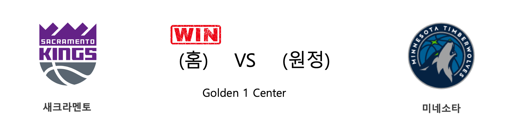
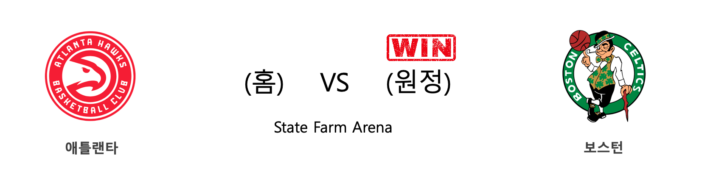
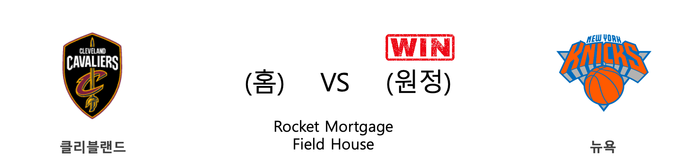
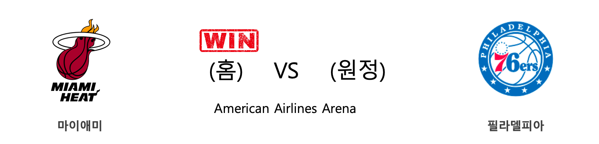
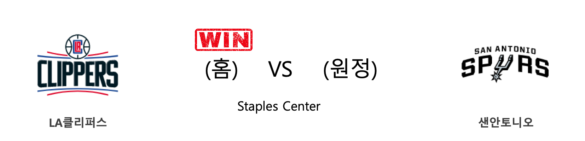
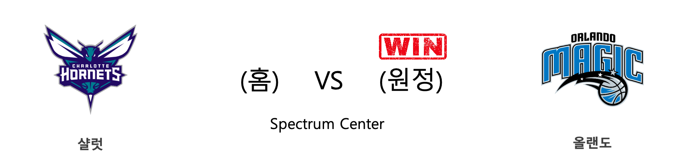

####  새크라멘토(홈) VS 미네소타(원정) 

<table class="tg">
  <tr>
    <th class="tg-rr9t">SAC</th>
    <th class="tg-rr9t">팀</th>
    <th class="tg-rr9t">MIN</th>
  </tr>
  <tr>
    <td class="tg-dcpn">2승 1패</td>
    <td class="tg-rr9t">시즌 상대전적</td>
    <td class="tg-dcpn">1승 2패</td>
  </tr>
  <tr>
    <td class="tg-dcpn">113</td>
    <td class="tg-rr9t">점수</td>
    <td class="tg-dcpn">109</td>
  </tr>
  <tr>
    <td class="tg-dcpn">24/48(50%)</td>
    <td class="tg-rr9t">2점(%)</td>
    <td class="tg-dcpn">24/47(51%)</td>
  </tr>
  <tr>
    <td class="tg-dcpn">14/27(52%)</td>
    <td class="tg-rr9t">3점(%)</td>
    <td class="tg-dcpn">13/38(34%)</td>
  </tr>
  <tr>
    <td class="tg-dcpn">23/31(74%)</td>
    <td class="tg-rr9t">자유투(%)</td>
    <td class="tg-dcpn">22/28(79%)</td>
  </tr>
  <tr>
    <td class="tg-dcpn">34</td>
    <td class="tg-rr9t">리바운드</td>
    <td class="tg-dcpn">45</td>
  </tr>
  <tr>
    <td class="tg-dcpn">26</td>
    <td class="tg-rr9t">어시스트</td>
    <td class="tg-dcpn">25</td>
  </tr>
  <tr>
    <td class="tg-dcpn">7</td>
    <td class="tg-rr9t">스틸</td>
    <td class="tg-dcpn">12</td>
  </tr>
  <tr>
    <td class="tg-dcpn">7</td>
    <td class="tg-rr9t">블록</td>
    <td class="tg-dcpn">6</td>
  </tr>
  <tr>
    <td class="tg-dcpn">16</td>
    <td class="tg-rr9t">턴오버</td>
    <td class="tg-dcpn">16</td>
  </tr>
  <tr>
    <td class="tg-dcpn">BogdanBogdano(23) De'AaronFoxG(31) BuddyHield(16)</td>
    <td class="tg-rr9t">주요 득점선수</td>
    <td class="tg-dcpn">RobertCovingt(15) Karl-AnthonyT(22) ShabazzNapier(17)</td>
  </tr>
</table>

#### 경기 관련 주요 기사         

[[오늘의 NBA] (2/2) '경이로운 자' 데미안 릴라드의 5차 슈팅 혁명](http://sports.news.naver.com/basketball/news/read.nhn?oid=486&aid=0000001215)

[[오늘의 NBA] (2/4) 크리스탑스 포르징기스, 댈러스의 새로운 대들보](http://sports.news.naver.com/basketball/news/read.nhn?oid=486&aid=0000001217)

[[오늘의 NBA] (1/19) 르브론 제임스, 휴스턴을 저격하다!](http://sports.news.naver.com/basketball/news/read.nhn?oid=486&aid=0000001201)

[[오늘의 NBA] (1/25) 러셀 웨스트브룩의 '마이 웨이'](http://sports.news.naver.com/basketball/news/read.nhn?oid=486&aid=0000001207)

[[오늘의 NBA] (1/28) 버디 힐드, 코비 브라이언트를 추모하다](http://sports.news.naver.com/basketball/news/read.nhn?oid=486&aid=0000001210)

        
        

####  인디애나(홈) VS 댈러스(원정) 

<table class="tg">
  <tr>
    <th class="tg-rr9t">IND</th>
    <th class="tg-rr9t">팀</th>
    <th class="tg-rr9t">DAL</th>
  </tr>
  <tr>
    <td class="tg-dcpn">0승 1패</td>
    <td class="tg-rr9t">시즌 상대전적</td>
    <td class="tg-dcpn">1승 0패</td>
  </tr>
  <tr>
    <td class="tg-dcpn">103</td>
    <td class="tg-rr9t">점수</td>
    <td class="tg-dcpn">112</td>
  </tr>
  <tr>
    <td class="tg-dcpn">37/62(60%)</td>
    <td class="tg-rr9t">2점(%)</td>
    <td class="tg-dcpn">18/41(44%)</td>
  </tr>
  <tr>
    <td class="tg-dcpn">7/34(21%)</td>
    <td class="tg-rr9t">3점(%)</td>
    <td class="tg-dcpn">18/45(40%)</td>
  </tr>
  <tr>
    <td class="tg-dcpn">8/11(73%)</td>
    <td class="tg-rr9t">자유투(%)</td>
    <td class="tg-dcpn">22/23(96%)</td>
  </tr>
  <tr>
    <td class="tg-dcpn">40</td>
    <td class="tg-rr9t">리바운드</td>
    <td class="tg-dcpn">51</td>
  </tr>
  <tr>
    <td class="tg-dcpn">28</td>
    <td class="tg-rr9t">어시스트</td>
    <td class="tg-dcpn">20</td>
  </tr>
  <tr>
    <td class="tg-dcpn">7</td>
    <td class="tg-rr9t">스틸</td>
    <td class="tg-dcpn">3</td>
  </tr>
  <tr>
    <td class="tg-dcpn">6</td>
    <td class="tg-rr9t">블록</td>
    <td class="tg-dcpn">2</td>
  </tr>
  <tr>
    <td class="tg-dcpn">4</td>
    <td class="tg-rr9t">턴오버</td>
    <td class="tg-dcpn">12</td>
  </tr>
  <tr>
    <td class="tg-dcpn">DomantasSabon(26)</td>
    <td class="tg-rr9t">주요 득점선수</td>
    <td class="tg-dcpn">KristapsPorzi(38) TimHardawayJr(25) DorianFinney-(15)</td>
  </tr>
</table>

#### 경기 관련 주요 기사         

[[오늘의 NBA] (2/2) '경이로운 자' 데미안 릴라드의 5차 슈팅 혁명](http://sports.news.naver.com/basketball/news/read.nhn?oid=486&aid=0000001215)

[[오늘의 NBA] (1/1) 휴스턴의 불장난](http://sports.news.naver.com/basketball/news/read.nhn?oid=486&aid=0000001183)

[[오늘의 NBA] (1/5) 제이슨 테이텀, 보스턴의 밀당남](http://sports.news.naver.com/basketball/news/read.nhn?oid=486&aid=0000001187)

[[오늘의 NBA] (2/4) 크리스탑스 포르징기스, 댈러스의 새로운 대들보](http://sports.news.naver.com/basketball/news/read.nhn?oid=486&aid=0000001217)

[[오늘의 NBA] (2/1) LAL, 코비 브라이언트와의 작별](http://sports.news.naver.com/basketball/news/read.nhn?oid=486&aid=0000001214)

        
        

####  애틀랜타(홈) VS 보스턴(원정) 

<table class="tg">
  <tr>
    <th class="tg-rr9t">ATL</th>
    <th class="tg-rr9t">팀</th>
    <th class="tg-rr9t">BOS</th>
  </tr>
  <tr>
    <td class="tg-dcpn">0승 2패</td>
    <td class="tg-rr9t">시즌 상대전적</td>
    <td class="tg-dcpn">2승 0패</td>
  </tr>
  <tr>
    <td class="tg-dcpn">115</td>
    <td class="tg-rr9t">점수</td>
    <td class="tg-dcpn">123</td>
  </tr>
  <tr>
    <td class="tg-dcpn">30/54(56%)</td>
    <td class="tg-rr9t">2점(%)</td>
    <td class="tg-dcpn">36/61(59%)</td>
  </tr>
  <tr>
    <td class="tg-dcpn">12/30(40%)</td>
    <td class="tg-rr9t">3점(%)</td>
    <td class="tg-dcpn">12/29(41%)</td>
  </tr>
  <tr>
    <td class="tg-dcpn">19/21(90%)</td>
    <td class="tg-rr9t">자유투(%)</td>
    <td class="tg-dcpn">15/17(88%)</td>
  </tr>
  <tr>
    <td class="tg-dcpn">32</td>
    <td class="tg-rr9t">리바운드</td>
    <td class="tg-dcpn">44</td>
  </tr>
  <tr>
    <td class="tg-dcpn">22</td>
    <td class="tg-rr9t">어시스트</td>
    <td class="tg-dcpn">21</td>
  </tr>
  <tr>
    <td class="tg-dcpn">9</td>
    <td class="tg-rr9t">스틸</td>
    <td class="tg-dcpn">10</td>
  </tr>
  <tr>
    <td class="tg-dcpn">6</td>
    <td class="tg-rr9t">블록</td>
    <td class="tg-dcpn">5</td>
  </tr>
  <tr>
    <td class="tg-dcpn">17</td>
    <td class="tg-rr9t">턴오버</td>
    <td class="tg-dcpn">15</td>
  </tr>
  <tr>
    <td class="tg-dcpn">JeffTeagueG(18) TraeYoungG(34) JohnCollinsF(22) KevinHuerterF(23)</td>
    <td class="tg-rr9t">주요 득점선수</td>
    <td class="tg-dcpn">JaysonTatumF(28) BradWanamaker(16) JaylenBrownG(21) GordonHayward(24)</td>
  </tr>
</table>

#### 경기 관련 주요 기사         

[[오늘의 NBA] (1/21) 데미안 릴라드, 포틀랜드의 슈퍼스타](http://sports.news.naver.com/basketball/news/read.nhn?oid=486&aid=0000001203)

[[오늘의 NBA] (1/17) 브랜든 잉그램 vs 도노반 미첼, 1월의 명승부](http://sports.news.naver.com/basketball/news/read.nhn?oid=486&aid=0000001199)

[[오늘의 NBA] (2/4) 크리스탑스 포르징기스, 댈러스의 새로운 대들보](http://sports.news.naver.com/basketball/news/read.nhn?oid=486&aid=0000001217)

[[오늘의 NBA] (1/10) PHI vs BOS, 먹이사슬의 역전!](http://sports.news.naver.com/basketball/news/read.nhn?oid=486&aid=0000001192)

[[오늘의 NBA] (1/23) 자이언 윌리엄슨의 NBA 데뷔전](http://sports.news.naver.com/basketball/news/read.nhn?oid=486&aid=0000001205)

        
        

####  브루클린(홈) VS 피닉스(원정) 

<table class="tg">
  <tr>
    <th class="tg-rr9t">BKN</th>
    <th class="tg-rr9t">팀</th>
    <th class="tg-rr9t">PHX</th>
  </tr>
  <tr>
    <td class="tg-dcpn">1승 1패</td>
    <td class="tg-rr9t">시즌 상대전적</td>
    <td class="tg-dcpn">1승 1패</td>
  </tr>
  <tr>
    <td class="tg-dcpn">119</td>
    <td class="tg-rr9t">점수</td>
    <td class="tg-dcpn">97</td>
  </tr>
  <tr>
    <td class="tg-dcpn">28/55(51%)</td>
    <td class="tg-rr9t">2점(%)</td>
    <td class="tg-dcpn">33/72(46%)</td>
  </tr>
  <tr>
    <td class="tg-dcpn">15/34(44%)</td>
    <td class="tg-rr9t">3점(%)</td>
    <td class="tg-dcpn">6/17(35%)</td>
  </tr>
  <tr>
    <td class="tg-dcpn">18/21(86%)</td>
    <td class="tg-rr9t">자유투(%)</td>
    <td class="tg-dcpn">13/18(72%)</td>
  </tr>
  <tr>
    <td class="tg-dcpn">44</td>
    <td class="tg-rr9t">리바운드</td>
    <td class="tg-dcpn">43</td>
  </tr>
  <tr>
    <td class="tg-dcpn">28</td>
    <td class="tg-rr9t">어시스트</td>
    <td class="tg-dcpn">23</td>
  </tr>
  <tr>
    <td class="tg-dcpn">8</td>
    <td class="tg-rr9t">스틸</td>
    <td class="tg-dcpn">7</td>
  </tr>
  <tr>
    <td class="tg-dcpn">4</td>
    <td class="tg-rr9t">블록</td>
    <td class="tg-dcpn">6</td>
  </tr>
  <tr>
    <td class="tg-dcpn">17</td>
    <td class="tg-rr9t">턴오버</td>
    <td class="tg-dcpn">16</td>
  </tr>
  <tr>
    <td class="tg-dcpn">CarisLeVertG(29) TaureanPrince(15) JoeHarrisF(16)</td>
    <td class="tg-rr9t">주요 득점선수</td>
    <td class="tg-dcpn">DeandreAytonC(25) KellyOubreJr.(21)</td>
  </tr>
</table>

#### 경기 관련 주요 기사         

[[오늘의 NBA] (1/27) 자 모란트, 4쿼터를 지배하는 신인](http://sports.news.naver.com/basketball/news/read.nhn?oid=486&aid=0000001209)

[[오늘의 NBA] (1/30) 빅터 올라디포, "READY 4 ACTION"](http://sports.news.naver.com/basketball/news/read.nhn?oid=486&aid=0000001212)

[[오늘의 NBA] (2/1) LAL, 코비 브라이언트와의 작별](http://sports.news.naver.com/basketball/news/read.nhn?oid=486&aid=0000001214)

[[오늘의 NBA] (1/21) 데미안 릴라드, 포틀랜드의 슈퍼스타](http://sports.news.naver.com/basketball/news/read.nhn?oid=486&aid=0000001203)

[[오늘의 NBA] (2/4) 크리스탑스 포르징기스, 댈러스의 새로운 대들보](http://sports.news.naver.com/basketball/news/read.nhn?oid=486&aid=0000001217)

        
        

####  멤피스(홈) VS 디트로이트(원정) 

<table class="tg">
  <tr>
    <th class="tg-rr9t">MEM</th>
    <th class="tg-rr9t">팀</th>
    <th class="tg-rr9t">DET</th>
  </tr>
  <tr>
    <td class="tg-dcpn">2승 0패</td>
    <td class="tg-rr9t">시즌 상대전적</td>
    <td class="tg-dcpn">0승 2패</td>
  </tr>
  <tr>
    <td class="tg-dcpn">96</td>
    <td class="tg-rr9t">점수</td>
    <td class="tg-dcpn">82</td>
  </tr>
  <tr>
    <td class="tg-dcpn">40/73(55%)</td>
    <td class="tg-rr9t">2점(%)</td>
    <td class="tg-dcpn">26/72(36%)</td>
  </tr>
  <tr>
    <td class="tg-dcpn">2/17(12%)</td>
    <td class="tg-rr9t">3점(%)</td>
    <td class="tg-dcpn">8/26(31%)</td>
  </tr>
  <tr>
    <td class="tg-dcpn">10/12(83%)</td>
    <td class="tg-rr9t">자유투(%)</td>
    <td class="tg-dcpn">6/9(67%)</td>
  </tr>
  <tr>
    <td class="tg-dcpn">47</td>
    <td class="tg-rr9t">리바운드</td>
    <td class="tg-dcpn">51</td>
  </tr>
  <tr>
    <td class="tg-dcpn">27</td>
    <td class="tg-rr9t">어시스트</td>
    <td class="tg-dcpn">21</td>
  </tr>
  <tr>
    <td class="tg-dcpn">6</td>
    <td class="tg-rr9t">스틸</td>
    <td class="tg-dcpn">6</td>
  </tr>
  <tr>
    <td class="tg-dcpn">12</td>
    <td class="tg-rr9t">블록</td>
    <td class="tg-dcpn">2</td>
  </tr>
  <tr>
    <td class="tg-dcpn">11</td>
    <td class="tg-rr9t">턴오버</td>
    <td class="tg-dcpn">14</td>
  </tr>
  <tr>
    <td class="tg-dcpn">DillonBrooksG(15) JonasValanciu(26)</td>
    <td class="tg-rr9t">주요 득점선수</td>
    <td class="tg-dcpn">LangstonGallo(17) ChristianWood(17) AndreDrummond(25)</td>
  </tr>
</table>

#### 경기 관련 주요 기사         

[[오늘의 NBA] (12/29) 마이애미, 연장전 승부 전문가](http://sports.news.naver.com/basketball/news/read.nhn?oid=486&aid=0000001180)

[[오늘의 NBA] (12/24) 자말 머레이와 데빈 부커의 뒤틀린 운명](http://sports.news.naver.com/basketball/news/read.nhn?oid=486&aid=0000001176)

[[오늘의 NBA] (1/30) 빅터 올라디포, "READY 4 ACTION"](http://sports.news.naver.com/basketball/news/read.nhn?oid=486&aid=0000001212)

[[오늘의 NBA] (11/30) 인디애나, 동부컨퍼런스의 복병](http://sports.news.naver.com/basketball/news/read.nhn?oid=486&aid=0000001152)

[[오늘의 NBA] (12/15) 밤 아데바요, 연장전의 지배자](http://sports.news.naver.com/basketball/news/read.nhn?oid=486&aid=0000001167)

        
        

####  클리블랜드(홈) VS 뉴욕(원정) 

<table class="tg">
  <tr>
    <th class="tg-rr9t">CLE</th>
    <th class="tg-rr9t">팀</th>
    <th class="tg-rr9t">NYK</th>
  </tr>
  <tr>
    <td class="tg-dcpn">1승 3패</td>
    <td class="tg-rr9t">시즌 상대전적</td>
    <td class="tg-dcpn">3승 1패</td>
  </tr>
  <tr>
    <td class="tg-dcpn">134</td>
    <td class="tg-rr9t">점수</td>
    <td class="tg-dcpn">139</td>
  </tr>
  <tr>
    <td class="tg-dcpn">34/57(60%)</td>
    <td class="tg-rr9t">2점(%)</td>
    <td class="tg-dcpn">47/76(62%)</td>
  </tr>
  <tr>
    <td class="tg-dcpn">18/35(51%)</td>
    <td class="tg-rr9t">3점(%)</td>
    <td class="tg-dcpn">10/26(38%)</td>
  </tr>
  <tr>
    <td class="tg-dcpn">12/18(67%)</td>
    <td class="tg-rr9t">자유투(%)</td>
    <td class="tg-dcpn">15/21(71%)</td>
  </tr>
  <tr>
    <td class="tg-dcpn">34</td>
    <td class="tg-rr9t">리바운드</td>
    <td class="tg-dcpn">46</td>
  </tr>
  <tr>
    <td class="tg-dcpn">34</td>
    <td class="tg-rr9t">어시스트</td>
    <td class="tg-dcpn">33</td>
  </tr>
  <tr>
    <td class="tg-dcpn">6</td>
    <td class="tg-rr9t">스틸</td>
    <td class="tg-dcpn">11</td>
  </tr>
  <tr>
    <td class="tg-dcpn">3</td>
    <td class="tg-rr9t">블록</td>
    <td class="tg-dcpn">1</td>
  </tr>
  <tr>
    <td class="tg-dcpn">14</td>
    <td class="tg-rr9t">턴오버</td>
    <td class="tg-dcpn">12</td>
  </tr>
  <tr>
    <td class="tg-dcpn">KevinLoveF(33) LarryNanceJr.(18) CollinSextonG(29) CediOsmanF(15)</td>
    <td class="tg-rr9t">주요 득점선수</td>
    <td class="tg-dcpn">JuliusRandleF(20) DennisSmithJr(15) MarcusMorrisS(26) ElfridPaytonG(17)</td>
  </tr>
</table>

#### 경기 관련 주요 기사         

[[오늘의 NBA] (1/19) 르브론 제임스, 휴스턴을 저격하다!](http://sports.news.naver.com/basketball/news/read.nhn?oid=486&aid=0000001201)

[[오늘의 NBA] (2/2) '경이로운 자' 데미안 릴라드의 5차 슈팅 혁명](http://sports.news.naver.com/basketball/news/read.nhn?oid=486&aid=0000001215)

[[오늘의 NBA] (2/4) 크리스탑스 포르징기스, 댈러스의 새로운 대들보](http://sports.news.naver.com/basketball/news/read.nhn?oid=486&aid=0000001217)

[[오늘의 NBA] (1/21) 데미안 릴라드, 포틀랜드의 슈퍼스타](http://sports.news.naver.com/basketball/news/read.nhn?oid=486&aid=0000001203)

[[오늘의 NBA] (1/29) 밀워키, 우승 후보 1순위 입지를 구축하다](http://sports.news.naver.com/basketball/news/read.nhn?oid=486&aid=0000001211)

        
        

####  마이애미(홈) VS 필라델피아(원정) 

<table class="tg">
  <tr>
    <th class="tg-rr9t">MIA</th>
    <th class="tg-rr9t">팀</th>
    <th class="tg-rr9t">PHI</th>
  </tr>
  <tr>
    <td class="tg-dcpn">3승 1패</td>
    <td class="tg-rr9t">시즌 상대전적</td>
    <td class="tg-dcpn">1승 3패</td>
  </tr>
  <tr>
    <td class="tg-dcpn">137</td>
    <td class="tg-rr9t">점수</td>
    <td class="tg-dcpn">106</td>
  </tr>
  <tr>
    <td class="tg-dcpn">32/53(60%)</td>
    <td class="tg-rr9t">2점(%)</td>
    <td class="tg-dcpn">23/45(51%)</td>
  </tr>
  <tr>
    <td class="tg-dcpn">16/32(50%)</td>
    <td class="tg-rr9t">3점(%)</td>
    <td class="tg-dcpn">13/38(34%)</td>
  </tr>
  <tr>
    <td class="tg-dcpn">25/30(83%)</td>
    <td class="tg-rr9t">자유투(%)</td>
    <td class="tg-dcpn">21/25(84%)</td>
  </tr>
  <tr>
    <td class="tg-dcpn">35</td>
    <td class="tg-rr9t">리바운드</td>
    <td class="tg-dcpn">44</td>
  </tr>
  <tr>
    <td class="tg-dcpn">27</td>
    <td class="tg-rr9t">어시스트</td>
    <td class="tg-dcpn">24</td>
  </tr>
  <tr>
    <td class="tg-dcpn">8</td>
    <td class="tg-rr9t">스틸</td>
    <td class="tg-dcpn">3</td>
  </tr>
  <tr>
    <td class="tg-dcpn">1</td>
    <td class="tg-rr9t">블록</td>
    <td class="tg-dcpn">1</td>
  </tr>
  <tr>
    <td class="tg-dcpn">3</td>
    <td class="tg-rr9t">턴오버</td>
    <td class="tg-dcpn">14</td>
  </tr>
  <tr>
    <td class="tg-dcpn">DerrickJonesJ(15) GoranDragic(24) DuncanRobinso(19) BamAdebayoF(18) JimmyButlerF(38)</td>
    <td class="tg-rr9t">주요 득점선수</td>
    <td class="tg-dcpn">BenSimmonsG(16) MikeScott(17) JoelEmbiidC(29)</td>
  </tr>
</table>

#### 경기 관련 주요 기사         

[[오늘의 NBA] (1/21) 데미안 릴라드, 포틀랜드의 슈퍼스타](http://sports.news.naver.com/basketball/news/read.nhn?oid=486&aid=0000001203)

[[오늘의 NBA] (2/4) 크리스탑스 포르징기스, 댈러스의 새로운 대들보](http://sports.news.naver.com/basketball/news/read.nhn?oid=486&aid=0000001217)

[[오늘의 NBA] (1/23) 자이언 윌리엄슨의 NBA 데뷔전](http://sports.news.naver.com/basketball/news/read.nhn?oid=486&aid=0000001205)

[[오늘의 NBA] (2/2) '경이로운 자' 데미안 릴라드의 5차 슈팅 혁명](http://sports.news.naver.com/basketball/news/read.nhn?oid=486&aid=0000001215)

[[오늘의 NBA] (1/10) PHI vs BOS, 먹이사슬의 역전!](http://sports.news.naver.com/basketball/news/read.nhn?oid=486&aid=0000001192)

        
        

####  워싱턴(홈) VS 골든스테이트(원정) 

<table class="tg">
  <tr>
    <th class="tg-rr9t">WAS</th>
    <th class="tg-rr9t">팀</th>
    <th class="tg-rr9t">GSW</th>
  </tr>
  <tr>
    <td class="tg-dcpn">0승 1패</td>
    <td class="tg-rr9t">시즌 상대전적</td>
    <td class="tg-dcpn">1승 0패</td>
  </tr>
  <tr>
    <td class="tg-dcpn">117</td>
    <td class="tg-rr9t">점수</td>
    <td class="tg-dcpn">125</td>
  </tr>
  <tr>
    <td class="tg-dcpn">33/61(54%)</td>
    <td class="tg-rr9t">2점(%)</td>
    <td class="tg-dcpn">28/57(49%)</td>
  </tr>
  <tr>
    <td class="tg-dcpn">9/22(41%)</td>
    <td class="tg-rr9t">3점(%)</td>
    <td class="tg-dcpn">15/30(50%)</td>
  </tr>
  <tr>
    <td class="tg-dcpn">24/29(83%)</td>
    <td class="tg-rr9t">자유투(%)</td>
    <td class="tg-dcpn">24/31(77%)</td>
  </tr>
  <tr>
    <td class="tg-dcpn">35</td>
    <td class="tg-rr9t">리바운드</td>
    <td class="tg-dcpn">44</td>
  </tr>
  <tr>
    <td class="tg-dcpn">28</td>
    <td class="tg-rr9t">어시스트</td>
    <td class="tg-dcpn">31</td>
  </tr>
  <tr>
    <td class="tg-dcpn">6</td>
    <td class="tg-rr9t">스틸</td>
    <td class="tg-dcpn">8</td>
  </tr>
  <tr>
    <td class="tg-dcpn">4</td>
    <td class="tg-rr9t">블록</td>
    <td class="tg-dcpn">6</td>
  </tr>
  <tr>
    <td class="tg-dcpn">11</td>
    <td class="tg-rr9t">턴오버</td>
    <td class="tg-dcpn">14</td>
  </tr>
  <tr>
    <td class="tg-dcpn">BradleyBealF(43) DavisBertans(19)</td>
    <td class="tg-rr9t">주요 득점선수</td>
    <td class="tg-dcpn">AlecBurks(30) DamionLeeG(19) GlennRobinson(22)</td>
  </tr>
</table>

#### 경기 관련 주요 기사         

[[오늘의 NBA] (1/5) 제이슨 테이텀, 보스턴의 밀당남](http://sports.news.naver.com/basketball/news/read.nhn?oid=486&aid=0000001187)

[[오늘의 NBA] (1/29) 밀워키, 우승 후보 1순위 입지를 구축하다](http://sports.news.naver.com/basketball/news/read.nhn?oid=486&aid=0000001211)

[[오늘의 NBA] (1/19) 르브론 제임스, 휴스턴을 저격하다!](http://sports.news.naver.com/basketball/news/read.nhn?oid=486&aid=0000001201)

[[오늘의 NBA] (10/31) HOU vs WAS, NBA 득점 쟁탈전 역사를 새로 쓰다](http://sports.news.naver.com/basketball/news/read.nhn?oid=486&aid=0000001123)

[[오늘의 NBA] (12/29) 마이애미, 연장전 승부 전문가](http://sports.news.naver.com/basketball/news/read.nhn?oid=486&aid=0000001180)

        
        

####  LA클리퍼스(홈) VS 샌안토니오(원정) 

<table class="tg">
  <tr>
    <th class="tg-rr9t">LAC</th>
    <th class="tg-rr9t">팀</th>
    <th class="tg-rr9t">SAS</th>
  </tr>
  <tr>
    <td class="tg-dcpn">3승 1패</td>
    <td class="tg-rr9t">시즌 상대전적</td>
    <td class="tg-dcpn">1승 3패</td>
  </tr>
  <tr>
    <td class="tg-dcpn">108</td>
    <td class="tg-rr9t">점수</td>
    <td class="tg-dcpn">105</td>
  </tr>
  <tr>
    <td class="tg-dcpn">28/57(49%)</td>
    <td class="tg-rr9t">2점(%)</td>
    <td class="tg-dcpn">28/58(48%)</td>
  </tr>
  <tr>
    <td class="tg-dcpn">11/27(41%)</td>
    <td class="tg-rr9t">3점(%)</td>
    <td class="tg-dcpn">12/37(32%)</td>
  </tr>
  <tr>
    <td class="tg-dcpn">19/24(79%)</td>
    <td class="tg-rr9t">자유투(%)</td>
    <td class="tg-dcpn">13/16(81%)</td>
  </tr>
  <tr>
    <td class="tg-dcpn">51</td>
    <td class="tg-rr9t">리바운드</td>
    <td class="tg-dcpn">46</td>
  </tr>
  <tr>
    <td class="tg-dcpn">28</td>
    <td class="tg-rr9t">어시스트</td>
    <td class="tg-dcpn">21</td>
  </tr>
  <tr>
    <td class="tg-dcpn">3</td>
    <td class="tg-rr9t">스틸</td>
    <td class="tg-dcpn">5</td>
  </tr>
  <tr>
    <td class="tg-dcpn">2</td>
    <td class="tg-rr9t">블록</td>
    <td class="tg-dcpn">9</td>
  </tr>
  <tr>
    <td class="tg-dcpn">12</td>
    <td class="tg-rr9t">턴오버</td>
    <td class="tg-dcpn">6</td>
  </tr>
  <tr>
    <td class="tg-dcpn">PaulGeorgeG(19) KawhiLeonardF(22)</td>
    <td class="tg-rr9t">주요 득점선수</td>
    <td class="tg-dcpn">LaMarcusAldri(27) DeMarDeRozanF(26) PattyMills(18)</td>
  </tr>
</table>

#### 경기 관련 주요 기사         

[[오늘의 NBA] (2/4) 크리스탑스 포르징기스, 댈러스의 새로운 대들보](http://sports.news.naver.com/basketball/news/read.nhn?oid=486&aid=0000001217)

[[오늘의 NBA] (1/13) 더마 드로잔, 1년간 기다렸던 복수극](http://sports.news.naver.com/basketball/news/read.nhn?oid=486&aid=0000001195)

[[오늘의 NBA] (12/29) 마이애미, 연장전 승부 전문가](http://sports.news.naver.com/basketball/news/read.nhn?oid=486&aid=0000001180)

[[오늘의 NBA] (1/25) 러셀 웨스트브룩의 '마이 웨이'](http://sports.news.naver.com/basketball/news/read.nhn?oid=486&aid=0000001207)

[[오늘의 NBA] (1/11) 멤피스, 서부컨퍼런스 8위 등극](http://sports.news.naver.com/basketball/news/read.nhn?oid=486&aid=0000001193)

        
        

####  샬럿(홈) VS 올랜도(원정) 

<table class="tg">
  <tr>
    <th class="tg-rr9t">CHA</th>
    <th class="tg-rr9t">팀</th>
    <th class="tg-rr9t">ORL</th>
  </tr>
  <tr>
    <td class="tg-dcpn">0승 2패</td>
    <td class="tg-rr9t">시즌 상대전적</td>
    <td class="tg-dcpn">2승 0패</td>
  </tr>
  <tr>
    <td class="tg-dcpn">100</td>
    <td class="tg-rr9t">점수</td>
    <td class="tg-dcpn">112</td>
  </tr>
  <tr>
    <td class="tg-dcpn">32/58(55%)</td>
    <td class="tg-rr9t">2점(%)</td>
    <td class="tg-dcpn">27/46(59%)</td>
  </tr>
  <tr>
    <td class="tg-dcpn">9/31(29%)</td>
    <td class="tg-rr9t">3점(%)</td>
    <td class="tg-dcpn">16/34(47%)</td>
  </tr>
  <tr>
    <td class="tg-dcpn">9/14(64%)</td>
    <td class="tg-rr9t">자유투(%)</td>
    <td class="tg-dcpn">10/17(59%)</td>
  </tr>
  <tr>
    <td class="tg-dcpn">46</td>
    <td class="tg-rr9t">리바운드</td>
    <td class="tg-dcpn">37</td>
  </tr>
  <tr>
    <td class="tg-dcpn">24</td>
    <td class="tg-rr9t">어시스트</td>
    <td class="tg-dcpn">35</td>
  </tr>
  <tr>
    <td class="tg-dcpn">8</td>
    <td class="tg-rr9t">스틸</td>
    <td class="tg-dcpn">7</td>
  </tr>
  <tr>
    <td class="tg-dcpn">2</td>
    <td class="tg-rr9t">블록</td>
    <td class="tg-dcpn">3</td>
  </tr>
  <tr>
    <td class="tg-dcpn">12</td>
    <td class="tg-rr9t">턴오버</td>
    <td class="tg-dcpn">9</td>
  </tr>
  <tr>
    <td class="tg-dcpn">MilesBridgesF(16) CodyZellerC(17) TerryRozierG(18) Devonte'Graha(15)</td>
    <td class="tg-rr9t">주요 득점선수</td>
    <td class="tg-dcpn">EvanFournierG(17) NikolaVucevic(22) AaronGordonF(16)</td>
  </tr>
</table>

#### 경기 관련 주요 기사         

[[오늘의 NBA] (11/30) 인디애나, 동부컨퍼런스의 복병](http://sports.news.naver.com/basketball/news/read.nhn?oid=486&aid=0000001152)

[[오늘의 NBA] (1/25) 러셀 웨스트브룩의 '마이 웨이'](http://sports.news.naver.com/basketball/news/read.nhn?oid=486&aid=0000001207)

[[오늘의 NBA] (1/21) 데미안 릴라드, 포틀랜드의 슈퍼스타](http://sports.news.naver.com/basketball/news/read.nhn?oid=486&aid=0000001203)

[[오늘의 NBA] (2/4) 크리스탑스 포르징기스, 댈러스의 새로운 대들보](http://sports.news.naver.com/basketball/news/read.nhn?oid=486&aid=0000001217)

[[오늘의 NBA] (1/7) ORL 마켈 펄츠의 커리어 나이트](http://sports.news.naver.com/basketball/news/read.nhn?oid=486&aid=0000001189)

        
        

#### 리그 (Eastern) 순위
    

<table class="tg">
  <tr>
    <th class="tg-d14o">순위</th>
    <th class="tg-d14o">팀명</th>
    <th class="tg-d14o">경기수</th>
    <th class="tg-d14o">승</th>
    <th class="tg-d14o">패</th>
    <th class="tg-d14o">승차</th>
    <th class="tg-d14o">승률</th>
  </tr>
  
<tr>
    <td class="tg-50j8">1</td>
    <td class="tg-50j8">MIL</td>
    <td class="tg-50j8">46</td>
    <td class="tg-50j8">39</td>
    <td class="tg-50j8">7</td>
    <td class="tg-50j8">0</td>
    <td class="tg-50j8">0.848</td>
</tr>

<tr>
    <td class="tg-50j8">2</td>
    <td class="tg-50j8">TOR</td>
    <td class="tg-50j8">49</td>
    <td class="tg-50j8">35</td>
    <td class="tg-50j8">14</td>
    <td class="tg-50j8">4</td>
    <td class="tg-50j8">0.714</td>
</tr>

<tr>
    <td class="tg-50j8">3</td>
    <td class="tg-50j8">MIA</td>
    <td class="tg-50j8">47</td>
    <td class="tg-50j8">34</td>
    <td class="tg-50j8">13</td>
    <td class="tg-50j8">5</td>
    <td class="tg-50j8">0.723</td>
</tr>

<tr>
    <td class="tg-50j8">4</td>
    <td class="tg-50j8">BOS</td>
    <td class="tg-50j8">46</td>
    <td class="tg-50j8">32</td>
    <td class="tg-50j8">14</td>
    <td class="tg-50j8">7</td>
    <td class="tg-50j8">0.696</td>
</tr>

<tr>
    <td class="tg-50j8">5</td>
    <td class="tg-50j8">IND</td>
    <td class="tg-50j8">50</td>
    <td class="tg-50j8">31</td>
    <td class="tg-50j8">19</td>
    <td class="tg-50j8">8</td>
    <td class="tg-50j8">0.62</td>
</tr>

<tr>
    <td class="tg-50j8">6</td>
    <td class="tg-50j8">PHI</td>
    <td class="tg-50j8">48</td>
    <td class="tg-50j8">29</td>
    <td class="tg-50j8">19</td>
    <td class="tg-50j8">10</td>
    <td class="tg-50j8">0.604</td>
</tr>

<tr>
    <td class="tg-50j8">7</td>
    <td class="tg-50j8">BKN</td>
    <td class="tg-50j8">48</td>
    <td class="tg-50j8">22</td>
    <td class="tg-50j8">26</td>
    <td class="tg-50j8">17</td>
    <td class="tg-50j8">0.458</td>
</tr>

<tr>
    <td class="tg-50j8">8</td>
    <td class="tg-50j8">ORL</td>
    <td class="tg-50j8">49</td>
    <td class="tg-50j8">22</td>
    <td class="tg-50j8">27</td>
    <td class="tg-50j8">17</td>
    <td class="tg-50j8">0.449</td>
</tr>

<tr>
    <td class="tg-50j8">9</td>
    <td class="tg-50j8">DET</td>
    <td class="tg-50j8">49</td>
    <td class="tg-50j8">18</td>
    <td class="tg-50j8">31</td>
    <td class="tg-50j8">21</td>
    <td class="tg-50j8">0.367</td>
</tr>

<tr>
    <td class="tg-50j8">10</td>
    <td class="tg-50j8">CHI</td>
    <td class="tg-50j8">50</td>
    <td class="tg-50j8">18</td>
    <td class="tg-50j8">32</td>
    <td class="tg-50j8">21</td>
    <td class="tg-50j8">0.36</td>
</tr>

<tr>
    <td class="tg-50j8">11</td>
    <td class="tg-50j8">WAS</td>
    <td class="tg-50j8">47</td>
    <td class="tg-50j8">16</td>
    <td class="tg-50j8">31</td>
    <td class="tg-50j8">23</td>
    <td class="tg-50j8">0.34</td>
</tr>

<tr>
    <td class="tg-50j8">12</td>
    <td class="tg-50j8">CHA</td>
    <td class="tg-50j8">49</td>
    <td class="tg-50j8">15</td>
    <td class="tg-50j8">34</td>
    <td class="tg-50j8">24</td>
    <td class="tg-50j8">0.306</td>
</tr>

<tr>
    <td class="tg-50j8">13</td>
    <td class="tg-50j8">NYK</td>
    <td class="tg-50j8">50</td>
    <td class="tg-50j8">15</td>
    <td class="tg-50j8">35</td>
    <td class="tg-50j8">24</td>
    <td class="tg-50j8">0.3</td>
</tr>

<tr>
    <td class="tg-50j8">14</td>
    <td class="tg-50j8">ATL</td>
    <td class="tg-50j8">49</td>
    <td class="tg-50j8">12</td>
    <td class="tg-50j8">37</td>
    <td class="tg-50j8">27</td>
    <td class="tg-50j8">0.245</td>
</tr>

<tr>
    <td class="tg-50j8">15</td>
    <td class="tg-50j8">CLE</td>
    <td class="tg-50j8">48</td>
    <td class="tg-50j8">11</td>
    <td class="tg-50j8">37</td>
    <td class="tg-50j8">28</td>
    <td class="tg-50j8">0.229</td>
</tr>
</table> 
#### 리그 (Western) 순위
    

<table class="tg">
  <tr>
    <th class="tg-d14o">순위</th>
    <th class="tg-d14o">팀명</th>
    <th class="tg-d14o">경기수</th>
    <th class="tg-d14o">승</th>
    <th class="tg-d14o">패</th>
    <th class="tg-d14o">승차</th>
    <th class="tg-d14o">승률</th>
  </tr>
  
<tr>
    <td class="tg-50j8">1</td>
    <td class="tg-50j8">LAL</td>
    <td class="tg-50j8">47</td>
    <td class="tg-50j8">36</td>
    <td class="tg-50j8">11</td>
    <td class="tg-50j8">3</td>
    <td class="tg-50j8">0.766</td>
</tr>

<tr>
    <td class="tg-50j8">2</td>
    <td class="tg-50j8">LAC</td>
    <td class="tg-50j8">50</td>
    <td class="tg-50j8">35</td>
    <td class="tg-50j8">15</td>
    <td class="tg-50j8">4</td>
    <td class="tg-50j8">0.7</td>
</tr>

<tr>
    <td class="tg-50j8">3</td>
    <td class="tg-50j8">DEN</td>
    <td class="tg-50j8">47</td>
    <td class="tg-50j8">33</td>
    <td class="tg-50j8">14</td>
    <td class="tg-50j8">6</td>
    <td class="tg-50j8">0.702</td>
</tr>

<tr>
    <td class="tg-50j8">4</td>
    <td class="tg-50j8">UTA</td>
    <td class="tg-50j8">48</td>
    <td class="tg-50j8">31</td>
    <td class="tg-50j8">17</td>
    <td class="tg-50j8">8</td>
    <td class="tg-50j8">0.646</td>
</tr>

<tr>
    <td class="tg-50j8">5</td>
    <td class="tg-50j8">HOU</td>
    <td class="tg-50j8">48</td>
    <td class="tg-50j8">30</td>
    <td class="tg-50j8">18</td>
    <td class="tg-50j8">9</td>
    <td class="tg-50j8">0.625</td>
</tr>

<tr>
    <td class="tg-50j8">6</td>
    <td class="tg-50j8">OKC</td>
    <td class="tg-50j8">49</td>
    <td class="tg-50j8">30</td>
    <td class="tg-50j8">19</td>
    <td class="tg-50j8">9</td>
    <td class="tg-50j8">0.612</td>
</tr>

<tr>
    <td class="tg-50j8">7</td>
    <td class="tg-50j8">DAL</td>
    <td class="tg-50j8">47</td>
    <td class="tg-50j8">29</td>
    <td class="tg-50j8">18</td>
    <td class="tg-50j8">10</td>
    <td class="tg-50j8">0.617</td>
</tr>

<tr>
    <td class="tg-50j8">8</td>
    <td class="tg-50j8">MEM</td>
    <td class="tg-50j8">49</td>
    <td class="tg-50j8">24</td>
    <td class="tg-50j8">25</td>
    <td class="tg-50j8">15</td>
    <td class="tg-50j8">0.49</td>
</tr>

<tr>
    <td class="tg-50j8">9</td>
    <td class="tg-50j8">POR</td>
    <td class="tg-50j8">47</td>
    <td class="tg-50j8">23</td>
    <td class="tg-50j8">24</td>
    <td class="tg-50j8">16</td>
    <td class="tg-50j8">0.489</td>
</tr>

<tr>
    <td class="tg-50j8">10</td>
    <td class="tg-50j8">SAS</td>
    <td class="tg-50j8">48</td>
    <td class="tg-50j8">22</td>
    <td class="tg-50j8">26</td>
    <td class="tg-50j8">17</td>
    <td class="tg-50j8">0.458</td>
</tr>

<tr>
    <td class="tg-50j8">11</td>
    <td class="tg-50j8">NOP</td>
    <td class="tg-50j8">48</td>
    <td class="tg-50j8">19</td>
    <td class="tg-50j8">29</td>
    <td class="tg-50j8">20</td>
    <td class="tg-50j8">0.396</td>
</tr>

<tr>
    <td class="tg-50j8">12</td>
    <td class="tg-50j8">SAC</td>
    <td class="tg-50j8">50</td>
    <td class="tg-50j8">19</td>
    <td class="tg-50j8">31</td>
    <td class="tg-50j8">20</td>
    <td class="tg-50j8">0.38</td>
</tr>

<tr>
    <td class="tg-50j8">13</td>
    <td class="tg-50j8">PHX</td>
    <td class="tg-50j8">48</td>
    <td class="tg-50j8">18</td>
    <td class="tg-50j8">30</td>
    <td class="tg-50j8">21</td>
    <td class="tg-50j8">0.375</td>
</tr>

<tr>
    <td class="tg-50j8">14</td>
    <td class="tg-50j8">MIN</td>
    <td class="tg-50j8">47</td>
    <td class="tg-50j8">14</td>
    <td class="tg-50j8">33</td>
    <td class="tg-50j8">25</td>
    <td class="tg-50j8">0.298</td>
</tr>

<tr>
    <td class="tg-50j8">15</td>
    <td class="tg-50j8">GSW</td>
    <td class="tg-50j8">50</td>
    <td class="tg-50j8">12</td>
    <td class="tg-50j8">38</td>
    <td class="tg-50j8">27</td>
    <td class="tg-50j8">0.24</td>
</tr>
</table> 

        
        
#nba #미국농구 #엔비에이 #농구분석 #토토 #스포츠토토 #경기예측 #농구결과 #20200204 #새크라멘토 #미네소타 #인디애나 #댈러스 #애틀랜타 #보스턴 #브루클린 #피닉스 #멤피스 #디트로이트 #클리블랜드 #뉴욕 #마이애미 #필라델피아 #워싱턴 #골든스테이트 #LA클리퍼스 #샌안토니오 #샬럿 #올랜도 #새크라멘토미네소타 #인디애나댈러스 #애틀랜타보스턴 #브루클린피닉스 #멤피스디트로이트 #클리블랜드뉴욕 #마이애미필라델피아 #워싱턴골든스테이트 #LA클리퍼스샌안토니오 #샬럿올랜도 