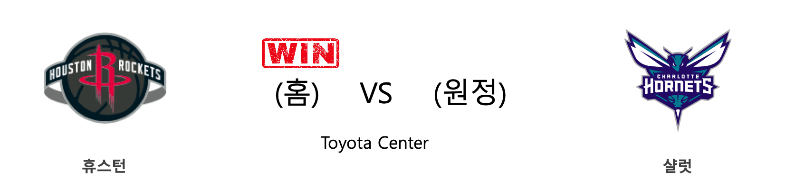
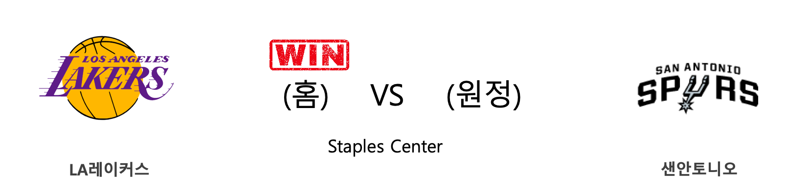

####  휴스턴(홈) VS 샬럿(원정) 

<table class="tg">
  <tr>
    <th class="tg-rr9t">HOU</th>
    <th class="tg-rr9t">팀</th>
    <th class="tg-rr9t">CHA</th>
  </tr>
  <tr>
    <td class="tg-dcpn">1승 0패</td>
    <td class="tg-rr9t">시즌 상대전적</td>
    <td class="tg-dcpn">0승 1패</td>
  </tr>
  <tr>
    <td class="tg-dcpn">125</td>
    <td class="tg-rr9t">점수</td>
    <td class="tg-dcpn">110</td>
  </tr>
  <tr>
    <td class="tg-dcpn">23/37(62%)</td>
    <td class="tg-rr9t">2점(%)</td>
    <td class="tg-dcpn">26/50(52%)</td>
  </tr>
  <tr>
    <td class="tg-dcpn">20/60(33%)</td>
    <td class="tg-rr9t">3점(%)</td>
    <td class="tg-dcpn">13/33(39%)</td>
  </tr>
  <tr>
    <td class="tg-dcpn">19/23(83%)</td>
    <td class="tg-rr9t">자유투(%)</td>
    <td class="tg-dcpn">19/24(79%)</td>
  </tr>
  <tr>
    <td class="tg-dcpn">41</td>
    <td class="tg-rr9t">리바운드</td>
    <td class="tg-dcpn">53</td>
  </tr>
  <tr>
    <td class="tg-dcpn">25</td>
    <td class="tg-rr9t">어시스트</td>
    <td class="tg-dcpn">22</td>
  </tr>
  <tr>
    <td class="tg-dcpn">11</td>
    <td class="tg-rr9t">스틸</td>
    <td class="tg-dcpn">2</td>
  </tr>
  <tr>
    <td class="tg-dcpn">5</td>
    <td class="tg-rr9t">블록</td>
    <td class="tg-dcpn">2</td>
  </tr>
  <tr>
    <td class="tg-dcpn">4</td>
    <td class="tg-rr9t">턴오버</td>
    <td class="tg-dcpn">17</td>
  </tr>
  <tr>
    <td class="tg-dcpn">DanuelHouseJr(22) EricGordonF(16) JamesHardenG(40)</td>
    <td class="tg-rr9t">주요 득점선수</td>
    <td class="tg-dcpn">MilesBridgesF(20) TerryRozierG(20) MalikMonk(19) Devonte'Graha(16)</td>
  </tr>
</table>

#### 경기 관련 주요 기사         

[[오늘의 NBA] (2/5) 야니스 아테토쿤보, 코트를 지배하는 MVP](http://sports.news.naver.com/basketball/news/read.nhn?oid=486&aid=0000001218)

[[오늘의 NBA] (1/25) 러셀 웨스트브룩의 '마이 웨이'](http://sports.news.naver.com/basketball/news/read.nhn?oid=486&aid=0000001207)

[[오늘의 NBA] (2/4) 크리스탑스 포르징기스, 댈러스의 새로운 대들보](http://sports.news.naver.com/basketball/news/read.nhn?oid=486&aid=0000001217)

[[오늘의 NBA] (1/16) 올랜도, 난적 LA 레이커스를 제압하다](http://sports.news.naver.com/basketball/news/read.nhn?oid=486&aid=0000001198)

[[오늘의 NBA] (1/21) 데미안 릴라드, 포틀랜드의 슈퍼스타](http://sports.news.naver.com/basketball/news/read.nhn?oid=486&aid=0000001203)

        
        

####  뉴올리언스(홈) VS 밀워키(원정) 

<table class="tg">
  <tr>
    <th class="tg-rr9t">NOP</th>
    <th class="tg-rr9t">팀</th>
    <th class="tg-rr9t">MIL</th>
  </tr>
  <tr>
    <td class="tg-dcpn">0승 2패</td>
    <td class="tg-rr9t">시즌 상대전적</td>
    <td class="tg-dcpn">2승 0패</td>
  </tr>
  <tr>
    <td class="tg-dcpn">108</td>
    <td class="tg-rr9t">점수</td>
    <td class="tg-dcpn">120</td>
  </tr>
  <tr>
    <td class="tg-dcpn">24/50(48%)</td>
    <td class="tg-rr9t">2점(%)</td>
    <td class="tg-dcpn">37/66(56%)</td>
  </tr>
  <tr>
    <td class="tg-dcpn">14/49(29%)</td>
    <td class="tg-rr9t">3점(%)</td>
    <td class="tg-dcpn">11/36(31%)</td>
  </tr>
  <tr>
    <td class="tg-dcpn">18/24(75%)</td>
    <td class="tg-rr9t">자유투(%)</td>
    <td class="tg-dcpn">13/17(76%)</td>
  </tr>
  <tr>
    <td class="tg-dcpn">49</td>
    <td class="tg-rr9t">리바운드</td>
    <td class="tg-dcpn">53</td>
  </tr>
  <tr>
    <td class="tg-dcpn">26</td>
    <td class="tg-rr9t">어시스트</td>
    <td class="tg-dcpn">34</td>
  </tr>
  <tr>
    <td class="tg-dcpn">10</td>
    <td class="tg-rr9t">스틸</td>
    <td class="tg-dcpn">11</td>
  </tr>
  <tr>
    <td class="tg-dcpn">6</td>
    <td class="tg-rr9t">블록</td>
    <td class="tg-dcpn">7</td>
  </tr>
  <tr>
    <td class="tg-dcpn">17</td>
    <td class="tg-rr9t">턴오버</td>
    <td class="tg-dcpn">17</td>
  </tr>
  <tr>
    <td class="tg-dcpn">ZionWilliamso(20) BrandonIngram(32)</td>
    <td class="tg-rr9t">주요 득점선수</td>
    <td class="tg-dcpn">GiannisAnteto(34) WesleyMatthew(17) KhrisMiddleto(20) EricBledsoeG(16)</td>
  </tr>
</table>

#### 경기 관련 주요 기사         

[[오늘의 NBA] (1/19) 르브론 제임스, 휴스턴을 저격하다!](http://sports.news.naver.com/basketball/news/read.nhn?oid=486&aid=0000001201)

[[오늘의 NBA] (2/3) 혁명가 마이크 댄토니가 꿈꾸는 세상](http://sports.news.naver.com/basketball/news/read.nhn?oid=486&aid=0000001216)

[[오늘의 NBA] (1/29) 밀워키, 우승 후보 1순위 입지를 구축하다](http://sports.news.naver.com/basketball/news/read.nhn?oid=486&aid=0000001211)

[[오늘의 NBA] (1/21) 데미안 릴라드, 포틀랜드의 슈퍼스타](http://sports.news.naver.com/basketball/news/read.nhn?oid=486&aid=0000001203)

[[오늘의 NBA] (2/1) LAL, 코비 브라이언트와의 작별](http://sports.news.naver.com/basketball/news/read.nhn?oid=486&aid=0000001214)

        
        

####  덴버(홈) VS 포틀랜드(원정) 

<table class="tg">
  <tr>
    <th class="tg-rr9t">DEN</th>
    <th class="tg-rr9t">팀</th>
    <th class="tg-rr9t">POR</th>
  </tr>
  <tr>
    <td class="tg-dcpn">2승 0패</td>
    <td class="tg-rr9t">시즌 상대전적</td>
    <td class="tg-dcpn">0승 2패</td>
  </tr>
  <tr>
    <td class="tg-dcpn">127</td>
    <td class="tg-rr9t">점수</td>
    <td class="tg-dcpn">99</td>
  </tr>
  <tr>
    <td class="tg-dcpn">29/56(52%)</td>
    <td class="tg-rr9t">2점(%)</td>
    <td class="tg-dcpn">27/60(45%)</td>
  </tr>
  <tr>
    <td class="tg-dcpn">17/34(50%)</td>
    <td class="tg-rr9t">3점(%)</td>
    <td class="tg-dcpn">9/31(29%)</td>
  </tr>
  <tr>
    <td class="tg-dcpn">18/25(72%)</td>
    <td class="tg-rr9t">자유투(%)</td>
    <td class="tg-dcpn">18/22(82%)</td>
  </tr>
  <tr>
    <td class="tg-dcpn">50</td>
    <td class="tg-rr9t">리바운드</td>
    <td class="tg-dcpn">36</td>
  </tr>
  <tr>
    <td class="tg-dcpn">30</td>
    <td class="tg-rr9t">어시스트</td>
    <td class="tg-dcpn">16</td>
  </tr>
  <tr>
    <td class="tg-dcpn">5</td>
    <td class="tg-rr9t">스틸</td>
    <td class="tg-dcpn">5</td>
  </tr>
  <tr>
    <td class="tg-dcpn">7</td>
    <td class="tg-rr9t">블록</td>
    <td class="tg-dcpn">6</td>
  </tr>
  <tr>
    <td class="tg-dcpn">13</td>
    <td class="tg-rr9t">턴오버</td>
    <td class="tg-dcpn">9</td>
  </tr>
  <tr>
    <td class="tg-dcpn">NikolaJokicC(29) JamalMurrayG(20) WillBartonF(16) JeramiGrantF(17)</td>
    <td class="tg-rr9t">주요 득점선수</td>
    <td class="tg-dcpn">CJMcCollumG(20) DamianLillard(21)</td>
  </tr>
</table>

#### 경기 관련 주요 기사         

[[오늘의 NBA] (1/25) 러셀 웨스트브룩의 '마이 웨이'](http://sports.news.naver.com/basketball/news/read.nhn?oid=486&aid=0000001207)

[[오늘의 NBA] (1/16) 올랜도, 난적 LA 레이커스를 제압하다](http://sports.news.naver.com/basketball/news/read.nhn?oid=486&aid=0000001198)

[[오늘의 NBA] (2/5) 야니스 아테토쿤보, 코트를 지배하는 MVP](http://sports.news.naver.com/basketball/news/read.nhn?oid=486&aid=0000001218)

[La era de la desigualdad](https://www.nytimes.com/es/2019/12/02/espanol/la-era-de-la-desigualdad.html?partner=naver)

[Arrestos por sobornos en la reparación de la red eléctrica en Puerto Rico](https://www.nytimes.com/es/2019/09/11/espanol/america-latina/sobornos-fema-puerto-rico.html?partner=naver)

        
        

####  LA레이커스(홈) VS 샌안토니오(원정) 

<table class="tg">
  <tr>
    <th class="tg-rr9t">LAL</th>
    <th class="tg-rr9t">팀</th>
    <th class="tg-rr9t">SAS</th>
  </tr>
  <tr>
    <td class="tg-dcpn">3승 0패</td>
    <td class="tg-rr9t">시즌 상대전적</td>
    <td class="tg-dcpn">0승 3패</td>
  </tr>
  <tr>
    <td class="tg-dcpn">129</td>
    <td class="tg-rr9t">점수</td>
    <td class="tg-dcpn">102</td>
  </tr>
  <tr>
    <td class="tg-dcpn">38/57(67%)</td>
    <td class="tg-rr9t">2점(%)</td>
    <td class="tg-dcpn">27/64(42%)</td>
  </tr>
  <tr>
    <td class="tg-dcpn">12/28(43%)</td>
    <td class="tg-rr9t">3점(%)</td>
    <td class="tg-dcpn">13/27(48%)</td>
  </tr>
  <tr>
    <td class="tg-dcpn">17/25(68%)</td>
    <td class="tg-rr9t">자유투(%)</td>
    <td class="tg-dcpn">9/15(60%)</td>
  </tr>
  <tr>
    <td class="tg-dcpn">58</td>
    <td class="tg-rr9t">리바운드</td>
    <td class="tg-dcpn">28</td>
  </tr>
  <tr>
    <td class="tg-dcpn">28</td>
    <td class="tg-rr9t">어시스트</td>
    <td class="tg-dcpn">21</td>
  </tr>
  <tr>
    <td class="tg-dcpn">4</td>
    <td class="tg-rr9t">스틸</td>
    <td class="tg-dcpn">5</td>
  </tr>
  <tr>
    <td class="tg-dcpn">4</td>
    <td class="tg-rr9t">블록</td>
    <td class="tg-dcpn">2</td>
  </tr>
  <tr>
    <td class="tg-dcpn">13</td>
    <td class="tg-rr9t">턴오버</td>
    <td class="tg-dcpn">5</td>
  </tr>
  <tr>
    <td class="tg-dcpn">LeBronJamesF(36) AnthonyDavisF(18) KyleKuzma(18)</td>
    <td class="tg-rr9t">주요 득점선수</td>
    <td class="tg-dcpn">DeMarDeRozanF(28)</td>
  </tr>
</table>

#### 경기 관련 주요 기사         

[[오늘의 NBA] (1/27) 자 모란트, 4쿼터를 지배하는 신인](http://sports.news.naver.com/basketball/news/read.nhn?oid=486&aid=0000001209)

[[오늘의 NBA] (2/5) 야니스 아테토쿤보, 코트를 지배하는 MVP](http://sports.news.naver.com/basketball/news/read.nhn?oid=486&aid=0000001218)

['레너드 맹활약' 클리퍼스, SAS 꺾고 선두 LAL 추격](http://news1.kr/articles/?3833142)

[[오늘의 NBA] (2/2) '경이로운 자' 데미안 릴라드의 5차 슈팅 혁명](http://sports.news.naver.com/basketball/news/read.nhn?oid=486&aid=0000001215)

[[오늘의 NBA] (2/1) LAL, 코비 브라이언트와의 작별](http://sports.news.naver.com/basketball/news/read.nhn?oid=486&aid=0000001214)

        
        

#### 리그 (Eastern) 순위
    

<table class="tg">
  <tr>
    <th class="tg-d14o">순위</th>
    <th class="tg-d14o">팀명</th>
    <th class="tg-d14o">경기수</th>
    <th class="tg-d14o">승</th>
    <th class="tg-d14o">패</th>
    <th class="tg-d14o">승차</th>
    <th class="tg-d14o">승률</th>
  </tr>
  
<tr>
    <td class="tg-50j8">1</td>
    <td class="tg-50j8">MIL</td>
    <td class="tg-50j8">47</td>
    <td class="tg-50j8">40</td>
    <td class="tg-50j8">7</td>
    <td class="tg-50j8">0</td>
    <td class="tg-50j8">0.851</td>
</tr>

<tr>
    <td class="tg-50j8">2</td>
    <td class="tg-50j8">TOR</td>
    <td class="tg-50j8">49</td>
    <td class="tg-50j8">35</td>
    <td class="tg-50j8">14</td>
    <td class="tg-50j8">5</td>
    <td class="tg-50j8">0.714</td>
</tr>

<tr>
    <td class="tg-50j8">3</td>
    <td class="tg-50j8">MIA</td>
    <td class="tg-50j8">47</td>
    <td class="tg-50j8">34</td>
    <td class="tg-50j8">13</td>
    <td class="tg-50j8">6</td>
    <td class="tg-50j8">0.723</td>
</tr>

<tr>
    <td class="tg-50j8">4</td>
    <td class="tg-50j8">BOS</td>
    <td class="tg-50j8">46</td>
    <td class="tg-50j8">32</td>
    <td class="tg-50j8">14</td>
    <td class="tg-50j8">8</td>
    <td class="tg-50j8">0.696</td>
</tr>

<tr>
    <td class="tg-50j8">5</td>
    <td class="tg-50j8">IND</td>
    <td class="tg-50j8">50</td>
    <td class="tg-50j8">31</td>
    <td class="tg-50j8">19</td>
    <td class="tg-50j8">9</td>
    <td class="tg-50j8">0.62</td>
</tr>

<tr>
    <td class="tg-50j8">6</td>
    <td class="tg-50j8">PHI</td>
    <td class="tg-50j8">48</td>
    <td class="tg-50j8">29</td>
    <td class="tg-50j8">19</td>
    <td class="tg-50j8">11</td>
    <td class="tg-50j8">0.604</td>
</tr>

<tr>
    <td class="tg-50j8">7</td>
    <td class="tg-50j8">BKN</td>
    <td class="tg-50j8">48</td>
    <td class="tg-50j8">22</td>
    <td class="tg-50j8">26</td>
    <td class="tg-50j8">18</td>
    <td class="tg-50j8">0.458</td>
</tr>

<tr>
    <td class="tg-50j8">8</td>
    <td class="tg-50j8">ORL</td>
    <td class="tg-50j8">49</td>
    <td class="tg-50j8">22</td>
    <td class="tg-50j8">27</td>
    <td class="tg-50j8">18</td>
    <td class="tg-50j8">0.449</td>
</tr>

<tr>
    <td class="tg-50j8">9</td>
    <td class="tg-50j8">DET</td>
    <td class="tg-50j8">49</td>
    <td class="tg-50j8">18</td>
    <td class="tg-50j8">31</td>
    <td class="tg-50j8">22</td>
    <td class="tg-50j8">0.367</td>
</tr>

<tr>
    <td class="tg-50j8">10</td>
    <td class="tg-50j8">CHI</td>
    <td class="tg-50j8">50</td>
    <td class="tg-50j8">18</td>
    <td class="tg-50j8">32</td>
    <td class="tg-50j8">22</td>
    <td class="tg-50j8">0.36</td>
</tr>

<tr>
    <td class="tg-50j8">11</td>
    <td class="tg-50j8">WAS</td>
    <td class="tg-50j8">47</td>
    <td class="tg-50j8">16</td>
    <td class="tg-50j8">31</td>
    <td class="tg-50j8">24</td>
    <td class="tg-50j8">0.34</td>
</tr>

<tr>
    <td class="tg-50j8">12</td>
    <td class="tg-50j8">NYK</td>
    <td class="tg-50j8">50</td>
    <td class="tg-50j8">15</td>
    <td class="tg-50j8">35</td>
    <td class="tg-50j8">25</td>
    <td class="tg-50j8">0.3</td>
</tr>

<tr>
    <td class="tg-50j8">12</td>
    <td class="tg-50j8">CHA</td>
    <td class="tg-50j8">50</td>
    <td class="tg-50j8">15</td>
    <td class="tg-50j8">35</td>
    <td class="tg-50j8">25</td>
    <td class="tg-50j8">0.3</td>
</tr>

<tr>
    <td class="tg-50j8">14</td>
    <td class="tg-50j8">ATL</td>
    <td class="tg-50j8">49</td>
    <td class="tg-50j8">12</td>
    <td class="tg-50j8">37</td>
    <td class="tg-50j8">28</td>
    <td class="tg-50j8">0.245</td>
</tr>

<tr>
    <td class="tg-50j8">15</td>
    <td class="tg-50j8">CLE</td>
    <td class="tg-50j8">48</td>
    <td class="tg-50j8">11</td>
    <td class="tg-50j8">37</td>
    <td class="tg-50j8">29</td>
    <td class="tg-50j8">0.229</td>
</tr>
</table> 
#### 리그 (Western) 순위
    

<table class="tg">
  <tr>
    <th class="tg-d14o">순위</th>
    <th class="tg-d14o">팀명</th>
    <th class="tg-d14o">경기수</th>
    <th class="tg-d14o">승</th>
    <th class="tg-d14o">패</th>
    <th class="tg-d14o">승차</th>
    <th class="tg-d14o">승률</th>
  </tr>
  
<tr>
    <td class="tg-50j8">1</td>
    <td class="tg-50j8">LAL</td>
    <td class="tg-50j8">48</td>
    <td class="tg-50j8">37</td>
    <td class="tg-50j8">11</td>
    <td class="tg-50j8">3</td>
    <td class="tg-50j8">0.771</td>
</tr>

<tr>
    <td class="tg-50j8">2</td>
    <td class="tg-50j8">LAC</td>
    <td class="tg-50j8">50</td>
    <td class="tg-50j8">35</td>
    <td class="tg-50j8">15</td>
    <td class="tg-50j8">5</td>
    <td class="tg-50j8">0.7</td>
</tr>

<tr>
    <td class="tg-50j8">3</td>
    <td class="tg-50j8">DEN</td>
    <td class="tg-50j8">48</td>
    <td class="tg-50j8">34</td>
    <td class="tg-50j8">14</td>
    <td class="tg-50j8">6</td>
    <td class="tg-50j8">0.708</td>
</tr>

<tr>
    <td class="tg-50j8">4</td>
    <td class="tg-50j8">UTA</td>
    <td class="tg-50j8">48</td>
    <td class="tg-50j8">31</td>
    <td class="tg-50j8">17</td>
    <td class="tg-50j8">9</td>
    <td class="tg-50j8">0.646</td>
</tr>

<tr>
    <td class="tg-50j8">5</td>
    <td class="tg-50j8">HOU</td>
    <td class="tg-50j8">49</td>
    <td class="tg-50j8">31</td>
    <td class="tg-50j8">18</td>
    <td class="tg-50j8">9</td>
    <td class="tg-50j8">0.633</td>
</tr>

<tr>
    <td class="tg-50j8">6</td>
    <td class="tg-50j8">OKC</td>
    <td class="tg-50j8">49</td>
    <td class="tg-50j8">30</td>
    <td class="tg-50j8">19</td>
    <td class="tg-50j8">10</td>
    <td class="tg-50j8">0.612</td>
</tr>

<tr>
    <td class="tg-50j8">7</td>
    <td class="tg-50j8">DAL</td>
    <td class="tg-50j8">47</td>
    <td class="tg-50j8">29</td>
    <td class="tg-50j8">18</td>
    <td class="tg-50j8">11</td>
    <td class="tg-50j8">0.617</td>
</tr>

<tr>
    <td class="tg-50j8">8</td>
    <td class="tg-50j8">MEM</td>
    <td class="tg-50j8">49</td>
    <td class="tg-50j8">24</td>
    <td class="tg-50j8">25</td>
    <td class="tg-50j8">16</td>
    <td class="tg-50j8">0.49</td>
</tr>

<tr>
    <td class="tg-50j8">9</td>
    <td class="tg-50j8">POR</td>
    <td class="tg-50j8">48</td>
    <td class="tg-50j8">23</td>
    <td class="tg-50j8">25</td>
    <td class="tg-50j8">17</td>
    <td class="tg-50j8">0.479</td>
</tr>

<tr>
    <td class="tg-50j8">10</td>
    <td class="tg-50j8">SAS</td>
    <td class="tg-50j8">49</td>
    <td class="tg-50j8">22</td>
    <td class="tg-50j8">27</td>
    <td class="tg-50j8">18</td>
    <td class="tg-50j8">0.449</td>
</tr>

<tr>
    <td class="tg-50j8">11</td>
    <td class="tg-50j8">NOP</td>
    <td class="tg-50j8">49</td>
    <td class="tg-50j8">19</td>
    <td class="tg-50j8">30</td>
    <td class="tg-50j8">21</td>
    <td class="tg-50j8">0.388</td>
</tr>

<tr>
    <td class="tg-50j8">12</td>
    <td class="tg-50j8">SAC</td>
    <td class="tg-50j8">50</td>
    <td class="tg-50j8">19</td>
    <td class="tg-50j8">31</td>
    <td class="tg-50j8">21</td>
    <td class="tg-50j8">0.38</td>
</tr>

<tr>
    <td class="tg-50j8">13</td>
    <td class="tg-50j8">PHX</td>
    <td class="tg-50j8">48</td>
    <td class="tg-50j8">18</td>
    <td class="tg-50j8">30</td>
    <td class="tg-50j8">22</td>
    <td class="tg-50j8">0.375</td>
</tr>

<tr>
    <td class="tg-50j8">14</td>
    <td class="tg-50j8">MIN</td>
    <td class="tg-50j8">47</td>
    <td class="tg-50j8">14</td>
    <td class="tg-50j8">33</td>
    <td class="tg-50j8">26</td>
    <td class="tg-50j8">0.298</td>
</tr>

<tr>
    <td class="tg-50j8">15</td>
    <td class="tg-50j8">GSW</td>
    <td class="tg-50j8">50</td>
    <td class="tg-50j8">12</td>
    <td class="tg-50j8">38</td>
    <td class="tg-50j8">28</td>
    <td class="tg-50j8">0.24</td>
</tr>
</table> 

        
        
#nba #미국농구 #엔비에이 #농구분석 #토토 #스포츠토토 #경기예측 #농구결과 #20200205 #휴스턴 #샬럿 #뉴올리언스 #밀워키 #덴버 #포틀랜드 #LA레이커스 #샌안토니오 #휴스턴샬럿 #뉴올리언스밀워키 #덴버포틀랜드 #LA레이커스샌안토니오 