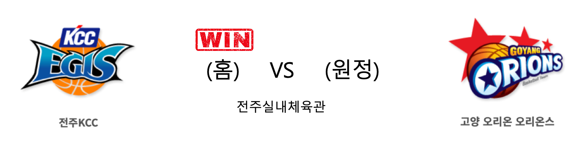

####  전주KCC(홈) VS 고양오리온(원정) 

<table class="tg">
  <tr>
    <th class="tg-rr9t">전주KCC</th>
    <th class="tg-rr9t">팀</th>
    <th class="tg-rr9t">고양오리온</th>
  </tr>
  <tr>
    <td class="tg-dcpn">4승 1패</td>
    <td class="tg-rr9t">시즌 상대전적</td>
    <td class="tg-dcpn">1승 4패</td>
  </tr>
  <tr>
    <td class="tg-dcpn">78</td>
    <td class="tg-rr9t">점수</td>
    <td class="tg-dcpn">70</td>
  </tr>
  <tr>
    <td class="tg-dcpn">20/37(54%)</td>
    <td class="tg-rr9t">2점(%)</td>
    <td class="tg-dcpn">21/51(41%)</td>
  </tr>
  <tr>
    <td class="tg-dcpn">6/23(26%)</td>
    <td class="tg-rr9t">3점(%)</td>
    <td class="tg-dcpn">8/27(30%)</td>
  </tr>
  <tr>
    <td class="tg-dcpn">20/24(83%)</td>
    <td class="tg-rr9t">자유투(%)</td>
    <td class="tg-dcpn">4/7(57%)</td>
  </tr>
  <tr>
    <td class="tg-dcpn">44</td>
    <td class="tg-rr9t">리바운드</td>
    <td class="tg-dcpn">34</td>
  </tr>
  <tr>
    <td class="tg-dcpn">1</td>
    <td class="tg-rr9t">어시스트</td>
    <td class="tg-dcpn">1</td>
  </tr>
  <tr>
    <td class="tg-dcpn">14</td>
    <td class="tg-rr9t">스틸</td>
    <td class="tg-dcpn">7</td>
  </tr>
  <tr>
    <td class="tg-dcpn">7</td>
    <td class="tg-rr9t">블록</td>
    <td class="tg-dcpn">8</td>
  </tr>
  <tr>
    <td class="tg-dcpn">15</td>
    <td class="tg-rr9t">턴오버</td>
    <td class="tg-dcpn">18</td>
  </tr>
  <tr>
    <td class="tg-dcpn">송교창(17) 이정현(19)</td>
    <td class="tg-rr9t">주요 득점선수</td>
    <td class="tg-dcpn"></td>
  </tr>
</table>

#### 경기 관련 주요 기사         

[KCC, 이정현 19점 앞세워 오리온 꺾고 3연승](http://www.sportsseoul.com/news/read/881319)

[[JB프리뷰] 부상에 흔들린 SK는 LG 기세 막을까, KCC는 최하위 오리온 맞이](http://sports.news.naver.com/basketball/news/read.nhn?oid=065&aid=0000196917)

['이정현-송교창 활약' KCC, 오리온 꺾고 3연승 행진](http://www.mydaily.co.kr/new_yk/html/read.php?newsid=202002071652414203&ext=na)

        
        

####  서울SK(홈) VS 창원LG(원정) 

<table class="tg">
  <tr>
    <th class="tg-rr9t">서울SK</th>
    <th class="tg-rr9t">팀</th>
    <th class="tg-rr9t">창원LG</th>
  </tr>
  <tr>
    <td class="tg-dcpn">4승 1패</td>
    <td class="tg-rr9t">시즌 상대전적</td>
    <td class="tg-dcpn">1승 4패</td>
  </tr>
  <tr>
    <td class="tg-dcpn">73</td>
    <td class="tg-rr9t">점수</td>
    <td class="tg-dcpn">58</td>
  </tr>
  <tr>
    <td class="tg-dcpn">23/46(50%)</td>
    <td class="tg-rr9t">2점(%)</td>
    <td class="tg-dcpn">17/38(45%)</td>
  </tr>
  <tr>
    <td class="tg-dcpn">7/29(24%)</td>
    <td class="tg-rr9t">3점(%)</td>
    <td class="tg-dcpn">5/20(25%)</td>
  </tr>
  <tr>
    <td class="tg-dcpn">6/8(75%)</td>
    <td class="tg-rr9t">자유투(%)</td>
    <td class="tg-dcpn">9/16(56%)</td>
  </tr>
  <tr>
    <td class="tg-dcpn">41</td>
    <td class="tg-rr9t">리바운드</td>
    <td class="tg-dcpn">32</td>
  </tr>
  <tr>
    <td class="tg-dcpn">2</td>
    <td class="tg-rr9t">어시스트</td>
    <td class="tg-dcpn">1</td>
  </tr>
  <tr>
    <td class="tg-dcpn">8</td>
    <td class="tg-rr9t">스틸</td>
    <td class="tg-dcpn">11</td>
  </tr>
  <tr>
    <td class="tg-dcpn">7</td>
    <td class="tg-rr9t">블록</td>
    <td class="tg-dcpn">4</td>
  </tr>
  <tr>
    <td class="tg-dcpn">15</td>
    <td class="tg-rr9t">턴오버</td>
    <td class="tg-dcpn">13</td>
  </tr>
  <tr>
    <td class="tg-dcpn">애런 헤인즈(17)</td>
    <td class="tg-rr9t">주요 득점선수</td>
    <td class="tg-dcpn">캐디 라렌(20)</td>
  </tr>
</table>

#### 경기 관련 주요 기사         

[[BK Review] '헤인즈는 못 말려' SK, 선형-준용 공백 딛고 LG 제압… 선두 1G 차 추격](http://www.basketkorea.com/news/articleView.html?idxno=192066)

[‘부상병동’ SK, 안영준 7일 LG전 출격…전태풍도 복귀](http://www.mydaily.co.kr/new_yk/html/read.php?newsid=202002071635352341&ext=na)

[[포토] LG 상대 대승 거두는 SK](http://sports.chosun.com/news/ntype.htm?id=202002070100057540003741&servicedate=20200207)

['안영준 12점' SK, LG에 완승…선두권 경쟁 이어가](http://yna.kr/AKR20200207169000007?did=1195m)

        
        

#### 리그 순위

<table class="tg">
  <tr>
    <th class="tg-d14o">순위</th>
    <th class="tg-d14o">팀명</th>
    <th class="tg-d14o">경기수</th>
    <th class="tg-d14o">승</th>
    <th class="tg-d14o">패</th>
    <th class="tg-d14o">승차</th>
    <th class="tg-d14o">승률</th>
  </tr>
  
<tr>
    <td class="tg-50j8">1</td>
    <td class="tg-50j8">원주DB</td>
    <td class="tg-50j8">39</td>
    <td class="tg-50j8">25</td>
    <td class="tg-50j8">14</td>
    <td class="tg-50j8">0</td>
    <td class="tg-50j8">0.641</td>
</tr>

<tr>
    <td class="tg-50j8">2</td>
    <td class="tg-50j8">안양KGC</td>
    <td class="tg-50j8">38</td>
    <td class="tg-50j8">24</td>
    <td class="tg-50j8">14</td>
    <td class="tg-50j8">1</td>
    <td class="tg-50j8">0.632</td>
</tr>

<tr>
    <td class="tg-50j8">3</td>
    <td class="tg-50j8">서울SK</td>
    <td class="tg-50j8">39</td>
    <td class="tg-50j8">24</td>
    <td class="tg-50j8">15</td>
    <td class="tg-50j8">1</td>
    <td class="tg-50j8">0.615</td>
</tr>

<tr>
    <td class="tg-50j8">4</td>
    <td class="tg-50j8">전주KCC</td>
    <td class="tg-50j8">39</td>
    <td class="tg-50j8">22</td>
    <td class="tg-50j8">17</td>
    <td class="tg-50j8">3</td>
    <td class="tg-50j8">0.564</td>
</tr>

<tr>
    <td class="tg-50j8">5</td>
    <td class="tg-50j8">인천전자랜드</td>
    <td class="tg-50j8">39</td>
    <td class="tg-50j8">20</td>
    <td class="tg-50j8">19</td>
    <td class="tg-50j8">5</td>
    <td class="tg-50j8">0.513</td>
</tr>

<tr>
    <td class="tg-50j8">6</td>
    <td class="tg-50j8">부산KT</td>
    <td class="tg-50j8">39</td>
    <td class="tg-50j8">19</td>
    <td class="tg-50j8">20</td>
    <td class="tg-50j8">6</td>
    <td class="tg-50j8">0.487</td>
</tr>

<tr>
    <td class="tg-50j8">7</td>
    <td class="tg-50j8">서울삼성</td>
    <td class="tg-50j8">39</td>
    <td class="tg-50j8">17</td>
    <td class="tg-50j8">22</td>
    <td class="tg-50j8">8</td>
    <td class="tg-50j8">0.436</td>
</tr>

<tr>
    <td class="tg-50j8">8</td>
    <td class="tg-50j8">울산현대모비스</td>
    <td class="tg-50j8">38</td>
    <td class="tg-50j8">16</td>
    <td class="tg-50j8">22</td>
    <td class="tg-50j8">9</td>
    <td class="tg-50j8">0.421</td>
</tr>

<tr>
    <td class="tg-50j8">9</td>
    <td class="tg-50j8">창원LG</td>
    <td class="tg-50j8">39</td>
    <td class="tg-50j8">15</td>
    <td class="tg-50j8">24</td>
    <td class="tg-50j8">10</td>
    <td class="tg-50j8">0.385</td>
</tr>

<tr>
    <td class="tg-50j8">10</td>
    <td class="tg-50j8">고양오리온</td>
    <td class="tg-50j8">39</td>
    <td class="tg-50j8">12</td>
    <td class="tg-50j8">27</td>
    <td class="tg-50j8">13</td>
    <td class="tg-50j8">0.308</td>
</tr>
</table> 

        
        
#kbl #국내농구 #농구분석 #토토 #스포츠토토 #경기예측 #농구결과 #20200207 #전주KCC #고양오리온 #서울SK #창원LG #전주KCC고양오리온 #서울SK창원LG 