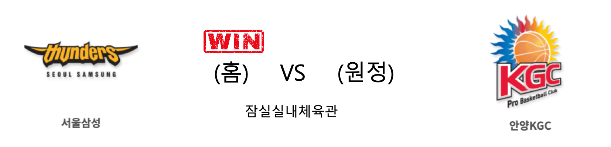
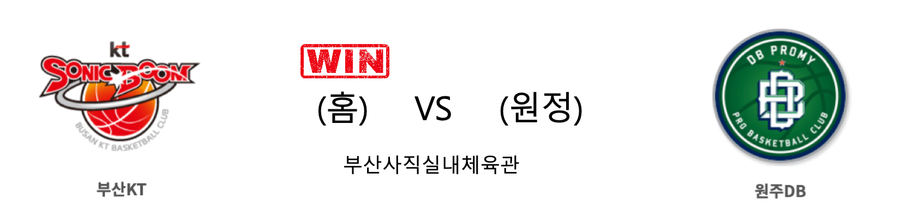

####  서울삼성(홈) VS 안양KGC(원정) 

<table class="tg">
  <tr>
    <th class="tg-rr9t">서울삼성</th>
    <th class="tg-rr9t">팀</th>
    <th class="tg-rr9t">안양KGC</th>
  </tr>
  <tr>
    <td class="tg-dcpn">2승 3패</td>
    <td class="tg-rr9t">시즌 상대전적</td>
    <td class="tg-dcpn">3승 2패</td>
  </tr>
  <tr>
    <td class="tg-dcpn">84</td>
    <td class="tg-rr9t">점수</td>
    <td class="tg-dcpn">78</td>
  </tr>
  <tr>
    <td class="tg-dcpn">16/30(53%)</td>
    <td class="tg-rr9t">2점(%)</td>
    <td class="tg-dcpn">17/34(50%)</td>
  </tr>
  <tr>
    <td class="tg-dcpn">11/34(32%)</td>
    <td class="tg-rr9t">3점(%)</td>
    <td class="tg-dcpn">12/36(33%)</td>
  </tr>
  <tr>
    <td class="tg-dcpn">19/21(90%)</td>
    <td class="tg-rr9t">자유투(%)</td>
    <td class="tg-dcpn">8/12(67%)</td>
  </tr>
  <tr>
    <td class="tg-dcpn">39</td>
    <td class="tg-rr9t">리바운드</td>
    <td class="tg-dcpn">33</td>
  </tr>
  <tr>
    <td class="tg-dcpn">1</td>
    <td class="tg-rr9t">어시스트</td>
    <td class="tg-dcpn">2</td>
  </tr>
  <tr>
    <td class="tg-dcpn">10</td>
    <td class="tg-rr9t">스틸</td>
    <td class="tg-dcpn">7</td>
  </tr>
  <tr>
    <td class="tg-dcpn">6</td>
    <td class="tg-rr9t">블록</td>
    <td class="tg-dcpn">5</td>
  </tr>
  <tr>
    <td class="tg-dcpn">21</td>
    <td class="tg-rr9t">턴오버</td>
    <td class="tg-dcpn">19</td>
  </tr>
  <tr>
    <td class="tg-dcpn">닉 미네라스(25) 천기범(15)</td>
    <td class="tg-rr9t">주요 득점선수</td>
    <td class="tg-dcpn">브랜든 브라운(26) 문성곤(21)</td>
  </tr>
</table>

#### 경기 관련 주요 기사         

['PO 진출 위한 전투' 삼성, 홈에서 KGC인삼공사와 5R 맞대결](http://www.basketkorea.com/news/articleView.html?idxno=192097)

[[JB화보] 삼성, KGC에 84-78로 승리](http://sports.news.naver.com/basketball/news/read.nhn?oid=065&aid=0000196987)

[3연승 삼성, 6강 PO 경쟁 '태풍의 눈' 급부상](http://www.dailian.co.kr/news/view/867227?sc=Naver)

[미네라스 25점 폭격 삼성, KGC 꺾고 3연승](https://www.seoul.co.kr/news/newsView.php?id=20200208500048&wlog_tag3=naver)

        
        

####  부산KT(홈) VS 원주DB(원정) 

<table class="tg">
  <tr>
    <th class="tg-rr9t">부산KT</th>
    <th class="tg-rr9t">팀</th>
    <th class="tg-rr9t">원주DB</th>
  </tr>
  <tr>
    <td class="tg-dcpn">1승 4패</td>
    <td class="tg-rr9t">시즌 상대전적</td>
    <td class="tg-dcpn">4승 1패</td>
  </tr>
  <tr>
    <td class="tg-dcpn">91</td>
    <td class="tg-rr9t">점수</td>
    <td class="tg-dcpn">86</td>
  </tr>
  <tr>
    <td class="tg-dcpn">23/49(47%)</td>
    <td class="tg-rr9t">2점(%)</td>
    <td class="tg-dcpn">30/52(58%)</td>
  </tr>
  <tr>
    <td class="tg-dcpn">11/24(46%)</td>
    <td class="tg-rr9t">3점(%)</td>
    <td class="tg-dcpn">4/16(25%)</td>
  </tr>
  <tr>
    <td class="tg-dcpn">12/18(67%)</td>
    <td class="tg-rr9t">자유투(%)</td>
    <td class="tg-dcpn">14/23(61%)</td>
  </tr>
  <tr>
    <td class="tg-dcpn">28</td>
    <td class="tg-rr9t">리바운드</td>
    <td class="tg-dcpn">39</td>
  </tr>
  <tr>
    <td class="tg-dcpn">0</td>
    <td class="tg-rr9t">어시스트</td>
    <td class="tg-dcpn">1</td>
  </tr>
  <tr>
    <td class="tg-dcpn">7</td>
    <td class="tg-rr9t">스틸</td>
    <td class="tg-dcpn">12</td>
  </tr>
  <tr>
    <td class="tg-dcpn">9</td>
    <td class="tg-rr9t">블록</td>
    <td class="tg-dcpn">5</td>
  </tr>
  <tr>
    <td class="tg-dcpn">22</td>
    <td class="tg-rr9t">턴오버</td>
    <td class="tg-dcpn">21</td>
  </tr>
  <tr>
    <td class="tg-dcpn">양홍석(21) 앨런 더햄(15) 최성모(21)</td>
    <td class="tg-rr9t">주요 득점선수</td>
    <td class="tg-dcpn">치나누 오누아쿠(23) 칼렙 그린(15)</td>
  </tr>
</table>

#### 경기 관련 주요 기사         

[최성모 커리어하이 21점, 친정 DB에 비수 꽂아…KT 2연승](http://www.newsis.com/view/?id=NISX20200208_0000912645&cID=10505&pID=10500)

[[JB화보] 부산 KT, 원주 DB에 91-86으로 승리](http://sports.news.naver.com/basketball/news/read.nhn?oid=065&aid=0000196981)

[놀라운 최성모, KT DB전 4연패 탈출](http://www.sportsseoul.com/news/read/881408)

['역전패' 이상범 DB 감독, "벤치 미스가 컸다"](http://www.basketkorea.com/news/articleView.html?idxno=192099)

        
        

####  인천전자랜드(홈) VS 울산현대모비스(원정) 

<table class="tg">
  <tr>
    <th class="tg-rr9t">인천전자랜드</th>
    <th class="tg-rr9t">팀</th>
    <th class="tg-rr9t">울산현대모비스</th>
  </tr>
  <tr>
    <td class="tg-dcpn">2승 3패</td>
    <td class="tg-rr9t">시즌 상대전적</td>
    <td class="tg-dcpn">3승 2패</td>
  </tr>
  <tr>
    <td class="tg-dcpn">80</td>
    <td class="tg-rr9t">점수</td>
    <td class="tg-dcpn">88</td>
  </tr>
  <tr>
    <td class="tg-dcpn">28/50(56%)</td>
    <td class="tg-rr9t">2점(%)</td>
    <td class="tg-dcpn">19/31(61%)</td>
  </tr>
  <tr>
    <td class="tg-dcpn">5/15(33%)</td>
    <td class="tg-rr9t">3점(%)</td>
    <td class="tg-dcpn">12/34(35%)</td>
  </tr>
  <tr>
    <td class="tg-dcpn">9/12(75%)</td>
    <td class="tg-rr9t">자유투(%)</td>
    <td class="tg-dcpn">14/17(82%)</td>
  </tr>
  <tr>
    <td class="tg-dcpn">33</td>
    <td class="tg-rr9t">리바운드</td>
    <td class="tg-dcpn">26</td>
  </tr>
  <tr>
    <td class="tg-dcpn">1</td>
    <td class="tg-rr9t">어시스트</td>
    <td class="tg-dcpn">0</td>
  </tr>
  <tr>
    <td class="tg-dcpn">14</td>
    <td class="tg-rr9t">스틸</td>
    <td class="tg-dcpn">8</td>
  </tr>
  <tr>
    <td class="tg-dcpn">4</td>
    <td class="tg-rr9t">블록</td>
    <td class="tg-dcpn">8</td>
  </tr>
  <tr>
    <td class="tg-dcpn">16</td>
    <td class="tg-rr9t">턴오버</td>
    <td class="tg-dcpn">22</td>
  </tr>
  <tr>
    <td class="tg-dcpn">머피 할로웨이(17) 트로이 길렌워터(19)</td>
    <td class="tg-rr9t">주요 득점선수</td>
    <td class="tg-dcpn">리온 윌리엄스(32) 함지훈(15)</td>
  </tr>
</table>

#### 경기 관련 주요 기사         

[[사진]열광하는 현대모비스](http://www.osen.co.kr/article/G1111305823)

['윌리엄스 32득점 폭발!' 현대모비스, 전자랜드 잡고 3연패 탈출](http://sports.news.naver.com/basketball/news/read.nhn?oid=065&aid=0000196986)

[전자랜드 8일 현대모비스전에서 고음대장 윤민서 초대](http://www.sportsseoul.com/news/read/881345)

[전자랜드, 8일 현대모비스전 홈경기서 'JOMA 스페셜 데이' 진행](http://isplus.live.joins.com/news/article/article.asp?total_id=23701015)

        
        

#### 리그 순위

<table class="tg">
  <tr>
    <th class="tg-d14o">순위</th>
    <th class="tg-d14o">팀명</th>
    <th class="tg-d14o">경기수</th>
    <th class="tg-d14o">승</th>
    <th class="tg-d14o">패</th>
    <th class="tg-d14o">승차</th>
    <th class="tg-d14o">승률</th>
  </tr>
  
<tr>
    <td class="tg-50j8">1</td>
    <td class="tg-50j8">원주DB</td>
    <td class="tg-50j8">40</td>
    <td class="tg-50j8">25</td>
    <td class="tg-50j8">15</td>
    <td class="tg-50j8">0</td>
    <td class="tg-50j8">0.625</td>
</tr>

<tr>
    <td class="tg-50j8">2</td>
    <td class="tg-50j8">서울SK</td>
    <td class="tg-50j8">39</td>
    <td class="tg-50j8">24</td>
    <td class="tg-50j8">15</td>
    <td class="tg-50j8">1</td>
    <td class="tg-50j8">0.615</td>
</tr>

<tr>
    <td class="tg-50j8">2</td>
    <td class="tg-50j8">안양KGC</td>
    <td class="tg-50j8">39</td>
    <td class="tg-50j8">24</td>
    <td class="tg-50j8">15</td>
    <td class="tg-50j8">1</td>
    <td class="tg-50j8">0.615</td>
</tr>

<tr>
    <td class="tg-50j8">4</td>
    <td class="tg-50j8">전주KCC</td>
    <td class="tg-50j8">39</td>
    <td class="tg-50j8">22</td>
    <td class="tg-50j8">17</td>
    <td class="tg-50j8">3</td>
    <td class="tg-50j8">0.564</td>
</tr>

<tr>
    <td class="tg-50j8">5</td>
    <td class="tg-50j8">부산KT</td>
    <td class="tg-50j8">40</td>
    <td class="tg-50j8">20</td>
    <td class="tg-50j8">20</td>
    <td class="tg-50j8">5</td>
    <td class="tg-50j8">0.5</td>
</tr>

<tr>
    <td class="tg-50j8">5</td>
    <td class="tg-50j8">인천전자랜드</td>
    <td class="tg-50j8">40</td>
    <td class="tg-50j8">20</td>
    <td class="tg-50j8">20</td>
    <td class="tg-50j8">5</td>
    <td class="tg-50j8">0.5</td>
</tr>

<tr>
    <td class="tg-50j8">7</td>
    <td class="tg-50j8">서울삼성</td>
    <td class="tg-50j8">40</td>
    <td class="tg-50j8">18</td>
    <td class="tg-50j8">22</td>
    <td class="tg-50j8">7</td>
    <td class="tg-50j8">0.45</td>
</tr>

<tr>
    <td class="tg-50j8">8</td>
    <td class="tg-50j8">울산현대모비스</td>
    <td class="tg-50j8">39</td>
    <td class="tg-50j8">17</td>
    <td class="tg-50j8">22</td>
    <td class="tg-50j8">8</td>
    <td class="tg-50j8">0.436</td>
</tr>

<tr>
    <td class="tg-50j8">9</td>
    <td class="tg-50j8">창원LG</td>
    <td class="tg-50j8">39</td>
    <td class="tg-50j8">15</td>
    <td class="tg-50j8">24</td>
    <td class="tg-50j8">10</td>
    <td class="tg-50j8">0.385</td>
</tr>

<tr>
    <td class="tg-50j8">10</td>
    <td class="tg-50j8">고양오리온</td>
    <td class="tg-50j8">39</td>
    <td class="tg-50j8">12</td>
    <td class="tg-50j8">27</td>
    <td class="tg-50j8">13</td>
    <td class="tg-50j8">0.308</td>
</tr>
</table> 

        
        
#kbl #국내농구 #농구분석 #토토 #스포츠토토 #경기예측 #농구결과 #20200208 #서울삼성 #안양KGC #부산KT #원주DB #인천전자랜드 #울산현대모비스 #서울삼성안양KGC #부산KT원주DB #인천전자랜드울산현대모비스 