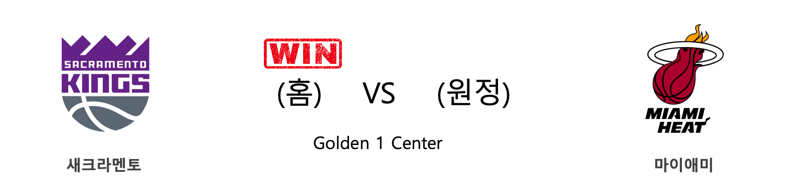
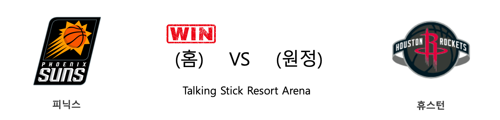
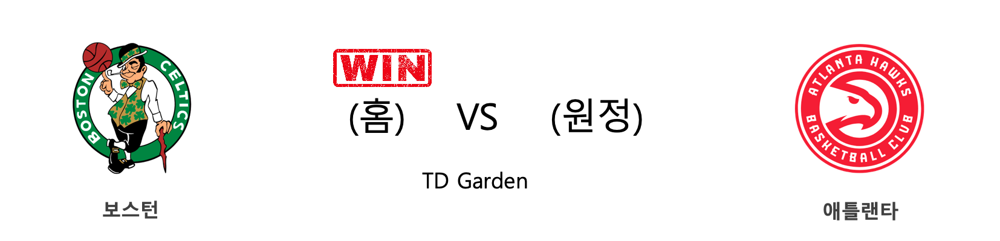

####  새크라멘토(홈) VS 마이애미(원정) 

<table class="tg">
  <tr>
    <th class="tg-rr9t">SAC</th>
    <th class="tg-rr9t">팀</th>
    <th class="tg-rr9t">MIA</th>
  </tr>
  <tr>
    <td class="tg-dcpn">1승 1패</td>
    <td class="tg-rr9t">시즌 상대전적</td>
    <td class="tg-dcpn">1승 1패</td>
  </tr>
  <tr>
    <td class="tg-dcpn">105</td>
    <td class="tg-rr9t">점수</td>
    <td class="tg-dcpn">97</td>
  </tr>
  <tr>
    <td class="tg-dcpn">21/38(55%)</td>
    <td class="tg-rr9t">2점(%)</td>
    <td class="tg-dcpn">22/37(59%)</td>
  </tr>
  <tr>
    <td class="tg-dcpn">19/44(43%)</td>
    <td class="tg-rr9t">3점(%)</td>
    <td class="tg-dcpn">12/40(30%)</td>
  </tr>
  <tr>
    <td class="tg-dcpn">6/12(50%)</td>
    <td class="tg-rr9t">자유투(%)</td>
    <td class="tg-dcpn">17/25(68%)</td>
  </tr>
  <tr>
    <td class="tg-dcpn">36</td>
    <td class="tg-rr9t">리바운드</td>
    <td class="tg-dcpn">42</td>
  </tr>
  <tr>
    <td class="tg-dcpn">29</td>
    <td class="tg-rr9t">어시스트</td>
    <td class="tg-dcpn">21</td>
  </tr>
  <tr>
    <td class="tg-dcpn">8</td>
    <td class="tg-rr9t">스틸</td>
    <td class="tg-dcpn">7</td>
  </tr>
  <tr>
    <td class="tg-dcpn">3</td>
    <td class="tg-rr9t">블록</td>
    <td class="tg-dcpn">5</td>
  </tr>
  <tr>
    <td class="tg-dcpn">14</td>
    <td class="tg-rr9t">턴오버</td>
    <td class="tg-dcpn">20</td>
  </tr>
  <tr>
    <td class="tg-dcpn">De'AaronFoxG(16) BuddyHield(21) NemanjaBjelic(15) BogdanBogdano(23)</td>
    <td class="tg-rr9t">주요 득점선수</td>
    <td class="tg-dcpn">BamAdebayoF(26) KendrickNunnG(16) DuncanRobinso(18)</td>
  </tr>
</table>

#### 경기 관련 주요 기사         

[[오늘의 NBA] (2/2) '경이로운 자' 데미안 릴라드의 5차 슈팅 혁명](http://sports.news.naver.com/basketball/news/read.nhn?oid=486&aid=0000001215)

[[오늘의 NBA] (2/4) 크리스탑스 포르징기스, 댈러스의 새로운 대들보](http://sports.news.naver.com/basketball/news/read.nhn?oid=486&aid=0000001217)

[[오늘의 NBA] (1/21) 데미안 릴라드, 포틀랜드의 슈퍼스타](http://sports.news.naver.com/basketball/news/read.nhn?oid=486&aid=0000001203)

[[오늘의 NBA] (1/25) 러셀 웨스트브룩의 '마이 웨이'](http://sports.news.naver.com/basketball/news/read.nhn?oid=486&aid=0000001207)

[[오늘의 NBA] (1/19) 르브론 제임스, 휴스턴을 저격하다!](http://sports.news.naver.com/basketball/news/read.nhn?oid=486&aid=0000001201)

        
        

####  피닉스(홈) VS 휴스턴(원정) 

<table class="tg">
  <tr>
    <th class="tg-rr9t">PHX</th>
    <th class="tg-rr9t">팀</th>
    <th class="tg-rr9t">HOU</th>
  </tr>
  <tr>
    <td class="tg-dcpn">1승 2패</td>
    <td class="tg-rr9t">시즌 상대전적</td>
    <td class="tg-dcpn">2승 1패</td>
  </tr>
  <tr>
    <td class="tg-dcpn">127</td>
    <td class="tg-rr9t">점수</td>
    <td class="tg-dcpn">91</td>
  </tr>
  <tr>
    <td class="tg-dcpn">28/46(61%)</td>
    <td class="tg-rr9t">2점(%)</td>
    <td class="tg-dcpn">18/37(49%)</td>
  </tr>
  <tr>
    <td class="tg-dcpn">15/31(48%)</td>
    <td class="tg-rr9t">3점(%)</td>
    <td class="tg-dcpn">11/48(23%)</td>
  </tr>
  <tr>
    <td class="tg-dcpn">26/27(96%)</td>
    <td class="tg-rr9t">자유투(%)</td>
    <td class="tg-dcpn">22/26(85%)</td>
  </tr>
  <tr>
    <td class="tg-dcpn">51</td>
    <td class="tg-rr9t">리바운드</td>
    <td class="tg-dcpn">29</td>
  </tr>
  <tr>
    <td class="tg-dcpn">29</td>
    <td class="tg-rr9t">어시스트</td>
    <td class="tg-dcpn">16</td>
  </tr>
  <tr>
    <td class="tg-dcpn">10</td>
    <td class="tg-rr9t">스틸</td>
    <td class="tg-dcpn">8</td>
  </tr>
  <tr>
    <td class="tg-dcpn">9</td>
    <td class="tg-rr9t">블록</td>
    <td class="tg-dcpn">5</td>
  </tr>
  <tr>
    <td class="tg-dcpn">23</td>
    <td class="tg-rr9t">턴오버</td>
    <td class="tg-dcpn">15</td>
  </tr>
  <tr>
    <td class="tg-dcpn">DevinBookerG(33) KellyOubreJr.(39)</td>
    <td class="tg-rr9t">주요 득점선수</td>
    <td class="tg-dcpn">JamesHardenG(32)</td>
  </tr>
</table>

#### 경기 관련 주요 기사         

[[오늘의 NBA] (2/1) LAL, 코비 브라이언트와의 작별](http://sports.news.naver.com/basketball/news/read.nhn?oid=486&aid=0000001214)

[[오늘의 NBA] (2/6) 토론토, 구단 역대 최다 연승 신기록 달성!](http://sports.news.naver.com/basketball/news/read.nhn?oid=486&aid=0000001219)

[[오늘의 NBA] (2/8) 보스턴의 신바람 농구](http://sports.news.naver.com/basketball/news/read.nhn?oid=486&aid=0000001221)

[[오늘의 NBA] (1/29) 밀워키, 우승 후보 1순위 입지를 구축하다](http://sports.news.naver.com/basketball/news/read.nhn?oid=486&aid=0000001211)

[[오늘의 NBA] (1/30) 빅터 올라디포, "READY 4 ACTION"](http://sports.news.naver.com/basketball/news/read.nhn?oid=486&aid=0000001212)

        
        

####  오클라호마씨티(홈) VS 디트로이트(원정) 

<table class="tg">
  <tr>
    <th class="tg-rr9t">OKC</th>
    <th class="tg-rr9t">팀</th>
    <th class="tg-rr9t">DET</th>
  </tr>
  <tr>
    <td class="tg-dcpn">1승 0패</td>
    <td class="tg-rr9t">시즌 상대전적</td>
    <td class="tg-dcpn">0승 1패</td>
  </tr>
  <tr>
    <td class="tg-dcpn">108</td>
    <td class="tg-rr9t">점수</td>
    <td class="tg-dcpn">101</td>
  </tr>
  <tr>
    <td class="tg-dcpn">34/53(64%)</td>
    <td class="tg-rr9t">2점(%)</td>
    <td class="tg-dcpn">27/51(53%)</td>
  </tr>
  <tr>
    <td class="tg-dcpn">5/23(22%)</td>
    <td class="tg-rr9t">3점(%)</td>
    <td class="tg-dcpn">11/38(29%)</td>
  </tr>
  <tr>
    <td class="tg-dcpn">25/30(83%)</td>
    <td class="tg-rr9t">자유투(%)</td>
    <td class="tg-dcpn">14/19(74%)</td>
  </tr>
  <tr>
    <td class="tg-dcpn">42</td>
    <td class="tg-rr9t">리바운드</td>
    <td class="tg-dcpn">37</td>
  </tr>
  <tr>
    <td class="tg-dcpn">21</td>
    <td class="tg-rr9t">어시스트</td>
    <td class="tg-dcpn">19</td>
  </tr>
  <tr>
    <td class="tg-dcpn">4</td>
    <td class="tg-rr9t">스틸</td>
    <td class="tg-dcpn">7</td>
  </tr>
  <tr>
    <td class="tg-dcpn">6</td>
    <td class="tg-rr9t">블록</td>
    <td class="tg-dcpn">1</td>
  </tr>
  <tr>
    <td class="tg-dcpn">11</td>
    <td class="tg-rr9t">턴오버</td>
    <td class="tg-dcpn">9</td>
  </tr>
  <tr>
    <td class="tg-dcpn">DennisSchrode(18) ChrisPaulG(22) StevenAdamsC(16) DaniloGallina(19) ShaiGilgeous-(21)</td>
    <td class="tg-rr9t">주요 득점선수</td>
    <td class="tg-dcpn">ChristianWood(27) ReggieJackson(28) ThonMakerC(19)</td>
  </tr>
</table>

#### 경기 관련 주요 기사         

[[오늘의 NBA] (1/26) 르브론 제임스의 두 번째 슬픈 언약식](http://sports.news.naver.com/basketball/news/read.nhn?oid=486&aid=0000001208)

[[오늘의 NBA] (2/6) 토론토, 구단 역대 최다 연승 신기록 달성!](http://sports.news.naver.com/basketball/news/read.nhn?oid=486&aid=0000001219)

[[오늘의 NBA] (2/8) 보스턴의 신바람 농구](http://sports.news.naver.com/basketball/news/read.nhn?oid=486&aid=0000001221)

[[오늘의 NBA] (1/23) 자이언 윌리엄슨의 NBA 데뷔전](http://sports.news.naver.com/basketball/news/read.nhn?oid=486&aid=0000001205)

[[오늘의 NBA] (2/1) LAL, 코비 브라이언트와의 작별](http://sports.news.naver.com/basketball/news/read.nhn?oid=486&aid=0000001214)

        
        

####  워싱턴(홈) VS 댈러스(원정) 

<table class="tg">
  <tr>
    <th class="tg-rr9t">WAS</th>
    <th class="tg-rr9t">팀</th>
    <th class="tg-rr9t">DAL</th>
  </tr>
  <tr>
    <td class="tg-dcpn">1승 1패</td>
    <td class="tg-rr9t">시즌 상대전적</td>
    <td class="tg-dcpn">1승 1패</td>
  </tr>
  <tr>
    <td class="tg-dcpn">119</td>
    <td class="tg-rr9t">점수</td>
    <td class="tg-dcpn">118</td>
  </tr>
  <tr>
    <td class="tg-dcpn">26/52(50%)</td>
    <td class="tg-rr9t">2점(%)</td>
    <td class="tg-dcpn">26/51(51%)</td>
  </tr>
  <tr>
    <td class="tg-dcpn">19/38(50%)</td>
    <td class="tg-rr9t">3점(%)</td>
    <td class="tg-dcpn">16/40(40%)</td>
  </tr>
  <tr>
    <td class="tg-dcpn">10/13(77%)</td>
    <td class="tg-rr9t">자유투(%)</td>
    <td class="tg-dcpn">18/21(86%)</td>
  </tr>
  <tr>
    <td class="tg-dcpn">39</td>
    <td class="tg-rr9t">리바운드</td>
    <td class="tg-dcpn">49</td>
  </tr>
  <tr>
    <td class="tg-dcpn">28</td>
    <td class="tg-rr9t">어시스트</td>
    <td class="tg-dcpn">27</td>
  </tr>
  <tr>
    <td class="tg-dcpn">9</td>
    <td class="tg-rr9t">스틸</td>
    <td class="tg-dcpn">7</td>
  </tr>
  <tr>
    <td class="tg-dcpn">4</td>
    <td class="tg-rr9t">블록</td>
    <td class="tg-dcpn">2</td>
  </tr>
  <tr>
    <td class="tg-dcpn">13</td>
    <td class="tg-rr9t">턴오버</td>
    <td class="tg-dcpn">13</td>
  </tr>
  <tr>
    <td class="tg-dcpn">RuiHachimuraF(17) DavisBertans(20) BradleyBealG(29)</td>
    <td class="tg-rr9t">주요 득점선수</td>
    <td class="tg-dcpn">JalenBrunsonG(15) SethCurry(20) TimHardawayJr(19)</td>
  </tr>
</table>

#### 경기 관련 주요 기사         

[[오늘의 NBA] (2/7) 밀워키의 대권 행보](http://sports.news.naver.com/basketball/news/read.nhn?oid=486&aid=0000001220)

[[오늘의 NBA] (1/29) 밀워키, 우승 후보 1순위 입지를 구축하다](http://sports.news.naver.com/basketball/news/read.nhn?oid=486&aid=0000001211)

[[오늘의 NBA] (1/24) 르브론 제임스, 코비 브라이언트를 정조준하다!](http://sports.news.naver.com/basketball/news/read.nhn?oid=486&aid=0000001206)

[[오늘의 NBA] (12/15) 밤 아데바요, 연장전의 지배자](http://sports.news.naver.com/basketball/news/read.nhn?oid=486&aid=0000001167)

[Annotated by the Author: ‘These Five Cuisines Are Easier on the Planet’](https://www.nytimes.com/2020/02/07/learning/annotated-by-the-author-these-five-cuisines-are-easier-on-the-planet.html?partner=naver)

        
        

####  인디애나(홈) VS 토론토(원정) 

<table class="tg">
  <tr>
    <th class="tg-rr9t">IND</th>
    <th class="tg-rr9t">팀</th>
    <th class="tg-rr9t">TOR</th>
  </tr>
  <tr>
    <td class="tg-dcpn">1승 1패</td>
    <td class="tg-rr9t">시즌 상대전적</td>
    <td class="tg-dcpn">1승 1패</td>
  </tr>
  <tr>
    <td class="tg-dcpn">106</td>
    <td class="tg-rr9t">점수</td>
    <td class="tg-dcpn">115</td>
  </tr>
  <tr>
    <td class="tg-dcpn">29/52(56%)</td>
    <td class="tg-rr9t">2점(%)</td>
    <td class="tg-dcpn">25/50(50%)</td>
  </tr>
  <tr>
    <td class="tg-dcpn">10/34(29%)</td>
    <td class="tg-rr9t">3점(%)</td>
    <td class="tg-dcpn">17/38(45%)</td>
  </tr>
  <tr>
    <td class="tg-dcpn">18/22(82%)</td>
    <td class="tg-rr9t">자유투(%)</td>
    <td class="tg-dcpn">14/17(82%)</td>
  </tr>
  <tr>
    <td class="tg-dcpn">47</td>
    <td class="tg-rr9t">리바운드</td>
    <td class="tg-dcpn">39</td>
  </tr>
  <tr>
    <td class="tg-dcpn">26</td>
    <td class="tg-rr9t">어시스트</td>
    <td class="tg-dcpn">28</td>
  </tr>
  <tr>
    <td class="tg-dcpn">5</td>
    <td class="tg-rr9t">스틸</td>
    <td class="tg-dcpn">12</td>
  </tr>
  <tr>
    <td class="tg-dcpn">5</td>
    <td class="tg-rr9t">블록</td>
    <td class="tg-dcpn">3</td>
  </tr>
  <tr>
    <td class="tg-dcpn">20</td>
    <td class="tg-rr9t">턴오버</td>
    <td class="tg-dcpn">16</td>
  </tr>
  <tr>
    <td class="tg-dcpn">DomantasSabon(19) MalcolmBrogdo(16) VictorOladipo(15)</td>
    <td class="tg-rr9t">주요 득점선수</td>
    <td class="tg-dcpn">FredVanVleetG(20) TerenceDavis(17) SergeIbakaC(22) OGAnunobyF(16) KyleLowryG(16) PascalSiakamF(15)</td>
  </tr>
</table>

#### 경기 관련 주요 기사         

[[오늘의 NBA] (2/6) 토론토, 구단 역대 최다 연승 신기록 달성!](http://sports.news.naver.com/basketball/news/read.nhn?oid=486&aid=0000001219)

[[오늘의 NBA] (2/4) 크리스탑스 포르징기스, 댈러스의 새로운 대들보](http://sports.news.naver.com/basketball/news/read.nhn?oid=486&aid=0000001217)

[[오늘의 NBA] (1/30) 빅터 올라디포, "READY 4 ACTION"](http://sports.news.naver.com/basketball/news/read.nhn?oid=486&aid=0000001212)

[[오늘의 NBA] (1/29) 밀워키, 우승 후보 1순위 입지를 구축하다](http://sports.news.naver.com/basketball/news/read.nhn?oid=486&aid=0000001211)

[[오늘의 NBA] (2/8) 보스턴의 신바람 농구](http://sports.news.naver.com/basketball/news/read.nhn?oid=486&aid=0000001221)

        
        

####  필라델피아(홈) VS 멤피스(원정) 

<table class="tg">
  <tr>
    <th class="tg-rr9t">PHI</th>
    <th class="tg-rr9t">팀</th>
    <th class="tg-rr9t">MEM</th>
  </tr>
  <tr>
    <td class="tg-dcpn">1승 0패</td>
    <td class="tg-rr9t">시즌 상대전적</td>
    <td class="tg-dcpn">0승 1패</td>
  </tr>
  <tr>
    <td class="tg-dcpn">119</td>
    <td class="tg-rr9t">점수</td>
    <td class="tg-dcpn">107</td>
  </tr>
  <tr>
    <td class="tg-dcpn">34/65(52%)</td>
    <td class="tg-rr9t">2점(%)</td>
    <td class="tg-dcpn">33/72(46%)</td>
  </tr>
  <tr>
    <td class="tg-dcpn">14/25(56%)</td>
    <td class="tg-rr9t">3점(%)</td>
    <td class="tg-dcpn">5/21(24%)</td>
  </tr>
  <tr>
    <td class="tg-dcpn">9/15(60%)</td>
    <td class="tg-rr9t">자유투(%)</td>
    <td class="tg-dcpn">26/31(84%)</td>
  </tr>
  <tr>
    <td class="tg-dcpn">50</td>
    <td class="tg-rr9t">리바운드</td>
    <td class="tg-dcpn">40</td>
  </tr>
  <tr>
    <td class="tg-dcpn">34</td>
    <td class="tg-rr9t">어시스트</td>
    <td class="tg-dcpn">25</td>
  </tr>
  <tr>
    <td class="tg-dcpn">8</td>
    <td class="tg-rr9t">스틸</td>
    <td class="tg-dcpn">13</td>
  </tr>
  <tr>
    <td class="tg-dcpn">11</td>
    <td class="tg-rr9t">블록</td>
    <td class="tg-dcpn">6</td>
  </tr>
  <tr>
    <td class="tg-dcpn">20</td>
    <td class="tg-rr9t">턴오버</td>
    <td class="tg-dcpn">14</td>
  </tr>
  <tr>
    <td class="tg-dcpn">BenSimmonsG(22) FurkanKorkmaz(34) TobiasHarrisF(21)</td>
    <td class="tg-rr9t">주요 득점선수</td>
    <td class="tg-dcpn">JaMorantG(15)</td>
  </tr>
</table>

#### 경기 관련 주요 기사         

[[오늘의 NBA] (2/6) 토론토, 구단 역대 최다 연승 신기록 달성!](http://sports.news.naver.com/basketball/news/read.nhn?oid=486&aid=0000001219)

[[오늘의 NBA] (1/21) 데미안 릴라드, 포틀랜드의 슈퍼스타](http://sports.news.naver.com/basketball/news/read.nhn?oid=486&aid=0000001203)

[[오늘의 NBA] (2/4) 크리스탑스 포르징기스, 댈러스의 새로운 대들보](http://sports.news.naver.com/basketball/news/read.nhn?oid=486&aid=0000001217)

[[오늘의 NBA] (2/2) '경이로운 자' 데미안 릴라드의 5차 슈팅 혁명](http://sports.news.naver.com/basketball/news/read.nhn?oid=486&aid=0000001215)

[[오늘의 NBA] (1/23) 자이언 윌리엄슨의 NBA 데뷔전](http://sports.news.naver.com/basketball/news/read.nhn?oid=486&aid=0000001205)

        
        

####  유타(홈) VS 포틀랜드(원정) 

<table class="tg">
  <tr>
    <th class="tg-rr9t">UTA</th>
    <th class="tg-rr9t">팀</th>
    <th class="tg-rr9t">POR</th>
  </tr>
  <tr>
    <td class="tg-dcpn">2승 1패</td>
    <td class="tg-rr9t">시즌 상대전적</td>
    <td class="tg-dcpn">1승 2패</td>
  </tr>
  <tr>
    <td class="tg-dcpn">117</td>
    <td class="tg-rr9t">점수</td>
    <td class="tg-dcpn">114</td>
  </tr>
  <tr>
    <td class="tg-dcpn">35/61(57%)</td>
    <td class="tg-rr9t">2점(%)</td>
    <td class="tg-dcpn">27/57(47%)</td>
  </tr>
  <tr>
    <td class="tg-dcpn">10/30(33%)</td>
    <td class="tg-rr9t">3점(%)</td>
    <td class="tg-dcpn">17/40(42%)</td>
  </tr>
  <tr>
    <td class="tg-dcpn">17/24(71%)</td>
    <td class="tg-rr9t">자유투(%)</td>
    <td class="tg-dcpn">9/14(64%)</td>
  </tr>
  <tr>
    <td class="tg-dcpn">56</td>
    <td class="tg-rr9t">리바운드</td>
    <td class="tg-dcpn">43</td>
  </tr>
  <tr>
    <td class="tg-dcpn">21</td>
    <td class="tg-rr9t">어시스트</td>
    <td class="tg-dcpn">14</td>
  </tr>
  <tr>
    <td class="tg-dcpn">6</td>
    <td class="tg-rr9t">스틸</td>
    <td class="tg-dcpn">9</td>
  </tr>
  <tr>
    <td class="tg-dcpn">2</td>
    <td class="tg-rr9t">블록</td>
    <td class="tg-dcpn">4</td>
  </tr>
  <tr>
    <td class="tg-dcpn">15</td>
    <td class="tg-rr9t">턴오버</td>
    <td class="tg-dcpn">9</td>
  </tr>
  <tr>
    <td class="tg-dcpn">BojanBogdanov(27) RudyGobertC(16) DonovanMitche(16) MikeConleyG(18)</td>
    <td class="tg-rr9t">주요 득점선수</td>
    <td class="tg-dcpn">CJMcCollumG(27) GaryTrentJr.(16) DamianLillard(42)</td>
  </tr>
</table>

#### 경기 관련 주요 기사         

[[오늘의 NBA] (1/21) 데미안 릴라드, 포틀랜드의 슈퍼스타](http://sports.news.naver.com/basketball/news/read.nhn?oid=486&aid=0000001203)

[[오늘의 NBA] (2/2) '경이로운 자' 데미안 릴라드의 5차 슈팅 혁명](http://sports.news.naver.com/basketball/news/read.nhn?oid=486&aid=0000001215)

[[오늘의 NBA] (1/11) 멤피스, 서부컨퍼런스 8위 등극](http://sports.news.naver.com/basketball/news/read.nhn?oid=486&aid=0000001193)

[[오늘의 NBA] (1/19) 르브론 제임스, 휴스턴을 저격하다!](http://sports.news.naver.com/basketball/news/read.nhn?oid=486&aid=0000001201)

[[오늘의 NBA] (2/6) 토론토, 구단 역대 최다 연승 신기록 달성!](http://sports.news.naver.com/basketball/news/read.nhn?oid=486&aid=0000001219)

        
        

####  보스턴(홈) VS 애틀랜타(원정) 

<table class="tg">
  <tr>
    <th class="tg-rr9t">BOS</th>
    <th class="tg-rr9t">팀</th>
    <th class="tg-rr9t">ATL</th>
  </tr>
  <tr>
    <td class="tg-dcpn">3승 0패</td>
    <td class="tg-rr9t">시즌 상대전적</td>
    <td class="tg-dcpn">0승 3패</td>
  </tr>
  <tr>
    <td class="tg-dcpn">112</td>
    <td class="tg-rr9t">점수</td>
    <td class="tg-dcpn">107</td>
  </tr>
  <tr>
    <td class="tg-dcpn">21/49(43%)</td>
    <td class="tg-rr9t">2점(%)</td>
    <td class="tg-dcpn">22/47(47%)</td>
  </tr>
  <tr>
    <td class="tg-dcpn">16/37(43%)</td>
    <td class="tg-rr9t">3점(%)</td>
    <td class="tg-dcpn">13/39(33%)</td>
  </tr>
  <tr>
    <td class="tg-dcpn">22/27(81%)</td>
    <td class="tg-rr9t">자유투(%)</td>
    <td class="tg-dcpn">24/26(92%)</td>
  </tr>
  <tr>
    <td class="tg-dcpn">47</td>
    <td class="tg-rr9t">리바운드</td>
    <td class="tg-dcpn">46</td>
  </tr>
  <tr>
    <td class="tg-dcpn">23</td>
    <td class="tg-rr9t">어시스트</td>
    <td class="tg-dcpn">21</td>
  </tr>
  <tr>
    <td class="tg-dcpn">5</td>
    <td class="tg-rr9t">스틸</td>
    <td class="tg-dcpn">7</td>
  </tr>
  <tr>
    <td class="tg-dcpn">8</td>
    <td class="tg-rr9t">블록</td>
    <td class="tg-dcpn">8</td>
  </tr>
  <tr>
    <td class="tg-dcpn">13</td>
    <td class="tg-rr9t">턴오버</td>
    <td class="tg-dcpn">14</td>
  </tr>
  <tr>
    <td class="tg-dcpn">KembaWalkerG(15) EnesKanterC(16) RomeoLangford(16) JaysonTatumF(32)</td>
    <td class="tg-rr9t">주요 득점선수</td>
    <td class="tg-dcpn">BrandonGoodwi(21) JohnCollinsF(30) KevinHuerterG(25)</td>
  </tr>
</table>

#### 경기 관련 주요 기사         

[[오늘의 NBA] (1/21) 데미안 릴라드, 포틀랜드의 슈퍼스타](http://sports.news.naver.com/basketball/news/read.nhn?oid=486&aid=0000001203)

[[오늘의 NBA] (2/6) 토론토, 구단 역대 최다 연승 신기록 달성!](http://sports.news.naver.com/basketball/news/read.nhn?oid=486&aid=0000001219)

[[오늘의 NBA] (2/4) 크리스탑스 포르징기스, 댈러스의 새로운 대들보](http://sports.news.naver.com/basketball/news/read.nhn?oid=486&aid=0000001217)

[[오늘의 NBA] (1/23) 자이언 윌리엄슨의 NBA 데뷔전](http://sports.news.naver.com/basketball/news/read.nhn?oid=486&aid=0000001205)

[[오늘의 NBA] (2/8) 보스턴의 신바람 농구](http://sports.news.naver.com/basketball/news/read.nhn?oid=486&aid=0000001221)

        
        

#### 리그 (Eastern) 순위
    

<table class="tg">
  <tr>
    <th class="tg-d14o">순위</th>
    <th class="tg-d14o">팀명</th>
    <th class="tg-d14o">경기수</th>
    <th class="tg-d14o">승</th>
    <th class="tg-d14o">패</th>
    <th class="tg-d14o">승차</th>
    <th class="tg-d14o">승률</th>
  </tr>
  
<tr>
    <td class="tg-50j8">1</td>
    <td class="tg-50j8">MIL</td>
    <td class="tg-50j8">48</td>
    <td class="tg-50j8">41</td>
    <td class="tg-50j8">7</td>
    <td class="tg-50j8">0</td>
    <td class="tg-50j8">0.854</td>
</tr>

<tr>
    <td class="tg-50j8">2</td>
    <td class="tg-50j8">TOR</td>
    <td class="tg-50j8">50</td>
    <td class="tg-50j8">36</td>
    <td class="tg-50j8">14</td>
    <td class="tg-50j8">5</td>
    <td class="tg-50j8">0.72</td>
</tr>

<tr>
    <td class="tg-50j8">3</td>
    <td class="tg-50j8">MIA</td>
    <td class="tg-50j8">48</td>
    <td class="tg-50j8">34</td>
    <td class="tg-50j8">14</td>
    <td class="tg-50j8">7</td>
    <td class="tg-50j8">0.708</td>
</tr>

<tr>
    <td class="tg-50j8">4</td>
    <td class="tg-50j8">BOS</td>
    <td class="tg-50j8">47</td>
    <td class="tg-50j8">33</td>
    <td class="tg-50j8">14</td>
    <td class="tg-50j8">8</td>
    <td class="tg-50j8">0.702</td>
</tr>

<tr>
    <td class="tg-50j8">5</td>
    <td class="tg-50j8">IND</td>
    <td class="tg-50j8">51</td>
    <td class="tg-50j8">31</td>
    <td class="tg-50j8">20</td>
    <td class="tg-50j8">10</td>
    <td class="tg-50j8">0.608</td>
</tr>

<tr>
    <td class="tg-50j8">6</td>
    <td class="tg-50j8">PHI</td>
    <td class="tg-50j8">50</td>
    <td class="tg-50j8">30</td>
    <td class="tg-50j8">20</td>
    <td class="tg-50j8">11</td>
    <td class="tg-50j8">0.6</td>
</tr>

<tr>
    <td class="tg-50j8">7</td>
    <td class="tg-50j8">BKN</td>
    <td class="tg-50j8">48</td>
    <td class="tg-50j8">22</td>
    <td class="tg-50j8">26</td>
    <td class="tg-50j8">19</td>
    <td class="tg-50j8">0.458</td>
</tr>

<tr>
    <td class="tg-50j8">8</td>
    <td class="tg-50j8">ORL</td>
    <td class="tg-50j8">50</td>
    <td class="tg-50j8">22</td>
    <td class="tg-50j8">28</td>
    <td class="tg-50j8">19</td>
    <td class="tg-50j8">0.44</td>
</tr>

<tr>
    <td class="tg-50j8">9</td>
    <td class="tg-50j8">DET</td>
    <td class="tg-50j8">50</td>
    <td class="tg-50j8">18</td>
    <td class="tg-50j8">32</td>
    <td class="tg-50j8">23</td>
    <td class="tg-50j8">0.36</td>
</tr>

<tr>
    <td class="tg-50j8">10</td>
    <td class="tg-50j8">CHI</td>
    <td class="tg-50j8">51</td>
    <td class="tg-50j8">18</td>
    <td class="tg-50j8">33</td>
    <td class="tg-50j8">23</td>
    <td class="tg-50j8">0.353</td>
</tr>

<tr>
    <td class="tg-50j8">11</td>
    <td class="tg-50j8">WAS</td>
    <td class="tg-50j8">48</td>
    <td class="tg-50j8">17</td>
    <td class="tg-50j8">31</td>
    <td class="tg-50j8">24</td>
    <td class="tg-50j8">0.354</td>
</tr>

<tr>
    <td class="tg-50j8">12</td>
    <td class="tg-50j8">NYK</td>
    <td class="tg-50j8">51</td>
    <td class="tg-50j8">16</td>
    <td class="tg-50j8">35</td>
    <td class="tg-50j8">25</td>
    <td class="tg-50j8">0.314</td>
</tr>

<tr>
    <td class="tg-50j8">13</td>
    <td class="tg-50j8">CHA</td>
    <td class="tg-50j8">50</td>
    <td class="tg-50j8">15</td>
    <td class="tg-50j8">35</td>
    <td class="tg-50j8">26</td>
    <td class="tg-50j8">0.3</td>
</tr>

<tr>
    <td class="tg-50j8">14</td>
    <td class="tg-50j8">ATL</td>
    <td class="tg-50j8">50</td>
    <td class="tg-50j8">12</td>
    <td class="tg-50j8">38</td>
    <td class="tg-50j8">29</td>
    <td class="tg-50j8">0.24</td>
</tr>

<tr>
    <td class="tg-50j8">15</td>
    <td class="tg-50j8">CLE</td>
    <td class="tg-50j8">48</td>
    <td class="tg-50j8">11</td>
    <td class="tg-50j8">37</td>
    <td class="tg-50j8">30</td>
    <td class="tg-50j8">0.229</td>
</tr>
</table> 
#### 리그 (Western) 순위
    

<table class="tg">
  <tr>
    <th class="tg-d14o">순위</th>
    <th class="tg-d14o">팀명</th>
    <th class="tg-d14o">경기수</th>
    <th class="tg-d14o">승</th>
    <th class="tg-d14o">패</th>
    <th class="tg-d14o">승차</th>
    <th class="tg-d14o">승률</th>
  </tr>
  
<tr>
    <td class="tg-50j8">1</td>
    <td class="tg-50j8">LAL</td>
    <td class="tg-50j8">49</td>
    <td class="tg-50j8">37</td>
    <td class="tg-50j8">12</td>
    <td class="tg-50j8">4</td>
    <td class="tg-50j8">0.755</td>
</tr>

<tr>
    <td class="tg-50j8">2</td>
    <td class="tg-50j8">LAC</td>
    <td class="tg-50j8">50</td>
    <td class="tg-50j8">35</td>
    <td class="tg-50j8">15</td>
    <td class="tg-50j8">6</td>
    <td class="tg-50j8">0.7</td>
</tr>

<tr>
    <td class="tg-50j8">3</td>
    <td class="tg-50j8">DEN</td>
    <td class="tg-50j8">48</td>
    <td class="tg-50j8">34</td>
    <td class="tg-50j8">14</td>
    <td class="tg-50j8">7</td>
    <td class="tg-50j8">0.708</td>
</tr>

<tr>
    <td class="tg-50j8">4</td>
    <td class="tg-50j8">UTA</td>
    <td class="tg-50j8">49</td>
    <td class="tg-50j8">32</td>
    <td class="tg-50j8">17</td>
    <td class="tg-50j8">9</td>
    <td class="tg-50j8">0.653</td>
</tr>

<tr>
    <td class="tg-50j8">5</td>
    <td class="tg-50j8">HOU</td>
    <td class="tg-50j8">51</td>
    <td class="tg-50j8">32</td>
    <td class="tg-50j8">19</td>
    <td class="tg-50j8">9</td>
    <td class="tg-50j8">0.627</td>
</tr>

<tr>
    <td class="tg-50j8">6</td>
    <td class="tg-50j8">OKC</td>
    <td class="tg-50j8">50</td>
    <td class="tg-50j8">31</td>
    <td class="tg-50j8">19</td>
    <td class="tg-50j8">10</td>
    <td class="tg-50j8">0.62</td>
</tr>

<tr>
    <td class="tg-50j8">7</td>
    <td class="tg-50j8">DAL</td>
    <td class="tg-50j8">48</td>
    <td class="tg-50j8">29</td>
    <td class="tg-50j8">19</td>
    <td class="tg-50j8">12</td>
    <td class="tg-50j8">0.604</td>
</tr>

<tr>
    <td class="tg-50j8">8</td>
    <td class="tg-50j8">MEM</td>
    <td class="tg-50j8">50</td>
    <td class="tg-50j8">24</td>
    <td class="tg-50j8">26</td>
    <td class="tg-50j8">17</td>
    <td class="tg-50j8">0.48</td>
</tr>

<tr>
    <td class="tg-50j8">8</td>
    <td class="tg-50j8">POR</td>
    <td class="tg-50j8">50</td>
    <td class="tg-50j8">24</td>
    <td class="tg-50j8">26</td>
    <td class="tg-50j8">17</td>
    <td class="tg-50j8">0.48</td>
</tr>

<tr>
    <td class="tg-50j8">10</td>
    <td class="tg-50j8">SAS</td>
    <td class="tg-50j8">50</td>
    <td class="tg-50j8">22</td>
    <td class="tg-50j8">28</td>
    <td class="tg-50j8">19</td>
    <td class="tg-50j8">0.44</td>
</tr>

<tr>
    <td class="tg-50j8">11</td>
    <td class="tg-50j8">NOP</td>
    <td class="tg-50j8">50</td>
    <td class="tg-50j8">20</td>
    <td class="tg-50j8">30</td>
    <td class="tg-50j8">21</td>
    <td class="tg-50j8">0.4</td>
</tr>

<tr>
    <td class="tg-50j8">12</td>
    <td class="tg-50j8">SAC</td>
    <td class="tg-50j8">51</td>
    <td class="tg-50j8">20</td>
    <td class="tg-50j8">31</td>
    <td class="tg-50j8">21</td>
    <td class="tg-50j8">0.392</td>
</tr>

<tr>
    <td class="tg-50j8">13</td>
    <td class="tg-50j8">PHX</td>
    <td class="tg-50j8">49</td>
    <td class="tg-50j8">19</td>
    <td class="tg-50j8">30</td>
    <td class="tg-50j8">22</td>
    <td class="tg-50j8">0.388</td>
</tr>

<tr>
    <td class="tg-50j8">14</td>
    <td class="tg-50j8">MIN</td>
    <td class="tg-50j8">47</td>
    <td class="tg-50j8">14</td>
    <td class="tg-50j8">33</td>
    <td class="tg-50j8">27</td>
    <td class="tg-50j8">0.298</td>
</tr>

<tr>
    <td class="tg-50j8">15</td>
    <td class="tg-50j8">GSW</td>
    <td class="tg-50j8">50</td>
    <td class="tg-50j8">12</td>
    <td class="tg-50j8">38</td>
    <td class="tg-50j8">29</td>
    <td class="tg-50j8">0.24</td>
</tr>
</table> 

        
        
#nba #미국농구 #엔비에이 #농구분석 #토토 #스포츠토토 #경기예측 #농구결과 #20200208 #새크라멘토 #마이애미 #피닉스 #휴스턴 #오클라호마씨티 #디트로이트 #워싱턴 #댈러스 #인디애나 #토론토 #필라델피아 #멤피스 #유타 #포틀랜드 #보스턴 #애틀랜타 #새크라멘토마이애미 #피닉스휴스턴 #오클라호마씨티디트로이트 #워싱턴댈러스 #인디애나토론토 #필라델피아멤피스 #유타포틀랜드 #보스턴애틀랜타 