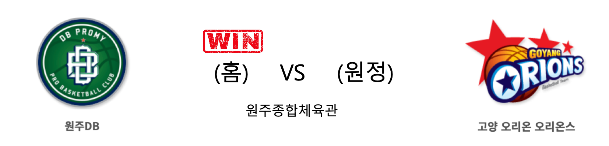
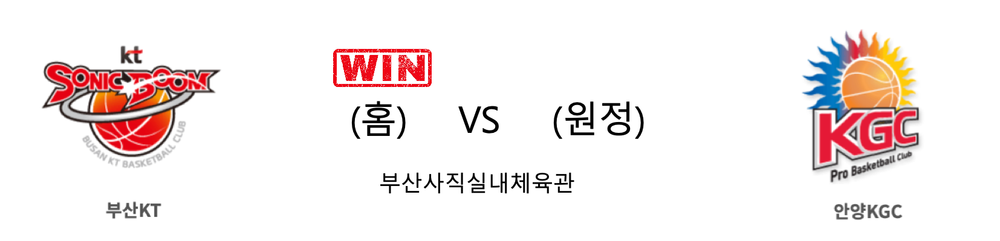

####  원주DB(홈) VS 고양오리온(원정) 

<table class="tg">
  <tr>
    <th class="tg-rr9t">원주DB</th>
    <th class="tg-rr9t">팀</th>
    <th class="tg-rr9t">고양오리온</th>
  </tr>
  <tr>
    <td class="tg-dcpn">3승 2패</td>
    <td class="tg-rr9t">시즌 상대전적</td>
    <td class="tg-dcpn">2승 3패</td>
  </tr>
  <tr>
    <td class="tg-dcpn">92</td>
    <td class="tg-rr9t">점수</td>
    <td class="tg-dcpn">82</td>
  </tr>
  <tr>
    <td class="tg-dcpn">32/43(74%)</td>
    <td class="tg-rr9t">2점(%)</td>
    <td class="tg-dcpn">19/34(56%)</td>
  </tr>
  <tr>
    <td class="tg-dcpn">6/27(22%)</td>
    <td class="tg-rr9t">3점(%)</td>
    <td class="tg-dcpn">9/25(36%)</td>
  </tr>
  <tr>
    <td class="tg-dcpn">10/14(71%)</td>
    <td class="tg-rr9t">자유투(%)</td>
    <td class="tg-dcpn">17/28(61%)</td>
  </tr>
  <tr>
    <td class="tg-dcpn">38</td>
    <td class="tg-rr9t">리바운드</td>
    <td class="tg-dcpn">24</td>
  </tr>
  <tr>
    <td class="tg-dcpn">6</td>
    <td class="tg-rr9t">어시스트</td>
    <td class="tg-dcpn">0</td>
  </tr>
  <tr>
    <td class="tg-dcpn">13</td>
    <td class="tg-rr9t">스틸</td>
    <td class="tg-dcpn">11</td>
  </tr>
  <tr>
    <td class="tg-dcpn">8</td>
    <td class="tg-rr9t">블록</td>
    <td class="tg-dcpn">10</td>
  </tr>
  <tr>
    <td class="tg-dcpn">23</td>
    <td class="tg-rr9t">턴오버</td>
    <td class="tg-dcpn">19</td>
  </tr>
  <tr>
    <td class="tg-dcpn">칼렙 그린(22) 치나누 오누아쿠(22)</td>
    <td class="tg-rr9t">주요 득점선수</td>
    <td class="tg-dcpn"></td>
  </tr>
</table>

#### 경기 관련 주요 기사         

[[JB화보] 원주 DB가 고양 오리온을 92-82로 승리하며 홈 6연승](http://sports.news.naver.com/basketball/news/read.nhn?oid=065&aid=0000197080)

['그린 22점 폭발' 오리온 악연 끊은 DB, 선두 독주](http://www.sportsseoul.com/news/read/881646)

[DB, 최하위 오리온 잡고 단독 선두 질주…KT 허훈 21어시스트 맹활약(종합)](http://news1.kr/articles/?3837635)

['골밑 지배' DB, 오리온 꺾고 1위 수성…LG는 21점 차 역전승](http://yna.kr/AKR20200209049500007?did=1195m)

        
        

####  창원LG(홈) VS 전주KCC(원정) 

<table class="tg">
  <tr>
    <th class="tg-rr9t">창원LG</th>
    <th class="tg-rr9t">팀</th>
    <th class="tg-rr9t">전주KCC</th>
  </tr>
  <tr>
    <td class="tg-dcpn">3승 2패</td>
    <td class="tg-rr9t">시즌 상대전적</td>
    <td class="tg-dcpn">2승 3패</td>
  </tr>
  <tr>
    <td class="tg-dcpn">69</td>
    <td class="tg-rr9t">점수</td>
    <td class="tg-dcpn">68</td>
  </tr>
  <tr>
    <td class="tg-dcpn">13/37(35%)</td>
    <td class="tg-rr9t">2점(%)</td>
    <td class="tg-dcpn">20/39(51%)</td>
  </tr>
  <tr>
    <td class="tg-dcpn">12/24(50%)</td>
    <td class="tg-rr9t">3점(%)</td>
    <td class="tg-dcpn">6/20(30%)</td>
  </tr>
  <tr>
    <td class="tg-dcpn">7/10(70%)</td>
    <td class="tg-rr9t">자유투(%)</td>
    <td class="tg-dcpn">10/15(67%)</td>
  </tr>
  <tr>
    <td class="tg-dcpn">34</td>
    <td class="tg-rr9t">리바운드</td>
    <td class="tg-dcpn">29</td>
  </tr>
  <tr>
    <td class="tg-dcpn">0</td>
    <td class="tg-rr9t">어시스트</td>
    <td class="tg-dcpn">1</td>
  </tr>
  <tr>
    <td class="tg-dcpn">14</td>
    <td class="tg-rr9t">스틸</td>
    <td class="tg-dcpn">11</td>
  </tr>
  <tr>
    <td class="tg-dcpn">7</td>
    <td class="tg-rr9t">블록</td>
    <td class="tg-dcpn">10</td>
  </tr>
  <tr>
    <td class="tg-dcpn">17</td>
    <td class="tg-rr9t">턴오버</td>
    <td class="tg-dcpn">12</td>
  </tr>
  <tr>
    <td class="tg-dcpn"></td>
    <td class="tg-rr9t">주요 득점선수</td>
    <td class="tg-dcpn">이정현(15) 라건아(17)</td>
  </tr>
</table>

#### 경기 관련 주요 기사         

['골밑 지배' DB, 오리온 꺾고 1위 수성…LG는 21점 차 역전승](http://yna.kr/AKR20200209049500007?did=1195m)

["6강 희망 여전해" LG, KCC에 21점차 대역전승…허훈 21어시스트](http://www.newsis.com/view/?id=NISX20200209_0000913027&cID=10505&pID=10500)

[‘21점차 뒤집었다’ LG, KCC에 대역전극](http://www.mydaily.co.kr/new_yk/html/read.php?newsid=202002091457479271&ext=na)

[[JB화보] 창원 LG, 전주 KCC에 69-68로 역전승](http://sports.news.naver.com/basketball/news/read.nhn?oid=065&aid=0000197079)

        
        

####  서울SK(홈) VS 서울삼성(원정) 

<table class="tg">
  <tr>
    <th class="tg-rr9t">서울SK</th>
    <th class="tg-rr9t">팀</th>
    <th class="tg-rr9t">서울삼성</th>
  </tr>
  <tr>
    <td class="tg-dcpn">3승 2패</td>
    <td class="tg-rr9t">시즌 상대전적</td>
    <td class="tg-dcpn">2승 3패</td>
  </tr>
  <tr>
    <td class="tg-dcpn">93</td>
    <td class="tg-rr9t">점수</td>
    <td class="tg-dcpn">92</td>
  </tr>
  <tr>
    <td class="tg-dcpn">31/51(61%)</td>
    <td class="tg-rr9t">2점(%)</td>
    <td class="tg-dcpn">17/30(57%)</td>
  </tr>
  <tr>
    <td class="tg-dcpn">5/20(25%)</td>
    <td class="tg-rr9t">3점(%)</td>
    <td class="tg-dcpn">15/34(44%)</td>
  </tr>
  <tr>
    <td class="tg-dcpn">16/21(76%)</td>
    <td class="tg-rr9t">자유투(%)</td>
    <td class="tg-dcpn">13/21(62%)</td>
  </tr>
  <tr>
    <td class="tg-dcpn">35</td>
    <td class="tg-rr9t">리바운드</td>
    <td class="tg-dcpn">32</td>
  </tr>
  <tr>
    <td class="tg-dcpn">2</td>
    <td class="tg-rr9t">어시스트</td>
    <td class="tg-dcpn">0</td>
  </tr>
  <tr>
    <td class="tg-dcpn">4</td>
    <td class="tg-rr9t">스틸</td>
    <td class="tg-dcpn">8</td>
  </tr>
  <tr>
    <td class="tg-dcpn">2</td>
    <td class="tg-rr9t">블록</td>
    <td class="tg-dcpn">3</td>
  </tr>
  <tr>
    <td class="tg-dcpn">14</td>
    <td class="tg-rr9t">턴오버</td>
    <td class="tg-dcpn">23</td>
  </tr>
  <tr>
    <td class="tg-dcpn">자밀 워니(24) 최부경(15)</td>
    <td class="tg-rr9t">주요 득점선수</td>
    <td class="tg-dcpn">장민국(15) 닉 미네라스(27)</td>
  </tr>
</table>

#### 경기 관련 주요 기사         

[[포토] SK-삼성, '잠실 라이벌'의 빅 이벤트에도...신종 코로나 악영향?](http://www.sportsseoul.com/news/read/881608)

[[BK Review] '워니 끌고 영준 마무리' SK, 4Q 접전 끝 삼성 꺾고 신승](http://www.basketkorea.com/news/articleView.html?idxno=192133)

[[JB화보]SK, 삼성 꺾고 S더비 짜릿한 승리](http://sports.news.naver.com/basketball/news/read.nhn?oid=065&aid=0000197099)

        
        

####  부산KT(홈) VS 안양KGC(원정) 

<table class="tg">
  <tr>
    <th class="tg-rr9t">부산KT</th>
    <th class="tg-rr9t">팀</th>
    <th class="tg-rr9t">안양KGC</th>
  </tr>
  <tr>
    <td class="tg-dcpn">3승 2패</td>
    <td class="tg-rr9t">시즌 상대전적</td>
    <td class="tg-dcpn">2승 3패</td>
  </tr>
  <tr>
    <td class="tg-dcpn">91</td>
    <td class="tg-rr9t">점수</td>
    <td class="tg-dcpn">89</td>
  </tr>
  <tr>
    <td class="tg-dcpn">22/46(48%)</td>
    <td class="tg-rr9t">2점(%)</td>
    <td class="tg-dcpn">14/32(44%)</td>
  </tr>
  <tr>
    <td class="tg-dcpn">10/28(36%)</td>
    <td class="tg-rr9t">3점(%)</td>
    <td class="tg-dcpn">15/43(35%)</td>
  </tr>
  <tr>
    <td class="tg-dcpn">17/25(68%)</td>
    <td class="tg-rr9t">자유투(%)</td>
    <td class="tg-dcpn">16/22(73%)</td>
  </tr>
  <tr>
    <td class="tg-dcpn">50</td>
    <td class="tg-rr9t">리바운드</td>
    <td class="tg-dcpn">36</td>
  </tr>
  <tr>
    <td class="tg-dcpn">3</td>
    <td class="tg-rr9t">어시스트</td>
    <td class="tg-dcpn">0</td>
  </tr>
  <tr>
    <td class="tg-dcpn">10</td>
    <td class="tg-rr9t">스틸</td>
    <td class="tg-dcpn">7</td>
  </tr>
  <tr>
    <td class="tg-dcpn">5</td>
    <td class="tg-rr9t">블록</td>
    <td class="tg-dcpn">7</td>
  </tr>
  <tr>
    <td class="tg-dcpn">27</td>
    <td class="tg-rr9t">턴오버</td>
    <td class="tg-dcpn">17</td>
  </tr>
  <tr>
    <td class="tg-dcpn">김영환(24) 허훈(24)</td>
    <td class="tg-rr9t">주요 득점선수</td>
    <td class="tg-dcpn">전성현(17) 브랜든 브라운(26) 이재도(16)</td>
  </tr>
</table>

#### 경기 관련 주요 기사         

[허훈, KBL 최초 '20득점-20어시스트'…KGC전서 24-21 대기록(종합)](http://yna.kr/AKR20200209049551007?did=1195m)

[‘어제는 성모, 오늘은 훈이’ KT, 백코트 듀오의 활약이 3연승 이끌었다](http://sports.news.naver.com/basketball/news/read.nhn?oid=065&aid=0000197093)

[[BK Review] 허훈 'KBL 최초 +20점에 +20AS', kt는 단독 5위](http://www.basketkorea.com/news/articleView.html?idxno=192134)

[서울 삼성 "6강 포기 못해" 안양 KGC인삼공사 제압](http://www.sportsseoul.com/news/read/881425)

        
        

#### 리그 순위

<table class="tg">
  <tr>
    <th class="tg-d14o">순위</th>
    <th class="tg-d14o">팀명</th>
    <th class="tg-d14o">경기수</th>
    <th class="tg-d14o">승</th>
    <th class="tg-d14o">패</th>
    <th class="tg-d14o">승차</th>
    <th class="tg-d14o">승률</th>
  </tr>
  
<tr>
    <td class="tg-50j8">1</td>
    <td class="tg-50j8">원주DB</td>
    <td class="tg-50j8">41</td>
    <td class="tg-50j8">26</td>
    <td class="tg-50j8">15</td>
    <td class="tg-50j8">0</td>
    <td class="tg-50j8">0.634</td>
</tr>

<tr>
    <td class="tg-50j8">2</td>
    <td class="tg-50j8">서울SK</td>
    <td class="tg-50j8">40</td>
    <td class="tg-50j8">25</td>
    <td class="tg-50j8">15</td>
    <td class="tg-50j8">1</td>
    <td class="tg-50j8">0.625</td>
</tr>

<tr>
    <td class="tg-50j8">3</td>
    <td class="tg-50j8">안양KGC</td>
    <td class="tg-50j8">40</td>
    <td class="tg-50j8">24</td>
    <td class="tg-50j8">16</td>
    <td class="tg-50j8">2</td>
    <td class="tg-50j8">0.6</td>
</tr>

<tr>
    <td class="tg-50j8">4</td>
    <td class="tg-50j8">전주KCC</td>
    <td class="tg-50j8">40</td>
    <td class="tg-50j8">22</td>
    <td class="tg-50j8">18</td>
    <td class="tg-50j8">4</td>
    <td class="tg-50j8">0.55</td>
</tr>

<tr>
    <td class="tg-50j8">5</td>
    <td class="tg-50j8">부산KT</td>
    <td class="tg-50j8">41</td>
    <td class="tg-50j8">21</td>
    <td class="tg-50j8">20</td>
    <td class="tg-50j8">5</td>
    <td class="tg-50j8">0.512</td>
</tr>

<tr>
    <td class="tg-50j8">6</td>
    <td class="tg-50j8">인천전자랜드</td>
    <td class="tg-50j8">40</td>
    <td class="tg-50j8">20</td>
    <td class="tg-50j8">20</td>
    <td class="tg-50j8">6</td>
    <td class="tg-50j8">0.5</td>
</tr>

<tr>
    <td class="tg-50j8">7</td>
    <td class="tg-50j8">서울삼성</td>
    <td class="tg-50j8">41</td>
    <td class="tg-50j8">18</td>
    <td class="tg-50j8">23</td>
    <td class="tg-50j8">8</td>
    <td class="tg-50j8">0.439</td>
</tr>

<tr>
    <td class="tg-50j8">8</td>
    <td class="tg-50j8">울산현대모비스</td>
    <td class="tg-50j8">39</td>
    <td class="tg-50j8">17</td>
    <td class="tg-50j8">22</td>
    <td class="tg-50j8">9</td>
    <td class="tg-50j8">0.436</td>
</tr>

<tr>
    <td class="tg-50j8">9</td>
    <td class="tg-50j8">창원LG</td>
    <td class="tg-50j8">40</td>
    <td class="tg-50j8">16</td>
    <td class="tg-50j8">24</td>
    <td class="tg-50j8">10</td>
    <td class="tg-50j8">0.4</td>
</tr>

<tr>
    <td class="tg-50j8">10</td>
    <td class="tg-50j8">고양오리온</td>
    <td class="tg-50j8">40</td>
    <td class="tg-50j8">12</td>
    <td class="tg-50j8">28</td>
    <td class="tg-50j8">14</td>
    <td class="tg-50j8">0.3</td>
</tr>
</table> 

        
        
#kbl #국내농구 #농구분석 #토토 #스포츠토토 #경기예측 #농구결과 #20200209 #원주DB #고양오리온 #창원LG #전주KCC #서울SK #서울삼성 #부산KT #안양KGC #원주DB고양오리온 #창원LG전주KCC #서울SK서울삼성 #부산KT안양KGC 