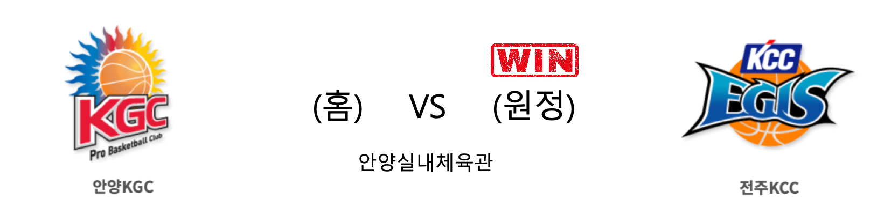
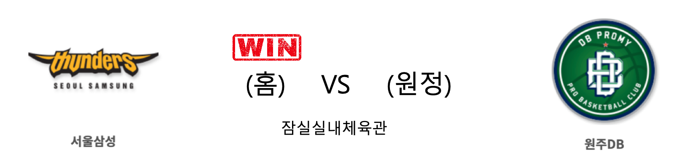

####  안양KGC(홈) VS 전주KCC(원정) 

<table class="tg">
  <tr>
    <th class="tg-rr9t">안양KGC</th>
    <th class="tg-rr9t">팀</th>
    <th class="tg-rr9t">전주KCC</th>
  </tr>
  <tr>
    <td class="tg-dcpn">2승 3패</td>
    <td class="tg-rr9t">시즌 상대전적</td>
    <td class="tg-dcpn">3승 2패</td>
  </tr>
  <tr>
    <td class="tg-dcpn">1</td>
    <td class="tg-rr9t">점수</td>
    <td class="tg-dcpn">6</td>
  </tr>
  <tr>
    <td class="tg-dcpn">0/2(0%)</td>
    <td class="tg-rr9t">2점(%)</td>
    <td class="tg-dcpn">2/6(33%)</td>
  </tr>
  <tr>
    <td class="tg-dcpn">0/4(0%)</td>
    <td class="tg-rr9t">3점(%)</td>
    <td class="tg-dcpn">0/4(0%)</td>
  </tr>
  <tr>
    <td class="tg-dcpn">1/2(50%)</td>
    <td class="tg-rr9t">자유투(%)</td>
    <td class="tg-dcpn">2/2(100%)</td>
  </tr>
  <tr>
    <td class="tg-dcpn">7</td>
    <td class="tg-rr9t">리바운드</td>
    <td class="tg-dcpn">6</td>
  </tr>
  <tr>
    <td class="tg-dcpn">0</td>
    <td class="tg-rr9t">어시스트</td>
    <td class="tg-dcpn">0</td>
  </tr>
  <tr>
    <td class="tg-dcpn">3</td>
    <td class="tg-rr9t">스틸</td>
    <td class="tg-dcpn">1</td>
  </tr>
  <tr>
    <td class="tg-dcpn">1</td>
    <td class="tg-rr9t">블록</td>
    <td class="tg-dcpn">1</td>
  </tr>
  <tr>
    <td class="tg-dcpn">1</td>
    <td class="tg-rr9t">턴오버</td>
    <td class="tg-dcpn">0</td>
  </tr>
  <tr>
    <td class="tg-dcpn"></td>
    <td class="tg-rr9t">주요 득점선수</td>
    <td class="tg-dcpn"></td>
  </tr>
</table>

#### 경기 관련 주요 기사         

[[JB프리뷰] 거리 가까워진 KGC와 KCC의 충돌, DB는 잠실 원정 연패 끊으러](http://sports.news.naver.com/basketball/news/read.nhn?oid=065&aid=0000197239)

[농구토토 매치 12회차, 안양KGC-전주KCC전 대상 발매](http://isplus.live.joins.com/news/article/article.asp?total_id=23703240)

[[포토] KGC 브라운, 아수라장~](http://www.sportsseoul.com/news/read/883563)

[KGC인삼공사 양희종, 오른쪽 발목 부상으로 KCC 전 결장](http://www.rookie.co.kr/news/articleView.html?idxno=39079)

        
        

####  서울삼성(홈) VS 원주DB(원정) 

<table class="tg">
  <tr>
    <th class="tg-rr9t">서울삼성</th>
    <th class="tg-rr9t">팀</th>
    <th class="tg-rr9t">원주DB</th>
  </tr>
  <tr>
    <td class="tg-dcpn">3승 2패</td>
    <td class="tg-rr9t">시즌 상대전적</td>
    <td class="tg-dcpn">2승 3패</td>
  </tr>
  <tr>
    <td class="tg-dcpn">13</td>
    <td class="tg-rr9t">점수</td>
    <td class="tg-dcpn">12</td>
  </tr>
  <tr>
    <td class="tg-dcpn">3/5(60%)</td>
    <td class="tg-rr9t">2점(%)</td>
    <td class="tg-dcpn">3/6(50%)</td>
  </tr>
  <tr>
    <td class="tg-dcpn">1/3(33%)</td>
    <td class="tg-rr9t">3점(%)</td>
    <td class="tg-dcpn">1/2(50%)</td>
  </tr>
  <tr>
    <td class="tg-dcpn">4/4(100%)</td>
    <td class="tg-rr9t">자유투(%)</td>
    <td class="tg-dcpn">3/3(100%)</td>
  </tr>
  <tr>
    <td class="tg-dcpn">3</td>
    <td class="tg-rr9t">리바운드</td>
    <td class="tg-dcpn">4</td>
  </tr>
  <tr>
    <td class="tg-dcpn">0</td>
    <td class="tg-rr9t">어시스트</td>
    <td class="tg-dcpn">1</td>
  </tr>
  <tr>
    <td class="tg-dcpn">4</td>
    <td class="tg-rr9t">스틸</td>
    <td class="tg-dcpn">5</td>
  </tr>
  <tr>
    <td class="tg-dcpn">5</td>
    <td class="tg-rr9t">블록</td>
    <td class="tg-dcpn">2</td>
  </tr>
  <tr>
    <td class="tg-dcpn">3</td>
    <td class="tg-rr9t">턴오버</td>
    <td class="tg-dcpn">3</td>
  </tr>
  <tr>
    <td class="tg-dcpn"></td>
    <td class="tg-rr9t">주요 득점선수</td>
    <td class="tg-dcpn"></td>
  </tr>
</table>

#### 경기 관련 주요 기사         

[[JB프리뷰] 거리 가까워진 KGC와 KCC의 충돌, DB는 잠실 원정 연패 끊으러](http://sports.news.naver.com/basketball/news/read.nhn?oid=065&aid=0000197239)

['6강 희망' 삼성 vs '선두 싸움' DB, 물러설 수 없는 맞대결](http://stoo.asiae.co.kr/article.php?aid=62077039060)

[단독 선두 노리는 DB, 허웅-김영훈 엔트리 이름 올려… 삼성은 스몰 라인업으로 맞불](http://www.basketkorea.com/news/articleView.html?idxno=192218)

[[루키 프리뷰] 순위 차이는 크지만 상대 전적은 호각지세, 삼성 vs DB](http://www.rookie.co.kr/news/articleView.html?idxno=39056)

[[라커룸에서] DB 상대하는 이상민 감독 “초반 주도권 잡는 게 중요해”](http://sports.news.naver.com/basketball/news/read.nhn?oid=065&aid=0000197256)

        
        

#### 리그 순위

<table class="tg">
  <tr>
    <th class="tg-d14o">순위</th>
    <th class="tg-d14o">팀명</th>
    <th class="tg-d14o">경기수</th>
    <th class="tg-d14o">승</th>
    <th class="tg-d14o">패</th>
    <th class="tg-d14o">승차</th>
    <th class="tg-d14o">승률</th>
  </tr>
  
<tr>
    <td class="tg-50j8">1</td>
    <td class="tg-50j8">서울SK</td>
    <td class="tg-50j8">41</td>
    <td class="tg-50j8">26</td>
    <td class="tg-50j8">15</td>
    <td class="tg-50j8">0</td>
    <td class="tg-50j8">0.634</td>
</tr>

<tr>
    <td class="tg-50j8">2</td>
    <td class="tg-50j8">원주DB</td>
    <td class="tg-50j8">42</td>
    <td class="tg-50j8">26</td>
    <td class="tg-50j8">16</td>
    <td class="tg-50j8">0</td>
    <td class="tg-50j8">0.619</td>
</tr>

<tr>
    <td class="tg-50j8">3</td>
    <td class="tg-50j8">안양KGC</td>
    <td class="tg-50j8">41</td>
    <td class="tg-50j8">24</td>
    <td class="tg-50j8">17</td>
    <td class="tg-50j8">2</td>
    <td class="tg-50j8">0.585</td>
</tr>

<tr>
    <td class="tg-50j8">4</td>
    <td class="tg-50j8">전주KCC</td>
    <td class="tg-50j8">41</td>
    <td class="tg-50j8">23</td>
    <td class="tg-50j8">18</td>
    <td class="tg-50j8">3</td>
    <td class="tg-50j8">0.561</td>
</tr>

<tr>
    <td class="tg-50j8">5</td>
    <td class="tg-50j8">부산KT</td>
    <td class="tg-50j8">41</td>
    <td class="tg-50j8">21</td>
    <td class="tg-50j8">20</td>
    <td class="tg-50j8">5</td>
    <td class="tg-50j8">0.512</td>
</tr>

<tr>
    <td class="tg-50j8">6</td>
    <td class="tg-50j8">인천전자랜드</td>
    <td class="tg-50j8">40</td>
    <td class="tg-50j8">20</td>
    <td class="tg-50j8">20</td>
    <td class="tg-50j8">6</td>
    <td class="tg-50j8">0.5</td>
</tr>

<tr>
    <td class="tg-50j8">7</td>
    <td class="tg-50j8">서울삼성</td>
    <td class="tg-50j8">42</td>
    <td class="tg-50j8">19</td>
    <td class="tg-50j8">23</td>
    <td class="tg-50j8">7</td>
    <td class="tg-50j8">0.452</td>
</tr>

<tr>
    <td class="tg-50j8">8</td>
    <td class="tg-50j8">울산현대모비스</td>
    <td class="tg-50j8">40</td>
    <td class="tg-50j8">18</td>
    <td class="tg-50j8">22</td>
    <td class="tg-50j8">8</td>
    <td class="tg-50j8">0.45</td>
</tr>

<tr>
    <td class="tg-50j8">9</td>
    <td class="tg-50j8">창원LG</td>
    <td class="tg-50j8">41</td>
    <td class="tg-50j8">16</td>
    <td class="tg-50j8">25</td>
    <td class="tg-50j8">10</td>
    <td class="tg-50j8">0.39</td>
</tr>

<tr>
    <td class="tg-50j8">10</td>
    <td class="tg-50j8">고양오리온</td>
    <td class="tg-50j8">41</td>
    <td class="tg-50j8">12</td>
    <td class="tg-50j8">29</td>
    <td class="tg-50j8">14</td>
    <td class="tg-50j8">0.293</td>
</tr>
</table> 

        
        
#kbl #국내농구 #농구분석 #토토 #스포츠토토 #경기예측 #농구결과 #20200213 #안양KGC #전주KCC #서울삼성 #원주DB #안양KGC전주KCC #서울삼성원주DB 