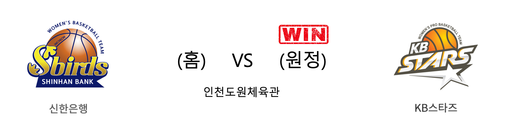

####  신한은행(홈) VS KB스타즈(원정) 

<table class="tg">
  <tr>
    <th class="tg-rr9t">신한은행</th>
    <th class="tg-rr9t">팀</th>
    <th class="tg-rr9t">KB스타즈</th>
  </tr>
  <tr>
    <td class="tg-dcpn">1승 4패</td>
    <td class="tg-rr9t">시즌 상대전적</td>
    <td class="tg-dcpn">4승 1패</td>
  </tr>
  <tr>
    <td class="tg-dcpn">60</td>
    <td class="tg-rr9t">점수</td>
    <td class="tg-dcpn">77</td>
  </tr>
  <tr>
    <td class="tg-dcpn">21/49(43%)</td>
    <td class="tg-rr9t">2점(%)</td>
    <td class="tg-dcpn">24/40(60%)</td>
  </tr>
  <tr>
    <td class="tg-dcpn">2/24(8%)</td>
    <td class="tg-rr9t">3점(%)</td>
    <td class="tg-dcpn">7/19(37%)</td>
  </tr>
  <tr>
    <td class="tg-dcpn">12/16(75%)</td>
    <td class="tg-rr9t">자유투(%)</td>
    <td class="tg-dcpn">8/11(73%)</td>
  </tr>
  <tr>
    <td class="tg-dcpn">34</td>
    <td class="tg-rr9t">리바운드</td>
    <td class="tg-dcpn">35</td>
  </tr>
  <tr>
    <td class="tg-dcpn">15</td>
    <td class="tg-rr9t">어시스트</td>
    <td class="tg-dcpn">20</td>
  </tr>
  <tr>
    <td class="tg-dcpn">5</td>
    <td class="tg-rr9t">스틸</td>
    <td class="tg-dcpn">8</td>
  </tr>
  <tr>
    <td class="tg-dcpn">12</td>
    <td class="tg-rr9t">블록</td>
    <td class="tg-dcpn">13</td>
  </tr>
  <tr>
    <td class="tg-dcpn">17</td>
    <td class="tg-rr9t">턴오버</td>
    <td class="tg-dcpn">20</td>
  </tr>
  <tr>
    <td class="tg-dcpn">김단비(18) 서덜랜드(16)</td>
    <td class="tg-rr9t">주요 득점선수</td>
    <td class="tg-dcpn">쏜튼(17) 김민정(18) 심성영(16)</td>
  </tr>
</table>

#### 경기 관련 주요 기사         

['쏜튼 17득점' KB스타즈, 신한은행 잡고 2연승 성공](http://news1.kr/articles/?3850255)

['시즌 10승 도전' 신한은행, 홈에서 KB스타즈와 5R 맞대결 펼친다](http://www.basketkorea.com/news/articleView.html?idxno=192391)

[[포토] KB스타즈 '신한은행 잡고 2연승'](http://sports.chosun.com/news/ntype.htm?id=202002220100164310010828&servicedate=20200222)

[KB, 신한은행 완파하고 2연승…2위 우리은행과 1경기 차](http://sports.khan.co.kr/news/sk_index.html?art_id=202002221921003&sec_id=530301&pt=nv)

        
        

#### 리그 순위

<table class="tg">
  <tr>
    <th class="tg-d14o">순위</th>
    <th class="tg-d14o">팀명</th>
    <th class="tg-d14o">경기수</th>
    <th class="tg-d14o">승</th>
    <th class="tg-d14o">패</th>
    <th class="tg-d14o">승차</th>
    <th class="tg-d14o">승률</th>
  </tr>
  
<tr>
    <td class="tg-50j8">1</td>
    <td class="tg-50j8">KB스타즈</td>
    <td class="tg-50j8">23</td>
    <td class="tg-50j8">17</td>
    <td class="tg-50j8">6</td>
    <td class="tg-50j8">0</td>
    <td class="tg-50j8">0.739</td>
</tr>

<tr>
    <td class="tg-50j8">2</td>
    <td class="tg-50j8">우리은행</td>
    <td class="tg-50j8">22</td>
    <td class="tg-50j8">16</td>
    <td class="tg-50j8">6</td>
    <td class="tg-50j8">1</td>
    <td class="tg-50j8">0.727</td>
</tr>

<tr>
    <td class="tg-50j8">3</td>
    <td class="tg-50j8">신한은행</td>
    <td class="tg-50j8">23</td>
    <td class="tg-50j8">9</td>
    <td class="tg-50j8">14</td>
    <td class="tg-50j8">8</td>
    <td class="tg-50j8">0.391</td>
</tr>

<tr>
    <td class="tg-50j8">4</td>
    <td class="tg-50j8">KEB하나</td>
    <td class="tg-50j8">19</td>
    <td class="tg-50j8">8</td>
    <td class="tg-50j8">11</td>
    <td class="tg-50j8">9</td>
    <td class="tg-50j8">0.421</td>
</tr>

<tr>
    <td class="tg-50j8">5</td>
    <td class="tg-50j8">삼성생명</td>
    <td class="tg-50j8">20</td>
    <td class="tg-50j8">7</td>
    <td class="tg-50j8">13</td>
    <td class="tg-50j8">10</td>
    <td class="tg-50j8">0.35</td>
</tr>

<tr>
    <td class="tg-50j8">6</td>
    <td class="tg-50j8">BNK썸</td>
    <td class="tg-50j8">22</td>
    <td class="tg-50j8">7</td>
    <td class="tg-50j8">15</td>
    <td class="tg-50j8">10</td>
    <td class="tg-50j8">0.318</td>
</tr>
</table> 

        
        
#wkbl #국내농구 #여자농구 #농구분석 #토토 #스포츠토토 #경기예측 #농구결과 #20200222 #신한은행 #KB스타즈 #신한은행KB스타즈 