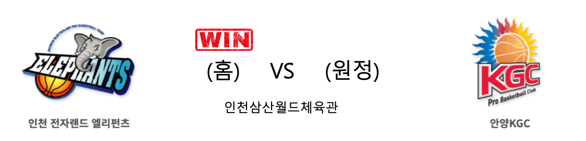

####  인천전자랜드(홈) VS 안양KGC(원정) 

<table class="tg">
  <tr>
    <th class="tg-rr9t">인천전자랜드</th>
    <th class="tg-rr9t">팀</th>
    <th class="tg-rr9t">안양KGC</th>
  </tr>
  <tr>
    <td class="tg-dcpn">1승 4패</td>
    <td class="tg-rr9t">시즌 상대전적</td>
    <td class="tg-dcpn">4승 1패</td>
  </tr>
  <tr>
    <td class="tg-dcpn">99</td>
    <td class="tg-rr9t">점수</td>
    <td class="tg-dcpn">88</td>
  </tr>
  <tr>
    <td class="tg-dcpn">26/38(68%)</td>
    <td class="tg-rr9t">2점(%)</td>
    <td class="tg-dcpn">21/30(70%)</td>
  </tr>
  <tr>
    <td class="tg-dcpn">12/24(50%)</td>
    <td class="tg-rr9t">3점(%)</td>
    <td class="tg-dcpn">12/39(31%)</td>
  </tr>
  <tr>
    <td class="tg-dcpn">11/19(58%)</td>
    <td class="tg-rr9t">자유투(%)</td>
    <td class="tg-dcpn">10/17(59%)</td>
  </tr>
  <tr>
    <td class="tg-dcpn">24</td>
    <td class="tg-rr9t">리바운드</td>
    <td class="tg-dcpn">35</td>
  </tr>
  <tr>
    <td class="tg-dcpn">3</td>
    <td class="tg-rr9t">어시스트</td>
    <td class="tg-dcpn">1</td>
  </tr>
  <tr>
    <td class="tg-dcpn">12</td>
    <td class="tg-rr9t">스틸</td>
    <td class="tg-dcpn">13</td>
  </tr>
  <tr>
    <td class="tg-dcpn">6</td>
    <td class="tg-rr9t">블록</td>
    <td class="tg-dcpn">11</td>
  </tr>
  <tr>
    <td class="tg-dcpn">26</td>
    <td class="tg-rr9t">턴오버</td>
    <td class="tg-dcpn">21</td>
  </tr>
  <tr>
    <td class="tg-dcpn">박찬희(17) 김낙현(25) 트로이 길렌워터(16) 머피 할로웨이(15)</td>
    <td class="tg-rr9t">주요 득점선수</td>
    <td class="tg-dcpn">브랜든 브라운(25)</td>
  </tr>
</table>

#### 경기 관련 주요 기사         

[[포토] 사상 초유의 무관중 경기, KGC에 승리한 전자랜드](http://sports.chosun.com/news/ntype.htm?id=202002260100198830012978&servicedate=20200226)

[전자랜드, 26일 KGC전서 온라인 이벤트 '집관을 직관처럼!' 진행](http://isplus.live.joins.com/news/article/article.asp?total_id=23716039)

[[BK Review] '김낙현 폭발' 전자랜드, KGC전 4연패 끊어](http://www.basketkorea.com/news/articleView.html?idxno=192447)

[전자랜드 `김낙현 활약속에 KGC에 99-88승` [MK포토]](http://mksports.co.kr/view/2020/201472/)

        
        

####  고양오리온(홈) VS 울산현대모비스(원정) 

<table class="tg">
  <tr>
    <th class="tg-rr9t">고양오리온</th>
    <th class="tg-rr9t">팀</th>
    <th class="tg-rr9t">울산현대모비스</th>
  </tr>
  <tr>
    <td class="tg-dcpn">3승 2패</td>
    <td class="tg-rr9t">시즌 상대전적</td>
    <td class="tg-dcpn">2승 3패</td>
  </tr>
  <tr>
    <td class="tg-dcpn">68</td>
    <td class="tg-rr9t">점수</td>
    <td class="tg-dcpn">64</td>
  </tr>
  <tr>
    <td class="tg-dcpn">23/43(53%)</td>
    <td class="tg-rr9t">2점(%)</td>
    <td class="tg-dcpn">16/36(44%)</td>
  </tr>
  <tr>
    <td class="tg-dcpn">5/15(33%)</td>
    <td class="tg-rr9t">3점(%)</td>
    <td class="tg-dcpn">6/26(23%)</td>
  </tr>
  <tr>
    <td class="tg-dcpn">7/9(78%)</td>
    <td class="tg-rr9t">자유투(%)</td>
    <td class="tg-dcpn">14/16(88%)</td>
  </tr>
  <tr>
    <td class="tg-dcpn">30</td>
    <td class="tg-rr9t">리바운드</td>
    <td class="tg-dcpn">38</td>
  </tr>
  <tr>
    <td class="tg-dcpn">3</td>
    <td class="tg-rr9t">어시스트</td>
    <td class="tg-dcpn">0</td>
  </tr>
  <tr>
    <td class="tg-dcpn">12</td>
    <td class="tg-rr9t">스틸</td>
    <td class="tg-dcpn">12</td>
  </tr>
  <tr>
    <td class="tg-dcpn">8</td>
    <td class="tg-rr9t">블록</td>
    <td class="tg-dcpn">8</td>
  </tr>
  <tr>
    <td class="tg-dcpn">19</td>
    <td class="tg-rr9t">턴오버</td>
    <td class="tg-dcpn">17</td>
  </tr>
  <tr>
    <td class="tg-dcpn">보리스 사보비치(22)</td>
    <td class="tg-rr9t">주요 득점선수</td>
    <td class="tg-dcpn">김국찬(18) 리온 윌리엄스(26)</td>
  </tr>
</table>

#### 경기 관련 주요 기사         

[감독 된 ‘피터팬’ 김병철, 데뷔전서 활짝…오리온 5연패 탈출](http://www.hankookilbo.com/news/npath/202002262066044129?did=NA)

['김병철 대행 첫 승' 오리온, '이종현 복귀' 현대모비스 제압](http://sports.chosun.com/news/ntype.htm?id=202002270100198680012967&servicedate=20200226)

[[뒷북STAT] 오리온 김병철 감독대행 데뷔전, 기대 승률은 26.3%?](http://sports.news.naver.com/basketball/news/read.nhn?oid=065&aid=0000197788)

[울산현대모비스-고양오리온 무관중 경기](http://yna.kr/PYH20200226222000060?did=1196m)

        
        

#### 리그 순위

<table class="tg">
  <tr>
    <th class="tg-d14o">순위</th>
    <th class="tg-d14o">팀명</th>
    <th class="tg-d14o">경기수</th>
    <th class="tg-d14o">승</th>
    <th class="tg-d14o">패</th>
    <th class="tg-d14o">승차</th>
    <th class="tg-d14o">승률</th>
  </tr>
  
<tr>
    <td class="tg-50j8">1</td>
    <td class="tg-50j8">원주DB</td>
    <td class="tg-50j8">42</td>
    <td class="tg-50j8">27</td>
    <td class="tg-50j8">15</td>
    <td class="tg-50j8">0</td>
    <td class="tg-50j8">0.643</td>
</tr>

<tr>
    <td class="tg-50j8">2</td>
    <td class="tg-50j8">서울SK</td>
    <td class="tg-50j8">41</td>
    <td class="tg-50j8">26</td>
    <td class="tg-50j8">15</td>
    <td class="tg-50j8">1</td>
    <td class="tg-50j8">0.634</td>
</tr>

<tr>
    <td class="tg-50j8">3</td>
    <td class="tg-50j8">안양KGC</td>
    <td class="tg-50j8">42</td>
    <td class="tg-50j8">25</td>
    <td class="tg-50j8">17</td>
    <td class="tg-50j8">2</td>
    <td class="tg-50j8">0.595</td>
</tr>

<tr>
    <td class="tg-50j8">4</td>
    <td class="tg-50j8">전주KCC</td>
    <td class="tg-50j8">41</td>
    <td class="tg-50j8">22</td>
    <td class="tg-50j8">19</td>
    <td class="tg-50j8">5</td>
    <td class="tg-50j8">0.537</td>
</tr>

<tr>
    <td class="tg-50j8">5</td>
    <td class="tg-50j8">인천전자랜드</td>
    <td class="tg-50j8">41</td>
    <td class="tg-50j8">21</td>
    <td class="tg-50j8">20</td>
    <td class="tg-50j8">6</td>
    <td class="tg-50j8">0.512</td>
</tr>

<tr>
    <td class="tg-50j8">5</td>
    <td class="tg-50j8">부산KT</td>
    <td class="tg-50j8">41</td>
    <td class="tg-50j8">21</td>
    <td class="tg-50j8">20</td>
    <td class="tg-50j8">6</td>
    <td class="tg-50j8">0.512</td>
</tr>

<tr>
    <td class="tg-50j8">7</td>
    <td class="tg-50j8">울산현대모비스</td>
    <td class="tg-50j8">41</td>
    <td class="tg-50j8">18</td>
    <td class="tg-50j8">23</td>
    <td class="tg-50j8">9</td>
    <td class="tg-50j8">0.439</td>
</tr>

<tr>
    <td class="tg-50j8">8</td>
    <td class="tg-50j8">서울삼성</td>
    <td class="tg-50j8">42</td>
    <td class="tg-50j8">18</td>
    <td class="tg-50j8">24</td>
    <td class="tg-50j8">9</td>
    <td class="tg-50j8">0.429</td>
</tr>

<tr>
    <td class="tg-50j8">9</td>
    <td class="tg-50j8">창원LG</td>
    <td class="tg-50j8">41</td>
    <td class="tg-50j8">16</td>
    <td class="tg-50j8">25</td>
    <td class="tg-50j8">11</td>
    <td class="tg-50j8">0.39</td>
</tr>

<tr>
    <td class="tg-50j8">10</td>
    <td class="tg-50j8">고양오리온</td>
    <td class="tg-50j8">42</td>
    <td class="tg-50j8">13</td>
    <td class="tg-50j8">29</td>
    <td class="tg-50j8">14</td>
    <td class="tg-50j8">0.31</td>
</tr>
</table> 

        
        
#kbl #국내농구 #농구분석 #토토 #스포츠토토 #경기예측 #농구결과 #20200226 #인천전자랜드 #안양KGC #고양오리온 #울산현대모비스 #인천전자랜드안양KGC #고양오리온울산현대모비스 