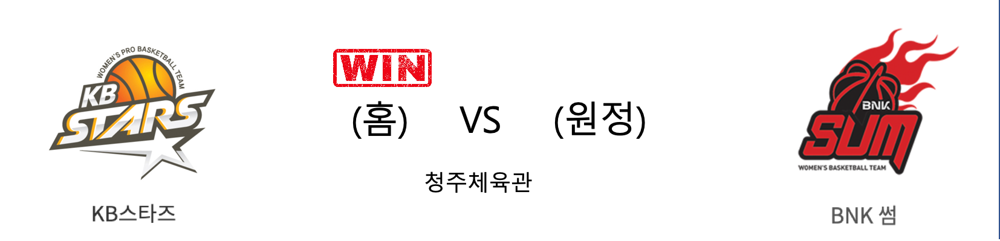

####  KB스타즈(홈) VS BNK썸(원정) 

<table class="tg">
  <tr>
    <th class="tg-rr9t">KB스타즈</th>
    <th class="tg-rr9t">팀</th>
    <th class="tg-rr9t">BNK썸</th>
  </tr>
  <tr>
    <td class="tg-dcpn">4승 1패</td>
    <td class="tg-rr9t">시즌 상대전적</td>
    <td class="tg-dcpn">1승 4패</td>
  </tr>
  <tr>
    <td class="tg-dcpn">62</td>
    <td class="tg-rr9t">점수</td>
    <td class="tg-dcpn">57</td>
  </tr>
  <tr>
    <td class="tg-dcpn">16/43(37%)</td>
    <td class="tg-rr9t">2점(%)</td>
    <td class="tg-dcpn">18/48(38%)</td>
  </tr>
  <tr>
    <td class="tg-dcpn">7/22(32%)</td>
    <td class="tg-rr9t">3점(%)</td>
    <td class="tg-dcpn">5/13(38%)</td>
  </tr>
  <tr>
    <td class="tg-dcpn">9/11(82%)</td>
    <td class="tg-rr9t">자유투(%)</td>
    <td class="tg-dcpn">6/8(75%)</td>
  </tr>
  <tr>
    <td class="tg-dcpn">40</td>
    <td class="tg-rr9t">리바운드</td>
    <td class="tg-dcpn">31</td>
  </tr>
  <tr>
    <td class="tg-dcpn">16</td>
    <td class="tg-rr9t">어시스트</td>
    <td class="tg-dcpn">14</td>
  </tr>
  <tr>
    <td class="tg-dcpn">13</td>
    <td class="tg-rr9t">스틸</td>
    <td class="tg-dcpn">12</td>
  </tr>
  <tr>
    <td class="tg-dcpn">20</td>
    <td class="tg-rr9t">블록</td>
    <td class="tg-dcpn">19</td>
  </tr>
  <tr>
    <td class="tg-dcpn">17</td>
    <td class="tg-rr9t">턴오버</td>
    <td class="tg-dcpn">21</td>
  </tr>
  <tr>
    <td class="tg-dcpn">쏜튼(16)</td>
    <td class="tg-rr9t">주요 득점선수</td>
    <td class="tg-dcpn"></td>
  </tr>
</table>

#### 경기 관련 주요 기사         

[[BK Review] '박지수의 위력' KB스타즈, BNK 꺾고 선두 유지](http://www.basketkorea.com/news/articleView.html?idxno=192448)

[농구팬 71%, “플레이오프 노리는 BNK썸, KB스타즈 상대로 우세한 경기 펼칠 것”](http://isplus.live.joins.com/news/article/article.asp?total_id=23714827)

[KB, 상승세 BNK 꺾고 3연승…1경기차 단독 선두](http://www.maniareport.com/view.php?ud=202002262127513285e8e941087_19)

[[내 맘대로 프리뷰] KB스타즈-BNK, 연승을 이어갈 팀은?](http://www.basketkorea.com/news/articleView.html?idxno=192442)

        
        

#### 리그 순위

<table class="tg">
  <tr>
    <th class="tg-d14o">순위</th>
    <th class="tg-d14o">팀명</th>
    <th class="tg-d14o">경기수</th>
    <th class="tg-d14o">승</th>
    <th class="tg-d14o">패</th>
    <th class="tg-d14o">승차</th>
    <th class="tg-d14o">승률</th>
  </tr>
  
<tr>
    <td class="tg-50j8">1</td>
    <td class="tg-50j8">KB스타즈</td>
    <td class="tg-50j8">24</td>
    <td class="tg-50j8">18</td>
    <td class="tg-50j8">6</td>
    <td class="tg-50j8">0</td>
    <td class="tg-50j8">0.75</td>
</tr>

<tr>
    <td class="tg-50j8">2</td>
    <td class="tg-50j8">우리은행</td>
    <td class="tg-50j8">23</td>
    <td class="tg-50j8">17</td>
    <td class="tg-50j8">6</td>
    <td class="tg-50j8">1</td>
    <td class="tg-50j8">0.739</td>
</tr>

<tr>
    <td class="tg-50j8">3</td>
    <td class="tg-50j8">신한은행</td>
    <td class="tg-50j8">23</td>
    <td class="tg-50j8">9</td>
    <td class="tg-50j8">14</td>
    <td class="tg-50j8">9</td>
    <td class="tg-50j8">0.391</td>
</tr>

<tr>
    <td class="tg-50j8">4</td>
    <td class="tg-50j8">KEB하나</td>
    <td class="tg-50j8">19</td>
    <td class="tg-50j8">8</td>
    <td class="tg-50j8">11</td>
    <td class="tg-50j8">10</td>
    <td class="tg-50j8">0.421</td>
</tr>

<tr>
    <td class="tg-50j8">5</td>
    <td class="tg-50j8">BNK썸</td>
    <td class="tg-50j8">24</td>
    <td class="tg-50j8">8</td>
    <td class="tg-50j8">16</td>
    <td class="tg-50j8">10</td>
    <td class="tg-50j8">0.333</td>
</tr>

<tr>
    <td class="tg-50j8">6</td>
    <td class="tg-50j8">삼성생명</td>
    <td class="tg-50j8">21</td>
    <td class="tg-50j8">7</td>
    <td class="tg-50j8">14</td>
    <td class="tg-50j8">11</td>
    <td class="tg-50j8">0.333</td>
</tr>
</table> 

        
        
#wkbl #국내농구 #여자농구 #농구분석 #토토 #스포츠토토 #경기예측 #농구결과 #20200226 #KB스타즈 #BNK썸 #KB스타즈BNK썸 