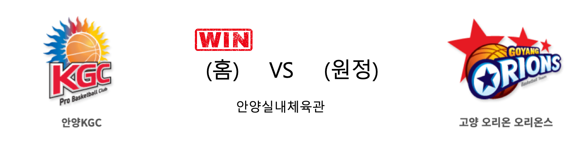

####  안양KGC(홈) VS 고양오리온(원정) 

<table class="tg">
  <tr>
    <th class="tg-rr9t">안양KGC</th>
    <th class="tg-rr9t">팀</th>
    <th class="tg-rr9t">고양오리온</th>
  </tr>
  <tr>
    <td class="tg-dcpn">4승 1패</td>
    <td class="tg-rr9t">시즌 상대전적</td>
    <td class="tg-dcpn">1승 4패</td>
  </tr>
  <tr>
    <td class="tg-dcpn">79</td>
    <td class="tg-rr9t">점수</td>
    <td class="tg-dcpn">78</td>
  </tr>
  <tr>
    <td class="tg-dcpn">23/37(62%)</td>
    <td class="tg-rr9t">2점(%)</td>
    <td class="tg-dcpn">27/50(54%)</td>
  </tr>
  <tr>
    <td class="tg-dcpn">9/29(31%)</td>
    <td class="tg-rr9t">3점(%)</td>
    <td class="tg-dcpn">6/22(27%)</td>
  </tr>
  <tr>
    <td class="tg-dcpn">6/10(60%)</td>
    <td class="tg-rr9t">자유투(%)</td>
    <td class="tg-dcpn">6/8(75%)</td>
  </tr>
  <tr>
    <td class="tg-dcpn">33</td>
    <td class="tg-rr9t">리바운드</td>
    <td class="tg-dcpn">38</td>
  </tr>
  <tr>
    <td class="tg-dcpn">2</td>
    <td class="tg-rr9t">어시스트</td>
    <td class="tg-dcpn">1</td>
  </tr>
  <tr>
    <td class="tg-dcpn">9</td>
    <td class="tg-rr9t">스틸</td>
    <td class="tg-dcpn">12</td>
  </tr>
  <tr>
    <td class="tg-dcpn">9</td>
    <td class="tg-rr9t">블록</td>
    <td class="tg-dcpn">7</td>
  </tr>
  <tr>
    <td class="tg-dcpn">17</td>
    <td class="tg-rr9t">턴오버</td>
    <td class="tg-dcpn">18</td>
  </tr>
  <tr>
    <td class="tg-dcpn">브랜든 브라운(31) 전성현(25)</td>
    <td class="tg-rr9t">주요 득점선수</td>
    <td class="tg-dcpn">이승현(15) 아드리안 유터(16)</td>
  </tr>
</table>

#### 경기 관련 주요 기사         

[KGC 김승기 감독 "리그 중단, KBL의 결정 따라야"](http://www.rookie.co.kr/news/articleView.html?idxno=39754)

[[JB화보] 안양 KGC인삼공사, 고양 오리온에 79-78로 승리](http://sports.news.naver.com/basketball/news/read.nhn?oid=065&aid=0000197960)

[SK, 전자랜드 꺾고 공동 선두 복귀… KGC·KCC도 승리](http://isplus.live.joins.com/news/article/article.asp?total_id=23718721)

['브라운-전성현 활약' KGC, '사보비치 이탈' 오리온에 진땀승](http://www.mydaily.co.kr/new_yk/html/read.php?newsid=202002291510999921&ext=na)

        
        

####  전주KCC(홈) VS 부산KT(원정) 

<table class="tg">
  <tr>
    <th class="tg-rr9t">전주KCC</th>
    <th class="tg-rr9t">팀</th>
    <th class="tg-rr9t">부산KT</th>
  </tr>
  <tr>
    <td class="tg-dcpn">3승 2패</td>
    <td class="tg-rr9t">시즌 상대전적</td>
    <td class="tg-dcpn">2승 3패</td>
  </tr>
  <tr>
    <td class="tg-dcpn">97</td>
    <td class="tg-rr9t">점수</td>
    <td class="tg-dcpn">63</td>
  </tr>
  <tr>
    <td class="tg-dcpn">29/51(57%)</td>
    <td class="tg-rr9t">2점(%)</td>
    <td class="tg-dcpn">20/43(47%)</td>
  </tr>
  <tr>
    <td class="tg-dcpn">11/26(42%)</td>
    <td class="tg-rr9t">3점(%)</td>
    <td class="tg-dcpn">5/33(15%)</td>
  </tr>
  <tr>
    <td class="tg-dcpn">6/12(50%)</td>
    <td class="tg-rr9t">자유투(%)</td>
    <td class="tg-dcpn">8/12(67%)</td>
  </tr>
  <tr>
    <td class="tg-dcpn">50</td>
    <td class="tg-rr9t">리바운드</td>
    <td class="tg-dcpn">34</td>
  </tr>
  <tr>
    <td class="tg-dcpn">0</td>
    <td class="tg-rr9t">어시스트</td>
    <td class="tg-dcpn">0</td>
  </tr>
  <tr>
    <td class="tg-dcpn">11</td>
    <td class="tg-rr9t">스틸</td>
    <td class="tg-dcpn">13</td>
  </tr>
  <tr>
    <td class="tg-dcpn">6</td>
    <td class="tg-rr9t">블록</td>
    <td class="tg-dcpn">6</td>
  </tr>
  <tr>
    <td class="tg-dcpn">26</td>
    <td class="tg-rr9t">턴오버</td>
    <td class="tg-dcpn">17</td>
  </tr>
  <tr>
    <td class="tg-dcpn">찰스 로드(16) 오데라 아노시케(18)</td>
    <td class="tg-rr9t">주요 득점선수</td>
    <td class="tg-dcpn"></td>
  </tr>
</table>

#### 경기 관련 주요 기사         

[프로농구 3월 1일부터 전면 중단…KCC 선수단 숙소에 확진자(종합)](http://yna.kr/AKR20200229067651007?did=1195m)

[kcc 찰스로드 '이 공은 내꺼야'](http://www.newsis.com/view/?id=NISI20200229_0016130526)

[프로농구 3월부터 잠정 중단, 전주 KCC 숙소에 코로나19 확진자 방문](http://www.sportsseoul.com/news/read/889152)

[KCC, 외국인 선수 없는 KT 상대 손쉬운 승리](http://sports.chosun.com/news/ntype.htm?id=202002290100217740014330&servicedate=20200229)

        
        

####  서울SK(홈) VS 인천전자랜드(원정) 

<table class="tg">
  <tr>
    <th class="tg-rr9t">서울SK</th>
    <th class="tg-rr9t">팀</th>
    <th class="tg-rr9t">인천전자랜드</th>
  </tr>
  <tr>
    <td class="tg-dcpn">5승 0패</td>
    <td class="tg-rr9t">시즌 상대전적</td>
    <td class="tg-dcpn">0승 5패</td>
  </tr>
  <tr>
    <td class="tg-dcpn">84</td>
    <td class="tg-rr9t">점수</td>
    <td class="tg-dcpn">63</td>
  </tr>
  <tr>
    <td class="tg-dcpn">23/49(47%)</td>
    <td class="tg-rr9t">2점(%)</td>
    <td class="tg-dcpn">12/39(31%)</td>
  </tr>
  <tr>
    <td class="tg-dcpn">7/20(35%)</td>
    <td class="tg-rr9t">3점(%)</td>
    <td class="tg-dcpn">9/37(24%)</td>
  </tr>
  <tr>
    <td class="tg-dcpn">17/22(77%)</td>
    <td class="tg-rr9t">자유투(%)</td>
    <td class="tg-dcpn">12/18(67%)</td>
  </tr>
  <tr>
    <td class="tg-dcpn">55</td>
    <td class="tg-rr9t">리바운드</td>
    <td class="tg-dcpn">37</td>
  </tr>
  <tr>
    <td class="tg-dcpn">0</td>
    <td class="tg-rr9t">어시스트</td>
    <td class="tg-dcpn">1</td>
  </tr>
  <tr>
    <td class="tg-dcpn">11</td>
    <td class="tg-rr9t">스틸</td>
    <td class="tg-dcpn">5</td>
  </tr>
  <tr>
    <td class="tg-dcpn">2</td>
    <td class="tg-rr9t">블록</td>
    <td class="tg-dcpn">7</td>
  </tr>
  <tr>
    <td class="tg-dcpn">13</td>
    <td class="tg-rr9t">턴오버</td>
    <td class="tg-dcpn">14</td>
  </tr>
  <tr>
    <td class="tg-dcpn">자밀 워니(16) 최성원(15)</td>
    <td class="tg-rr9t">주요 득점선수</td>
    <td class="tg-dcpn"></td>
  </tr>
</table>

#### 경기 관련 주요 기사         

[워니·최성원 맹활약 SK, 전자랜드 잡고 5연승…공동 선두(종합)](http://yna.kr/AKR20200229061151007?did=1195m)

[[BK Review] '최성원 3점슛 폭발' SK, 전자랜드에 5전 전승… 5연승+공동 선두](http://www.basketkorea.com/news/articleView.html?idxno=192525)

[[JB화보]SK, 전자랜드 꺾고 공동 1위](http://sports.news.naver.com/basketball/news/read.nhn?oid=065&aid=0000197959)

[[포토] SK-전자랜드전 끝으로 전면 중단된 프로농구](http://sports.chosun.com/news/ntype.htm?id=202002290100218170014384&servicedate=20200229)

        
        

#### 리그 순위

<table class="tg">
  <tr>
    <th class="tg-d14o">순위</th>
    <th class="tg-d14o">팀명</th>
    <th class="tg-d14o">경기수</th>
    <th class="tg-d14o">승</th>
    <th class="tg-d14o">패</th>
    <th class="tg-d14o">승차</th>
    <th class="tg-d14o">승률</th>
  </tr>
  
<tr>
    <td class="tg-50j8">1</td>
    <td class="tg-50j8">서울SK</td>
    <td class="tg-50j8">43</td>
    <td class="tg-50j8">28</td>
    <td class="tg-50j8">15</td>
    <td class="tg-50j8">0</td>
    <td class="tg-50j8">0.651</td>
</tr>

<tr>
    <td class="tg-50j8">1</td>
    <td class="tg-50j8">원주DB</td>
    <td class="tg-50j8">43</td>
    <td class="tg-50j8">28</td>
    <td class="tg-50j8">15</td>
    <td class="tg-50j8">0</td>
    <td class="tg-50j8">0.651</td>
</tr>

<tr>
    <td class="tg-50j8">3</td>
    <td class="tg-50j8">안양KGC</td>
    <td class="tg-50j8">43</td>
    <td class="tg-50j8">26</td>
    <td class="tg-50j8">17</td>
    <td class="tg-50j8">2</td>
    <td class="tg-50j8">0.605</td>
</tr>

<tr>
    <td class="tg-50j8">4</td>
    <td class="tg-50j8">전주KCC</td>
    <td class="tg-50j8">42</td>
    <td class="tg-50j8">23</td>
    <td class="tg-50j8">19</td>
    <td class="tg-50j8">5</td>
    <td class="tg-50j8">0.548</td>
</tr>

<tr>
    <td class="tg-50j8">5</td>
    <td class="tg-50j8">인천전자랜드</td>
    <td class="tg-50j8">42</td>
    <td class="tg-50j8">21</td>
    <td class="tg-50j8">21</td>
    <td class="tg-50j8">7</td>
    <td class="tg-50j8">0.5</td>
</tr>

<tr>
    <td class="tg-50j8">6</td>
    <td class="tg-50j8">부산KT</td>
    <td class="tg-50j8">43</td>
    <td class="tg-50j8">21</td>
    <td class="tg-50j8">22</td>
    <td class="tg-50j8">7</td>
    <td class="tg-50j8">0.488</td>
</tr>

<tr>
    <td class="tg-50j8">7</td>
    <td class="tg-50j8">서울삼성</td>
    <td class="tg-50j8">43</td>
    <td class="tg-50j8">19</td>
    <td class="tg-50j8">24</td>
    <td class="tg-50j8">9</td>
    <td class="tg-50j8">0.442</td>
</tr>

<tr>
    <td class="tg-50j8">8</td>
    <td class="tg-50j8">울산현대모비스</td>
    <td class="tg-50j8">42</td>
    <td class="tg-50j8">18</td>
    <td class="tg-50j8">24</td>
    <td class="tg-50j8">10</td>
    <td class="tg-50j8">0.429</td>
</tr>

<tr>
    <td class="tg-50j8">9</td>
    <td class="tg-50j8">창원LG</td>
    <td class="tg-50j8">42</td>
    <td class="tg-50j8">16</td>
    <td class="tg-50j8">26</td>
    <td class="tg-50j8">12</td>
    <td class="tg-50j8">0.381</td>
</tr>

<tr>
    <td class="tg-50j8">10</td>
    <td class="tg-50j8">고양오리온</td>
    <td class="tg-50j8">43</td>
    <td class="tg-50j8">13</td>
    <td class="tg-50j8">30</td>
    <td class="tg-50j8">15</td>
    <td class="tg-50j8">0.302</td>
</tr>
</table> 

        
        
#kbl #국내농구 #농구분석 #토토 #스포츠토토 #경기예측 #농구결과 #20200229 #안양KGC #고양오리온 #전주KCC #부산KT #서울SK #인천전자랜드 #안양KGC고양오리온 #전주KCC부산KT #서울SK인천전자랜드 