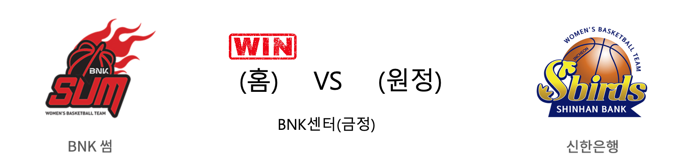

####  BNK썸(홈) VS 신한은행(원정) 

<table class="tg">
  <tr>
    <th class="tg-rr9t">BNK썸</th>
    <th class="tg-rr9t">팀</th>
    <th class="tg-rr9t">신한은행</th>
  </tr>
  <tr>
    <td class="tg-dcpn">2승 4패</td>
    <td class="tg-rr9t">시즌 상대전적</td>
    <td class="tg-dcpn">4승 2패</td>
  </tr>
  <tr>
    <td class="tg-dcpn">69</td>
    <td class="tg-rr9t">점수</td>
    <td class="tg-dcpn">68</td>
  </tr>
  <tr>
    <td class="tg-dcpn">18/40(45%)</td>
    <td class="tg-rr9t">2점(%)</td>
    <td class="tg-dcpn">18/39(46%)</td>
  </tr>
  <tr>
    <td class="tg-dcpn">7/23(30%)</td>
    <td class="tg-rr9t">3점(%)</td>
    <td class="tg-dcpn">6/18(33%)</td>
  </tr>
  <tr>
    <td class="tg-dcpn">12/22(55%)</td>
    <td class="tg-rr9t">자유투(%)</td>
    <td class="tg-dcpn">14/17(82%)</td>
  </tr>
  <tr>
    <td class="tg-dcpn">29</td>
    <td class="tg-rr9t">리바운드</td>
    <td class="tg-dcpn">31</td>
  </tr>
  <tr>
    <td class="tg-dcpn">23</td>
    <td class="tg-rr9t">어시스트</td>
    <td class="tg-dcpn">17</td>
  </tr>
  <tr>
    <td class="tg-dcpn">9</td>
    <td class="tg-rr9t">스틸</td>
    <td class="tg-dcpn">5</td>
  </tr>
  <tr>
    <td class="tg-dcpn">11</td>
    <td class="tg-rr9t">블록</td>
    <td class="tg-dcpn">16</td>
  </tr>
  <tr>
    <td class="tg-dcpn">22</td>
    <td class="tg-rr9t">턴오버</td>
    <td class="tg-dcpn">23</td>
  </tr>
  <tr>
    <td class="tg-dcpn">단타스(28) 구슬(15)</td>
    <td class="tg-rr9t">주요 득점선수</td>
    <td class="tg-dcpn">한채진(17) 서덜랜드(15)</td>
  </tr>
</table>

#### 경기 관련 주요 기사         

['막판 집중력' BNK 썸, 혈투 속 신한은행에 1점차 신승](http://www.sportsseoul.com/news/read/891318)

[[루키 프리뷰] 단독 3위 수성 노리는 신한은행 vs 연패 탈출이 시급한 BNK](http://www.rookie.co.kr/news/articleView.html?idxno=40009)

[BNK, 신한은행에 짜릿한 역전승…공동 5위](http://sports.khan.co.kr/news/sk_index.html?art_id=202003062133003&sec_id=530301&pt=nv)

[[BK Review] '구슬 결승 자유투' BNK, 혈투 끝에 신한은행 격파](http://www.basketkorea.com/news/articleView.html?idxno=192622)

        
        

#### 리그 순위

<table class="tg">
  <tr>
    <th class="tg-d14o">순위</th>
    <th class="tg-d14o">팀명</th>
    <th class="tg-d14o">경기수</th>
    <th class="tg-d14o">승</th>
    <th class="tg-d14o">패</th>
    <th class="tg-d14o">승차</th>
    <th class="tg-d14o">승률</th>
  </tr>
  
<tr>
    <td class="tg-50j8">1</td>
    <td class="tg-50j8">우리은행</td>
    <td class="tg-50j8">26</td>
    <td class="tg-50j8">20</td>
    <td class="tg-50j8">6</td>
    <td class="tg-50j8">0</td>
    <td class="tg-50j8">0.769</td>
</tr>

<tr>
    <td class="tg-50j8">2</td>
    <td class="tg-50j8">KB스타즈</td>
    <td class="tg-50j8">26</td>
    <td class="tg-50j8">19</td>
    <td class="tg-50j8">7</td>
    <td class="tg-50j8">1</td>
    <td class="tg-50j8">0.731</td>
</tr>

<tr>
    <td class="tg-50j8">3</td>
    <td class="tg-50j8">신한은행</td>
    <td class="tg-50j8">27</td>
    <td class="tg-50j8">11</td>
    <td class="tg-50j8">16</td>
    <td class="tg-50j8">9</td>
    <td class="tg-50j8">0.407</td>
</tr>

<tr>
    <td class="tg-50j8">4</td>
    <td class="tg-50j8">BNK썸</td>
    <td class="tg-50j8">26</td>
    <td class="tg-50j8">9</td>
    <td class="tg-50j8">17</td>
    <td class="tg-50j8">11</td>
    <td class="tg-50j8">0.346</td>
</tr>

<tr>
    <td class="tg-50j8">5</td>
    <td class="tg-50j8">KEB하나</td>
    <td class="tg-50j8">19</td>
    <td class="tg-50j8">8</td>
    <td class="tg-50j8">11</td>
    <td class="tg-50j8">12</td>
    <td class="tg-50j8">0.421</td>
</tr>

<tr>
    <td class="tg-50j8">6</td>
    <td class="tg-50j8">삼성생명</td>
    <td class="tg-50j8">24</td>
    <td class="tg-50j8">8</td>
    <td class="tg-50j8">16</td>
    <td class="tg-50j8">12</td>
    <td class="tg-50j8">0.333</td>
</tr>
</table> 

        
        
#wkbl #국내농구 #여자농구 #농구분석 #토토 #스포츠토토 #경기예측 #농구결과 #20200306 #BNK썸 #신한은행 #BNK썸신한은행 